## Universidad Peruana de Ciencias Aplicadas

**Carrera de Ingeniería de Software**

**Periodo:** 202610

**NRC:** 10155

**Nombre del profesor:** Mori Paiva, Hugo Allan

### "Informe de Trabajo Final"

**Nombre del Startup:** NetCore

**Nombre del Producto:** CleanWave

#### Relación de integrantes

| Integrante                           | Código     |
| ------------------------------------ | ---------- |
| Nestor Molina| U200000000 |
| Jorge Armando Laban Hijar         | U200000000 |
| Gabriel Marcelo Mendoza Palacios          | U202416908 |


**Mes y Año**: Junio 2026

---

</div>

<div class="page"></div>

<br>

# Registro de Versiones del Informe

| Versión | Fecha | Autores | Descripción de modificación |
|---|---|---|---|
| AV1 | 15/03/2026 | Nestor Molina <br>Jorge Armando Laban Hijar<br>Gabriel Marcelo Mendoza Palacios<br><br> | Para la AV1 se creó la estructura completa del informe incluyendo carátula, registro de versiones, tabla de contenidos y Student Outcomes.<br><br>**Capítulo I — Introducción:** Se redactó el Startup Profile, Solution Profile, Lean UX Process y segmentos objetivo.<br><br>**Capítulo II — Requirements Elicitation & Analysis:** Se elaboró el análisis de competidores, diseño y registro de entrevistas, needfinding (User Personas, Task Matrix, Journey Mapping, Empathy Mapping), Big Picture Event Storming y Ubiquitous Language.<br><br>**Capítulo III — Requirements Specification:** Se desarrollaron las User Stories, Impact Mapping y Product Backlog.<br><br>**Capítulo IV — Product Design:** Se completaron las Style Guidelines, Information Architecture, Landing Page UI Design, Web Applications UX/UI Design, Web Prototyping, Domain-Driven Software Architecture, Software Object-Oriented Design y Database Design.<br><br>**Capítulo V — Product Implementation:** Se realizó el Software Configuration Management y la evidencia del Sprint 1, incluyendo planning, backlog, development evidence, execution evidence, services documentation, deployment evidence y collaboration insights.<br><br>Finalmente, se añadieron conclusiones preliminares, bibliografía y anexos. |

# Project Report Collaboration Insights

Para el desarrollo del **Project Report**, el equipo utiliza un repositorio dentro de la organización en GitHub. A continuación, se presenta la evidencia de colaboración correspondiente al **TB1**, en coherencia con el **Registro de Versiones del Informe**.

**Repositorio del informe del proyecto:** https://github.com/NetCore-open/NetCore-CleanWave-Project-Report

- **Total de commits:** 60
- **Autores contribuyentes:**
  - Nestor Molina ( `nestoroUPC` )
  - Jorge Armando Laban Hijar ( `jarlh19` )
  - Gabriel Marcelo Mendoza Palacios ( `Gabriel2349` )
  


---

## AV1 — Informe inicial (Semana 4)

Durante esta fase, el equipo elaboró el **informe inicial**, que incluyó los siguientes aspectos:

- **Carátula** con información institucional y de la startup.
- **Registro de Versiones del Informe**, documentando los cambios realizados.
- **Contenido preliminar** con tabla de contenidos, *Student Outcomes* y Capítulo I (*Introducción*).
- **Capítulo II** con los primeros avances en *Requirements Elicitation & Analysis*.
- **Capítulo III** con la especificación de requisitos, User Stories y Product Backlog.
- **Capítulo IV** con los avances en *Product Design*, incluyendo Style Guidelines, wireframes y mockups.<
- **Capítulo V** con los avnces del Product Implementation, Validation & Deployment.
- *\*Conclusiones preliminares, bibliografía y anexos.*

A continuación se presenta la captura de los analíticos de colaboración y commits en GitHub para este entregable:


| Integrante | Usuario GitHub | Commits | Adiciones | Eliminaciones |
|---|---|---|---|---|
| Jorge Armando Laban Hijar | `jarlh19` | 12 | 167  | 21  |
| Gabriel Marcelo Mendoza Palacios | `Gabriel2349` | 9 | 188  | 6  |

La colaboración fue activa y equitativa, con aportes sustanciales de todos los integrantes en la redacción y organización del informe.

<>br

# Tabla de Contenidos

## [Capítulo I: Introducción](01-Chapter-1-Introducción.md#capítulo-i-introducción)

- [1.1. Startup Profile](01-Chapter-1-Introducción.md#11-startup-profile)
  - [1.1.1. Descripción de la Startup](01-Chapter-1-Introducción.md#111-descripcion-del-startup)
  - [1.1.2. Perfiles de integrantes del equipo](01-Chapter-1-Introducción.md#112-perfiles-de-integrantes-del-equipo)
- [1.2. Solution Profile](01-Chapter-1-Introducción.md#12-solution-profile)
  - [1.2.1. Antecedentes y problemática](01-Chapter-1-Introducción.md#121-antecedentes-y-problemática)
  - [1.2.2. Lean UX Process](01-Chapter-1-Introducción.md#122-lean-ux-process)
    - [1.2.2.1. Lean UX Problem Statements](01-Chapter-1-Introducción.md#1221-lean-ux-problem-statements)
    - [1.2.2.2. Lean UX Assumptions](01-Chapter-1-Introducción.md#1222-lean-ux-assumptions)
    - [1.2.2.3. Lean UX Hypothesis Statements](01-Chapter-1-Introducción.md#1223-lean-ux-hypothesis-statements)
    - [1.2.2.4. Lean UX Canvas](01-Chapter-1-Introducción.md#1224-lean-ux-canvas)
- [1.3. Segmentos objetivo](01-Chapter-1-Introducción.md#13-segmentos-objetivos)

---

## [Capítulo II: Requirements Elicitation & Analysis](02-Chapter-2-Requirements-Elicitation-Analysis.md#capítulo-ii-requirements-elicitation--analysis)

- [2.1. Competidores](02-Chapter-2-Requirements-Elicitation-Analysis.md#21-competidores)
  - [2.1.1. Análisis competitivo](02-Chapter-2-Requirements-Elicitation-Analysis.md#211-analisis-competitivo)
  - [2.1.2. Estrategias y tácticas frente a competidores](02-Chapter-2-Requirements-Elicitation-Analysis.md#212-estrategias-y-tácticas-frente-a-competidores)
- [2.2. Entrevistas](02-Chapter-2-Requirements-Elicitation-Analysis.md#22-entrevistas)
  - [2.2.1. Diseño de entrevistas](02-Chapter-2-Requirements-Elicitation-Analysis.md#221-diseño-de-entrevistas)
  - [2.2.2. Registro de entrevistas](02-Chapter-2-Requirements-Elicitation-Analysis.md#222-registro-de-entrevistas)
  - [2.2.3. Análisis de entrevistas](02-Chapter-2-Requirements-Elicitation-Analysis.md#223-análisis-de-entrevistas)
- [2.3. Needfinding](02-Chapter-2-Requirements-Elicitation-Analysis.md#23-needfinding)
  - [2.3.1. User Personas](02-Chapter-2-Requirements-Elicitation-Analysis.md#231-user-personas)
  - [2.3.2. User Task Matrix](02-Chapter-2-Requirements-Elicitation-Analysis.md#232-user-task-matrix)
  - [2.3.3. User Journey Mapping](02-Chapter-2-Requirements-Elicitation-Analysis.md#233-user-journey-mapping)
  - [2.3.4. Empathy Mapping](02-Chapter-2-Requirements-Elicitation-Analysis.md#234-empathy-mapping)
- [2.4. Big Picture Event Storming](02-Chapter-2-Requirements-Elicitation-Analysis.md#24-big-picture-EventStorming)
- [2.5. Ubiquitous Language](02-Chapter-2-Requirements-Elicitation-Analysis.md#25-ubiquitous-language)

---

## [Capítulo III: Requirements Specification](03-Chapter-3-Requirements-Specification.md#capítulo-iii-requirements-specification)

- [3.1. User Stories](03-Chapter-3-Requirements-Specification.md#31-user-stories)
- [3.2. Impact Mapping](03-Chapter-3-Requirements-Specification.md#32-impact-mapping)
- [3.3. Product Backlog](03-Chapter-3-Requirements-Specification.md#33-product-backlog)

---

## [Capítulo IV: Product Design](04-Chapter-4-Product-Design.md#capítulo-iv-product-design)

- [4.1. Style Guidelines](04-Chapter-4-Product-Design.md#41-style-guidelines)
  - [4.1.1. General Style Guidelines](04-Chapter-4-Product-Design.md#411-general-style-guidelines)
  - [4.1.2. Web Style Guidelines](04-Chapter-4-Product-Design.md#412-web-style-guidelines)
- [4.2. Information Architecture](04-Chapter-4-Product-Design.md#42-information-architecture)
  - [4.2.1. Organization Systems](04-Chapter-4-Product-Design.md#421-organization-systems)
  - [4.2.2. Labeling Systems](04-Chapter-4-Product-Design.md#422-labeling-systems)
  - [4.2.3. SEO Tags and Meta Tags](04-Chapter-4-Product-Design.md#423-seo-tags-and-meta-tags)
  - [4.2.4. Searching Systems](04-Chapter-4-Product-Design.md#424-searching-systems)
  - [4.2.5. Navigation Systems](04-Chapter-4-Product-Design.md#425-navigation-systems)
- [4.3. Landing Page UI Design](04-Chapter-4-Product-Design.md#43-landing-page-ui-design)
  - [4.3.1. Landing Page Wireframe](04-Chapter-4-Product-Design.md#431-landing-page-wireframe)
  - [4.3.2. Landing Page Mock-up](04-Chapter-4-Product-Design.md#432-landing-page-mock-up)
- [4.4. Web Applications UX/UI Design](04-Chapter-4-Product-Design.md#44-web-applications-uxui-design)
  - [4.4.1. Web Applications Wireframes](04-Chapter-4-Product-Design.md#441-web-applications-wireframes)
  - [4.4.2. Web Applications Wireflow Diagrams](04-Chapter-4-Product-Design.md#442-web-applications-wireflow-diagrams)
  - [4.4.3. Web Applications Mock-ups](04-Chapter-4-Product-Design.md#443-web-applications-mock-ups)
  - [4.4.4. Web Applications User Flow Diagrams](04-Chapter-4-Product-Design.md#444-web-applications-user-flow-diagrams)
- [4.5. Web Applications Prototyping](04-Chapter-4-Product-Design.md#45-web-applications-prototyping)
- [4.6. Domain-Driven Software Architecture](04-Chapter-4-Product-Design.md#46-domain-driven-software-architecture)
  - [4.6.1. Design-Level Event Storming.](04-Chapter-4-Product-Design.md#461-design-level-event-storming.)
  - [4.6.2. Software Architecture Context Diagram](04-Chapter-4-Product-Design.md#462-software-architecture-context-diagram)
  - [4.6.3. Software Architecture Container Diagrams](04-Chapter-4-Product-Design.md#463-software-architecture-container-diagrams)
  - [4.6.4. Software Architecture Components Diagrams](04-Chapter-4-Product-Design.md#464-software-architecture-components-diagrams)
- [4.7. Software Object-Oriented Design](04-Chapter-4-Product-Design.md#47-software-object-oriented-design)
  - [4.7.1. Class Diagrams](04-Chapter-4-Product-Design.md#471-class-diagrams)
- [4.8. Database Design](04-Chapter-4-Product-Design.md#48-database-design)
  - [4.8.1. Database Diagram](04-Chapter-4-Product-Design.md#481-database-diagram)

---

## [Capítulo V: Product Implementation, Validation & Deployment](05-Chapter-5-Product-Implementation%2C-Validation-%26-Deployment.md#capítulo-v-product-implementation-validation--deployment)

- [5.1. Software Configuration Management](05-Chapter-5-Product-Implementation%2C-Validation-%26-Deployment.md#51-software-configuration-management)
  - [5.1.1. Software Development Environment Configuration](05-Chapter-5-Product-Implementation%2C-Validation-%26-Deployment.md#511-software-development-environment-configuration)
  - [5.1.2. Source Code Management](05-Chapter-5-Product-Implementation%2C-Validation-%26-Deployment.md#512-source-code-management)
  - [5.1.3. Source Code Style Guide & Conventions](05-Chapter-5-Product-Implementation%2C-Validation-%26-Deployment.md#513-source-code-style-guide--conventions)
  - [5.1.4. Software Deployment Configuration](05-Chapter-5-Product-Implementation%2C-Validation-%26-Deployment.md#514-software-deployment-configuration)
- [5.2. Landing Page, Services & Applications Implementation](05-Chapter-5-Product-Implementation%2C-Validation-%26-Deployment.md#52-landing-page-services--applications-implementation)
  - [5.2.1. Sprint 1](05-Chapter-5-Product-Implementation%2C-Validation-%26-Deployment.md#521-sprint-1)
    - [5.2.1.1. Sprint Planning 1](05-Chapter-5-Product-Implementation%2C-Validation-%26-Deployment.md#5211-sprint-planning-1)
    - [5.2.1.2. Aspect Leaders and Collaborators](05-Chapter-5-Product-Implementation%2C-Validation-%26-Deployment.md#5212-aspect-leaders-and-collaborators)
    - [5.2.1.3. Sprint Backlog 1](05-Chapter-5-Product-Implementation%2C-Validation-%26-Deployment.md#5213-sprint-backlog-1)
    - [5.2.1.4. Development Evidence for Sprint Review](05-Chapter-5-Product-Implementation%2C-Validation-%26-Deployment.md#5214-development-evidence-for-sprint-review)
    - [5.2.1.5. Execution Evidence for Sprint Review](05-Chapter-5-Product-Implementation%2C-Validation-%26-Deployment.md#5215-execution-evidence-for-sprint-review)
    - [5.2.1.6. Services Documentation Evidence for Sprint Review](05-Chapter-5-Product-Implementation%2C-Validation-%26-Deployment.md#5216-services-documentation-evidence-for-sprint-review)
    - [5.2.1.7. Software Deployment Evidence for Sprint Review](05-Chapter-5-Product-Implementation%2C-Validation-%26-Deployment.md#5217-software-deployment-evidence-for-sprint-review)
    - [5.2.1.8. Team Collaboration Insights during Sprint](05-Chapter-5-Product-Implementation%2C-Validation-%26-Deployment.md#5218-team-collaboration-insights-during-sprint)
---

## [Conclusiones](Conclusiones.md#Conclusiones)


## [Bibliografía](Bibliografia.md#bibliografia)

---

## [Anexos](Anexos.md#anexos)

<br>

# ABET – EAC - Student Outcome 3

**Criterio:** *Capacidad de comunicarse efectivamente con un rango de audiencias.*

En el siguiente cuadro se describe las acciones realizadas y enunciados de conclusiones por parte del grupo, que permiten sustentar el haber alcanzado el logro del ABET – EAC - Student Outcome 3.

| Criterio específico | Acciones realizadas | Conclusiones |
|---|---|---|
| **Comunica oralmente con efectividad a diferentes rangos de audiencia.** | **Molina, Nestor**<br><br>**Laban Hijar, Jorge Armando**<br>AV1<br>Chapter 4 - Style Guidelines: Aprendió a definir y documentar estándares visuales y de diseño para el equipo.<br>Chapter 5 - Software Configuration Management y Sprint 1: Aplicó metodologías de gestión de configuración y planificación ágil.<br>Landing Page Mock-up Mobile Responsive: Desarrolló habilidades de diseño adaptable para distintos dispositivos.<br><br>**Mendoza Palacios, Gabriel Marcelo**<br>AV1<br>Impact Mapping: Aplicó técnicas de alineación estratégica entre objetivos del negocio y funcionalidades del producto.<br>User Stories: Adquirió habilidades para traducir necesidades del usuario en requerimientos funcionales claros.<br>Product Backlog: Desarrolló competencias de priorización y gestión de tareas en entornos ágiles.      | El grupo demostró capacidad de comunicación oral efectiva al exponer los avances del proyecto ante diferentes audiencias, incluyendo docentes y compañeros. Durante el AV1, cada integrante presentó sus contribuciones de forma clara y estructurada, adaptando el nivel técnico del discurso según el contexto. Las exposiciones reflejaron dominio del tema y coherencia con los objetivos del proyecto. |
| **Comunica por escrito con efectividad a diferentes rangos de audiencia.** | **Molina, Nestor**<br><br>**Laban Hijar, Jorge Armando**<br>AV1<br>Chapter 4 - Style Guidelines: Aprendió a definir y documentar estándares visuales y de diseño para el equipo.<br>Chapter 5 - Software Configuration Management y Sprint 1: Aplicó metodologías de gestión de configuración y planificación ágil.<br>Landing Page Mock-up Mobile Responsive: Desarrolló habilidades de diseño adaptable para distintos dispositivos.<br><br>**Mendoza Palacios, Gabriel Marcelo**<br>AV1<br>Impact Mapping: Aplicó técnicas de alineación estratégica entre objetivos del negocio y funcionalidades del producto.<br>User Stories: Adquirió habilidades para traducir necesidades del usuario en requerimientos funcionales claros.<br>Product Backlog: Desarrolló competencias de priorización y gestión de tareas en entornos ágiles. | A lo largo del AV1, el grupo elaboró documentación técnica y visual de calidad, incluyendo diagramas, guidelines, mockups, user stories y el product backlog. Estos entregables evidencian la capacidad del equipo para comunicarse por escrito con precisión, empleando formatos adecuados para distintas audiencias: técnica (diagramas, bounded context) y de usuario final (landing page, entrevistas). La redacción fue clara, organizada y alineada a los estándares del curso. |

## Capítulo I: Presentación

La introducción constituye un elemento esencial para contextualizar y fundamentar el desarrollo del presente proyecto, ya que establece el marco conceptual, estratégico y operativo sobre el cual se estructura la propuesta de negocio. En esta sección se presenta una visión general de la problemática identificada en el sector de lavanderías locales, así como el enfoque innovador planteado para su resolución mediante el uso de tecnologías digitales e inteligencia artificial.

### 1.1. Startup Profile

El perfil de la startup constituye un componente fundamental para comprender la naturaleza estratégica, operativa y comercial de la empresa emergente propuesta. A través de esta sección se define la identidad de la startup, su propósito empresarial, la problemática que aborda y el enfoque innovador mediante el cual busca posicionarse en el mercado.

Asimismo, se detallan los principios rectores de la organización, su visión de crecimiento y la propuesta de valor diferencial que la distingue dentro de un sector tradicional con baja transformación digital. Comprender estos elementos resulta esencial para evaluar la viabilidad de la startup, su potencial de escalabilidad y el impacto que puede generar en la modernización del rubro de lavanderías locales.

#### 1.1.1. Descripción de la Startup

En un entorno donde los consumidores demandan servicios cada vez más rápidos, transparentes y digitalizados, CleanWave nace con la visión de transformar la operación tradicional de las lavanderías locales mediante tecnología inteligente y automatización operativa.

Nuestro propósito es brindar a pequeñas y medianas lavanderías una plataforma integral de gestión que les permita digitalizar sus procesos de inventario, seguimiento de pedidos, logística de recojo y entrega, y atención al cliente, elevando así su competitividad frente a grandes cadenas que ya operan bajo modelos digitalizados.

La solución propuesta integra herramientas avanzadas de gestión operativa con algoritmos de inteligencia artificial para optimizar rutas logísticas y ajustar dinámicamente tiempos de entrega en función de variables externas como tráfico, demanda y condiciones climáticas. De esta manera, no solo se mejora la eficiencia interna del negocio, sino que también se ofrece una experiencia moderna, transparente y confiable al usuario final.

Nuestra plataforma está diseñada bajo un modelo SaaS (Software as a Service), permitiendo que lavanderías de distintos tamaños puedan acceder a planes flexibles según sus necesidades operativas, democratizando así la transformación digital en un sector históricamente rezagado tecnológicamente.

CleanWave no es únicamente un software de gestión. Es una plataforma de modernización operativa, un habilitador tecnológico para negocios tradicionales y un puente hacia una nueva era de competitividad para las lavanderías locales.
<h4 id="Mision">Misión</h4>

Desarrollar soluciones tecnológicas innovadoras, accesibles y eficientes que permitan a lavanderías locales digitalizar y optimizar sus procesos operativos, logísticos y de atención al cliente, incrementando su competitividad mediante automatización inteligente, análisis de datos y herramientas de gestión modernas.

<h4 id="Vision">Visión</h4>

Convertirnos en la plataforma líder de digitalización para lavanderías en Latinoamérica, impulsando la transformación tecnológica de negocios tradicionales mediante automatización logística y experiencias digitales centradas en el usuario.

#### 1.1.2. Perfiles de integrantes del equipo

<div style="page-break-after: always;"></div>

<table border="1" width="100%">
  <tr>
    <td width="140" valign="top" align="center">
      
    </td>
    <td valign="top">
      <strong>Nestor Molina - ()</strong> - Ingeniería de Software<br><br>
      Estudiante de la carrera de Ingeniería de Software, con gran interés en el desarrollo y diseño de base de datos. Trabajar soluciones a problemas reales con software limpio y eficiente. Con buenas prácticas de programación, trabajo en equipo y en constante aprendizaje.
    </td>
  </tr>

  <tr>
    <td width="140" valign="top" align="center">
      
    </td>
    <td valign="top">
      <strong>Jorge Armando Laban Hijar - (U201616054)</strong> - Ingeniería de Software<br><br>
        Estudiante de la carrera de Ingeniería de Sotware con mucho interes en aprender sobre nuevas tecnologías e inteligencia artificial. Con dedicación y disponibilidad para trabajos en equipo. Además de seguir las buenas prácticas y normas.
    </td>
  </tr>

  <tr>
    <td width="140" valign="top" align="center">
      
    </td>
    <td valign="top">
      <strong>Gabriel Marcelo Mendoza Palacios - (U202416908)</strong> - Ingeniería de Software<br><br>
      Soy estudiante de Ingeniería de Software con interes en seguir desarrollando mis habilidades de manera constante. Suelo trabajar de forma ordenada y cumplir con mis responsabilidades, aportando en entornos colaborativos. Tengo conocimientos en C++ y Python, que utilizo para resolver problemas y entender mejor el desarrollo de software. Busco seguir aprendiendo a través de nuevos retos y experiencias que me permitan crecer tanto a nivel académico como profesional.
    </td>
  </tr>

  
</table>


### 1.2. Solution Profile
#### 1.2.1. Antecedentes y problemática

**1. ANTECEDENTES**

En los últimos años, la transformación digital ha generado cambios significativos en los patrones de consumo, especialmente en entornos urbanos, donde los usuarios priorizan la inmediatez, la transparencia y la posibilidad de gestionar servicios mediante plataformas digitales. Este fenómeno ha impulsado el crecimiento de modelos basados en servicios bajo demanda (on-demand), los cuales han redefinido sectores como el transporte, la alimentación y el comercio electrónico (OECD, 2020).

Sin embargo, el sector de lavanderías locales no ha evolucionado al mismo ritmo que otros servicios digitalizados. En muchos casos, estos negocios continúan operando mediante procesos manuales, registros físicos o herramientas no especializadas, lo que limita su eficiencia operativa y su capacidad de adaptación al mercado actual. De acuerdo con el Banco Interamericano de Desarrollo (BID), las micro y pequeñas empresas en América Latina presentan bajos niveles de adopción tecnológica, lo que afecta directamente su productividad y competitividad en mercados cada vez más digitalizados.

En el contexto peruano, la brecha digital en pequeños negocios sigue siendo un desafío relevante. Según el Instituto Nacional de Estadística e Informática (INEI), una gran proporción de microempresas aún no utiliza herramientas digitales avanzadas para la gestión de sus operaciones, lo que evidencia la necesidad de soluciones accesibles que impulsen su modernización.

En este escenario, surge la oportunidad de desarrollar plataformas tecnológicas orientadas a la digitalización de lavanderías locales, permitiéndoles optimizar sus procesos internos, mejorar su eficiencia logística y ofrecer una experiencia alineada con las expectativas del consumidor moderno.

**2. PROBLEMÁTICA**

En el contexto actual de creciente digitalización de servicios, las lavanderías locales enfrentan una serie de limitaciones estructurales derivadas del uso de procesos manuales y herramientas no especializadas. Estas prácticas generan ineficiencias operativas que impactan directamente en la calidad del servicio, la satisfacción del cliente y la competitividad del negocio.

En primer lugar, la gestión de pedidos, inventario y control de prendas se realiza, en muchos casos, mediante registros físicos o sistemas básicos, lo que incrementa la probabilidad de errores, pérdidas de información y desorganización en los procesos internos. Esta falta de sistematización dificulta el seguimiento adecuado de cada orden, afectando la trazabilidad y generando retrasos en las entregas.

Asimismo, existe una carencia significativa de transparencia hacia el cliente final. Los usuarios no cuentan con herramientas que les permitan conocer el estado de sus prendas en tiempo real, lo que produce incertidumbre y una percepción negativa del servicio. En un entorno donde los consumidores están acostumbrados a plataformas con seguimiento digital inmediato, esta limitación representa una desventaja crítica.

Por otro lado, la logística de recojo y entrega suele gestionarse de manera empírica, sin considerar variables clave como rutas óptimas, tráfico o condiciones externas. Esta situación incrementa los costos operativos, reduce la eficiencia en el uso de recursos y afecta los tiempos de cumplimiento.

Finalmente, esta combinación de ineficiencias operativas, falta de digitalización y limitada orientación al cliente genera una brecha competitiva significativa frente a grandes cadenas que sí han incorporado tecnología en sus procesos. Como resultado, las lavanderías tradicionales ven reducida su capacidad de crecimiento, fidelización de clientes y sostenibilidad en el mercado.

En este contexto, se evidencia la necesidad de una solución tecnológica que permita integrar, automatizar y optimizar los procesos operativos y logísticos, alineando el servicio con las exigencias actuales del entorno digital.

**Análisis 5W+2H:**

**What (¿Qué?):** La problemática identificada consiste en la baja digitalización de las lavanderías locales, las cuales operan, en su mayoría, mediante procesos manuales para la gestión de pedidos, control de prendas, seguimiento de entregas y atención al cliente. Esta situación ocasiona errores logísticos, falta de trazabilidad en los servicios y una experiencia poco eficiente para el usuario final.
<br>

**Why (¿Por qué?):** Es importante abordar esta problemática porque la falta de herramientas tecnológicas reduce la competitividad de las lavanderías locales frente a grandes cadenas digitalizadas. Además, los consumidores actuales demandan servicios más rápidos, transparentes y accesibles desde entornos digitales, por lo que mantener procesos tradicionales limita el crecimiento del negocio, incrementa costos operativos y deteriora la satisfacción del cliente.
<br>

**Who (¿Quién?):** La problemática afecta principalmente a dos grupos. En primer lugar, a los dueños y administradores de lavanderías locales, quienes enfrentan dificultades para organizar y optimizar sus operaciones. En segundo lugar, impacta a los usuarios finales, especialmente profesionales, estudiantes y personas con poco tiempo disponible, que buscan comodidad, seguimiento en tiempo real y una experiencia de servicio más moderna.
<br>

**When (¿Cuándo?):** Esta necesidad se presenta en el contexto actual de transformación digital, donde los usuarios esperan interactuar con los servicios mediante plataformas tecnológicas. La problemática se vuelve más crítica en momentos de alta demanda, retrasos logísticos, condiciones climáticas adversas o fallas en la coordinación de entregas, situaciones en las que la falta de digitalización expone mayores debilidades operativas.
<br>

**Where (¿Dónde?):** El problema se manifiesta principalmente en lavanderías locales ubicadas en zonas urbanas, donde existe una alta demanda de servicios tercerizados y una mayor presión competitiva por parte de negocios digitalizados. Asimismo, se extiende al entorno del cliente final, quien requiere acceso remoto y seguimiento constante del servicio contratado.
<br>

**How (¿Cómo?):** La problemática puede abordarse mediante el desarrollo de una plataforma digital que integre la gestión operativa, el control de pedidos, el seguimiento en tiempo real y la optimización logística. Esta solución utilizará inteligencia artificial para mejorar la planificación de rutas de recojo y entrega, además de apoyarse en servicios externos, como datos climáticos, para ajustar dinámicamente los tiempos de entrega y optimizar la toma de decisiones
<br>

**How much (¿Cuánto?):** La solución se plantea bajo un modelo de negocio SaaS (Software as a Service), mediante el cual las lavanderías pagarán una suscripción mensual o anual según el tamaño de su operación o la cantidad de pedidos gestionados. Este enfoque permitirá ofrecer una solución escalable, accesible y sostenible, al mismo tiempo que facilitará la incorporación progresiva de nuevas funcionalidades tecnológicas.
<br>

#### 1.2.2. Lean UX Process

El enfoque Lean UX permite diseñar soluciones centradas en el usuario mediante la validación continua de hipótesis y supuestos. Este enfoque prioriza la comprensión profunda de las necesidades reales de los usuarios, reduciendo la incertidumbre en el desarrollo del producto y permitiendo iteraciones rápidas basadas en evidencia.

##### 1.2.2.1. Lean UX Problem Statements

El estado actual de las lavanderías locales se caracteriza por el uso de procesos manuales y herramientas no especializadas, lo que genera ineficiencias operativas, errores en la gestión de pedidos, falta de trazabilidad y una experiencia de usuario limitada.

Los servicios existentes no logran integrar de manera eficiente la gestión operativa, la logística de entrega y la interacción con el cliente en una sola plataforma digital, lo que provoca fragmentación en los procesos y dificultades en la toma de decisiones.

La solución propuesta busca abordar esta problemática mediante una plataforma tecnológica que:

Centralice la gestión de pedidos e inventario
Permita el seguimiento en tiempo real del estado del servicio
Optimice las rutas de recojo y entrega mediante inteligencia artificial
Mejore la comunicación y transparencia hacia el cliente

El enfoque inicial estará dirigido a lavanderías locales con operaciones manuales o semidigitales ubicadas en entornos urbanos, así como a usuarios finales que demandan servicios eficientes, accesibles y digitalizados.

El éxito de la solución se medirá a través de la reducción de errores operativos, la mejora en los tiempos de entrega y el incremento en la satisfacción del cliente.

##### 1.2.2.2. Lean UX Assumptions

**Business Assumptions:**

Existe un mercado relevante de lavanderías locales que requieren digitalizar sus operaciones para mantenerse competitivas.
Los dueños de lavanderías están dispuestos a adoptar soluciones tecnológicas si estas generan mejoras claras en eficiencia y reducción de costos.
Un modelo de suscripción SaaS es viable y sostenible dentro del sector.
La optimización logística mediante tecnología puede reducir costos operativos y mejorar el servicio.
La digitalización de procesos incrementa la fidelización de clientes y la rentabilidad del negocio.

**Business Outcomes:**

Incremento en la adopción de la plataforma por parte de lavanderías locales.
Reducción de errores en la gestión de pedidos e inventario.
Mejora en los tiempos de entrega y eficiencia logística.
Aumento en la satisfacción y retención de clientes.
Validación del modelo de negocio mediante suscripciones activas.

**User Assumptions:**

Los dueños de lavanderías necesitan herramientas que simplifiquen la gestión operativa.
Los usuarios finales valoran el seguimiento en tiempo real de sus pedidos.
La facilidad de uso es un factor clave para la adopción del sistema.
Los clientes prefieren soluciones digitales accesibles desde cualquier dispositivo.
La transparencia en el servicio genera confianza y fidelización.

**User Outcomes:**

Los dueños de lavanderías logran una mejor organización y control de sus operaciones.
Los procesos manuales se reducen significativamente.
Los clientes tienen mayor visibilidad sobre el estado de sus pedidos.
Se reduce la incertidumbre y mejora la experiencia del usuario.
Se optimiza la toma de decisiones basada en información actualizada.

**Features:**

1) Sistema de gestión de pedidos e inventario en tiempo real.
2) Plataforma web para seguimiento del estado del servicio.
3) Optimización de rutas de recojo y entrega mediante IA.
4) Notificaciones automáticas sobre el estado del pedido.
5) Panel de control con indicadores operativos y reportes.

##### 1.2.2.3. Lean UX Hypothesis Statements

**Hipótesis 1 – Gestión operativa digital**

Creemos que lograremos una mejora significativa en la organización y control de las operaciones,
si los dueños de lavanderías
pueden gestionar pedidos e inventario en tiempo real,
mediante una plataforma centralizada de gestión operativa.

**Hipótesis 2 – Seguimiento en tiempo real**

Creemos que lograremos un aumento en la satisfacción del cliente,
si los usuarios finales
pueden visualizar el estado de sus pedidos en tiempo real,
mediante una interfaz accesible y transparente.

**Hipótesis 3 – Optimización logística**

Creemos que lograremos una reducción en los tiempos de entrega y costos operativos,
si las lavanderías
optimizan sus rutas de recojo y entrega,
mediante algoritmos de inteligencia artificial.

**Hipótesis 4 – Notificaciones automáticas**

Creemos que lograremos una mejora en la comunicación con el cliente,
si los usuarios
reciben notificaciones automáticas sobre el estado de su servicio,
mediante un sistema de alertas integrado.

##### 1.2.2.4. Lean UX Canvas


### 1.3. Segmentos objetivo

<h3 id="segment1">Segmento Objetivo 1: Dueños de lavanderías locales</h3>

El segmento principal está conformado por dueños y administradores de lavanderías locales, especialmente pequeñas y medianas empresas que operan en entornos urbanos y que presentan un bajo nivel de digitalización en sus procesos.

Estos negocios suelen gestionar sus operaciones mediante métodos manuales o herramientas básicas, lo que limita su capacidad de organización, control y eficiencia. En este contexto, requieren soluciones tecnológicas que les permitan optimizar sus procesos internos, reducir errores operativos y mejorar la calidad del servicio ofrecido.

**Características:**
Negocios pequeños o medianos del rubro lavandería
Operación manual o semidigital
Limitado uso de herramientas tecnológicas especializadas
Necesidad de mejorar eficiencia operativa y logística
**Necesidades:**
Digitalización de la gestión de pedidos e inventario
Optimización de rutas de recojo y entrega
Reducción de errores operativos
Mejora en la toma de decisiones

<h3 id="segment1">Segmento Objetivo 2: Usuarios finales</h3>

El segmento secundario está compuesto por los clientes finales que utilizan servicios de lavandería, principalmente en entornos urbanos donde el ritmo de vida es acelerado y el tiempo disponible es limitado.

Estos usuarios buscan soluciones prácticas, rápidas y accesibles que les permitan gestionar el cuidado de sus prendas sin necesidad de desplazarse o invertir tiempo en procesos tradicionales. Asimismo, valoran la transparencia del servicio y la posibilidad de realizar seguimiento en tiempo real.

**Características:**
Profesionales jóvenes
Estudiantes universitarios
Personas con alta carga laboral o académica
Usuarios familiarizados con plataformas digitales
**Necesidades:**
Comodidad y ahorro de tiempo
Seguimiento en tiempo real del servicio
Transparencia en el estado de sus pedidos
Experiencia digital intuitiva y confiable

# Capítulo II: Requirements Elicitation & Analysis

## 2.1. Competidores

### 2.1.1. Análisis competitivo

<table border="1" cellpadding="8" cellspacing="0" style="border-collapse:collapse; width:100%; font-family:Arial, sans-serif;">
    <tr>
        <th colspan="7" style="background-color:#d9ead3;">Competitive Analysis Landscape</th>
    </tr>
    <tr>
        <td colspan="2" rowspan="2" style="background-color:#f4cccc;"><strong>¿Por qué llevar a cabo este análisis?</strong></td>
        <td colspan="5">¿Cómo se posiciona nuestra startup frente a sus competidores en cuanto a propuesta de valor, marketing, producto y estrategia?</td>
    </tr>
    <tr>
        <td colspan="5">
            Es un análisis comparativo que permite identificar fortalezas, debilidades, oportunidades y amenazas, así como entender mejor la posición del producto frente a otros actores del mercado de lavanderías y servicios bajo demanda.
        </td>
    </tr>
    <tr>
        <td colspan="3"></td>
        <td style="text-align:center;">
            <strong>Nuestra Startup</strong><br>
            
        </td>
        <td style="text-align:center;">
            <strong>Rinse</strong><br>
            
        </td>
        <td style="text-align:center;">
            <strong>CleanCloud</strong><br>
            
        </td>
        <td style="text-align:center;">
            <strong>Laundryheap</strong><br>
            
        </td>
    </tr>
    <tr>
        <td rowspan="2">Perfil</td>
        <td colspan="2">Overview</td>
        <td>Plataforma SaaS enfocada en digitalizar lavanderías locales mediante gestión de pedidos, inventario y optimización logística con inteligencia artificial.</td>
        <td>Servicio premium de lavandería con app móvil enfocado en usuarios de alto nivel adquisitivo.</td>
        <td>Software SaaS especializado en la gestión de lavanderías (POS, inventario, clientes).</td>
        <td>Servicio global de lavandería bajo demanda con enfoque en rapidez y delivery.</td>
    </tr>
    <tr>
        <td colspan="2">Ventaja competitiva ¿Qué valor ofrece a los clientes?</td>
        <td>Especialización en pequeñas lavanderías, optimización logística con IA, seguimiento en tiempo real y modelo accesible tipo SaaS.</td>
        <td>Alta calidad de servicio y experiencia premium para el cliente.</td>
        <td>Gestión operativa completa para lavanderías con múltiples funcionalidades.</td>
        <td>Entrega rápida y cobertura internacional con enfoque en conveniencia.</td>
    </tr>
    <tr>
        <td rowspan="2">Perfil de Marketing</td>
        <td colspan="2">Mercado objetivo</td>
        <td>Lavanderías locales pequeñas y medianas, así como usuarios urbanos que buscan servicios digitalizados.</td>
        <td>Usuarios premium en ciudades grandes (EE.UU.).</td>
        <td>Negocios de lavandería a nivel global.</td>
        <td>Usuarios finales en mercados internacionales.</td>
    </tr>
    <tr>
        <td colspan="2">Estrategias de marketing</td>
        <td>Marketing digital, posicionamiento local, enfoque en digitalización y eficiencia operativa.</td>
        <td>Branding fuerte, marketing digital y experiencia premium.</td>
        <td>Marketing SaaS, posicionamiento como software de gestión.</td>
        <td>Marketing basado en rapidez y conveniencia del servicio.</td>
    </tr>
    <tr>
        <td rowspan="3">Perfil de Producto</td>
        <td colspan="2">Productos & Servicios.</td>
        <td>Plataforma web con gestión operativa, tracking en tiempo real y optimización logística.</td>
        <td>Aplicación móvil + servicio de lavandería.</td>
        <td>Software de gestión para lavanderías.</td>
        <td>App móvil + servicio de lavandería.</td>
    </tr>
    <tr>
        <td colspan="2">Precios & Costos</td>
        <td>Modelo SaaS con suscripción mensual accesible y escalable.</td>
        <td>Servicio de alto costo.</td>
        <td>Suscripción SaaS de costo medio.</td>
        <td>Precios medios-altos según servicio.</td>
    </tr>
    <tr>
        <td colspan="2">Canales de distribución (Web y/o Móvil)</td>
        <td>Web (fase inicial), escalable a móvil.</td>
        <td>App móvil.</td>
        <td>Web.</td>
        <td>App móvil y web.</td>
    </tr>
    <tr>
        <td rowspan="5">Análisis SWOT</td>
    <tr>
        <td colspan="2">Fortalezas</td>
        <td>Especialización en lavanderías locales, uso de IA, modelo escalable.</td>
        <td>Fuerte marca y experiencia premium.</td>
        <td>Funcionalidades completas de gestión.</td>
        <td>Logística eficiente y presencia global.</td>
    </tr>
    <tr>
        <td colspan="2">Debilidades</td>
        <td>Startup nueva, baja presencia en el mercado.</td>
        <td>Alto costo para usuarios.</td>
        <td>No enfocado en experiencia del cliente final.</td>
        <td>No orientado a digitalizar lavanderías pequeñas.</td>
    </tr>
    <tr>
        <td colspan="2">Oportunidades</td>
        <td>Alta demanda de digitalización, crecimiento del sector.</td>
        <td>Expansión a nuevos mercados.</td>
        <td>Mejorar experiencia de usuario.</td>
        <td>Expandir cobertura global.</td>
    </tr>
    <tr>
        <td colspan="2">Amenazas</td>
        <td>Competidores globales y adopción lenta.</td>
        <td>Competencia en precios.</td>
        <td>Nuevas tecnologías disruptivas.</td>
        <td>Nuevas startups locales más económicas.</td>
    </tr>
</table>

### 2.1.2. Estrategias y tácticas frente a competidores

| **Análisis FODA cruzado** | **Oportunidades** | **Amenazas** |
|---|---|---|
| **Fortalezas (F)**<br>1. Especialización en lavanderías locales con bajo nivel de digitalización.<br>2. Optimización logística mediante inteligencia artificial.<br>3. Plataforma SaaS accesible y fácil de implementar.<br>4. Seguimiento en tiempo real para mejorar la experiencia del cliente. | **Estrategia (FO) — Estrategias Ofensivas**<br>1. Posicionar la startup como la principal solución de digitalización para lavanderías locales en Perú y LATAM.<br>2. Implementar campañas de adquisición en zonas urbanas con alta concentración de lavanderías.<br>3. Generar alianzas con lavanderías piloto para validar el producto y obtener casos de éxito.<br>4. Ofrecer planes freemium o promociones iniciales para incentivar la adopción temprana.<br>5. Destacar el uso de IA como diferenciador competitivo en marketing. | **Estrategia (FA) — Estrategias Defensivas**<br>1. Diferenciarse de plataformas globales mediante enfoque en negocio local y accesibilidad económica.<br>2. Priorizar la simplicidad y facilidad de uso frente a soluciones complejas.<br>3. Construir fidelización mediante mejora continua del servicio y experiencia del cliente.<br>4. Reforzar la propuesta de valor basada en eficiencia operativa y reducción de costos.<br>5. Comunicar claramente los beneficios de digitalización frente a métodos tradicionales. |
| **Debilidades (D)**<br>1. Bajo reconocimiento de marca al ser una startup nueva.<br>2. Recursos limitados frente a competidores consolidados.<br>3. Dependencia inicial de adopción tecnológica por parte de lavanderías.<br>4. Necesidad de validar el producto en el mercado real. | **Estrategia (DO) — Reorientación**<br>1. Validar el modelo mediante pruebas piloto con lavanderías locales.<br>2. Ejecutar estrategias de marketing digital enfocadas en pequeños negocios.<br>3. Desarrollar prototipos rápidos para validar funcionalidades clave (Lean UX).<br>4. Generar contenido educativo sobre digitalización en lavanderías.<br>5. Buscar financiamiento mediante incubadoras o programas de emprendimiento. | **Estrategia (DA) — Supervivencia**<br>1. Mantener un enfoque lean en el desarrollo del producto para optimizar recursos.<br>2. Priorizar funcionalidades esenciales del MVP antes de escalar.<br>3. Enfocar el mercado en zonas específicas para lograr tracción inicial.<br>4. Implementar estrategias de retención temprana para fidelizar clientes.<br>5. Iterar continuamente el producto en base al feedback de los usuarios. |

## 2.2. Entrevistas

### 2.2.1. Diseño de entrevistas

<h4 id="Segment">Segmento objetivo: Dueños y administradores de lavanderías</h4> 

<h4 id="PreguntPersonal">Preguntas Personales:</h4> 

¿Cuál es su nombre?

¿Cuál es su edad?

¿Cuál es su rol dentro del negocio?

¿Cuántos años de experiencia tiene en el rubro de lavandería?

---

<h4 id="PreguntEspe">Preguntas específicas:</h4> 

¿Cómo gestionan actualmente los pedidos y el control de prendas?

¿Qué tipo de herramientas o sistemas utiliza en sus operaciones diarias (cuaderno, Excel, apps, etc.)?

¿Cuáles son los principales problemas que enfrenta en la gestión de su lavandería?

¿Cómo organizan actualmente el recojo y la entrega de prendas?

¿Ha tenido problemas como pérdida de prendas, retrasos o errores en pedidos?

¿Qué procesos considera más urgentes de digitalizar o mejorar?

¿Qué funcionalidades considera importantes en una plataforma que le ayude a gestionar su negocio?

¿Estaría dispuesto a usar una plataforma digital para mejorar su operación?

¿Estaría dispuesto a pagar por una solución que optimice su negocio?

---

<h4 id="Segment">Segmento objetivo: Usuarios de servicios de lavandería</h4> 

<h4 id="PreguntPersonal">Preguntas Personales:</h4> 

¿Cuál es su nombre?

¿Cuál es su edad?

¿Cuál es su ocupación?

¿Dónde reside actualmente?

---

<h4 id="PreguntESP">Preguntas específicas :</h4> 

¿Con qué frecuencia utiliza servicios de lavandería?

¿Qué problemas ha tenido al usar servicios de lavandería?

¿Qué tan importante es para usted conocer el estado de su pedido en tiempo real?

¿Qué aspectos valora más en el servicio (precio, rapidez, calidad, seguimiento)?

¿Le gustaría poder solicitar y gestionar el servicio desde una plataforma web o aplicación?

¿Qué tipo de información le gustaría recibir sobre su pedido?

¿Qué tipo de dispositivo utiliza con mayor frecuencia (celular, laptop, tablet, PC)?

¿Por qué medio preferiría recibir notificaciones importantes? (WhatsApp, SMS, llamada, correo, app)

---

<div style="page-break-after: always;"></div>

### 2.2.2. Registro de entrevistas

<table>
<colgroup>
</colgroup>
<thead>
  <tr>
    <th colspan="2">Entrevista #1<br></th>
  </tr>
</thead>
<tbody>
  <tr>
    <td>Nombre</td>
    <td>Madeleine</td>
  </tr>
  <tr>
    <td>Apellidos</td>
    <td>Del Carmen</td>
  </tr>
  <tr>
    <td>Edad</td>
    <td>49 años</td>
  </tr>
  <tr>
    <td>Rol</td>
    <td>Nutricionista</td>
  </tr>
  <tr>
    <td>Evidencia</td>
    <td><div align="center"></td>
  </tr>
  <tr>
    <td>Link</td>
    <td><a href="https://upcedupe-my.sharepoint.com/:v:/g/personal/u202416908_upc_edu_pe/IQCO56Ai47_pS694zMw-m0kKAQgynVAr787B5dfQfAieBnc?e=LgVhlz" target="_blank">https://upcedupe-my.sharepoint.com/:v:/g/personal/u202416908_upc_edu_pe/IQCO56Ai47_pS694zMw-m0kKAQgynVAr787B5dfQfAieBnc?e=LgVhlz</a></td>
  </tr>
    <td>Timing donde inicia la entrevista<br></td>
    <td>00:00 min</td>
  </tr>
  <tr>
    <td>Duración de la entrevista<br></td>
    <td>02:52 min</td>
  <tr>
    <td>Resumen</td>
    <td> Mencionó que le frustra mucho desplazarse hasta el local y descubrir que su ropa aún no está lista. Prefiere un sistema que le permita verificar el estado real de su pedido desde el celular para evitar viajes en vano.
* **Calidad del servicio:** Comentó que ha tenido experiencias donde algunas manchas no fueron removidas por completo. Para ella, es clave que el servicio garantice una limpieza profunda y un cuidado impecable de las prendas.
* **Digitalización y notificaciones:** Al ser una persona muy ocupada, prefiere gestionar todo vía app o web. Le gustaría recibir avisos directos (como por WhatsApp) cuando su ropa esté lista para ser recogida.
* **Equilibrio entre rapidez y costo:** Valora mucho la velocidad de entrega, especialmente por temas de urgencia, pero espera que el precio sea justo y no se sienta como un cobro excesivo.
</td>
  </tr>
</tbody>
</table>

<table>
<colgroup>
</colgroup>
<thead>
  <tr>
    <th colspan="2">Entrevista #2<br></th>
  </tr>
</thead>
<tbody>
  <tr>
    <td>Nombre</td>
    <td>Beatriz</td>
  </tr>
  <tr>
    <td>Apellidos</td>
    <td>Espinoza</td>
  </tr>
  <tr>
    <td>Edad</td>
    <td>55 años</td>
  </tr>
  <tr>
    <td>Rol</td>
    <td>Contadora</td>
  </tr>
  <tr>
    <td>Evidencia</td>
    <td><div align="center"></td>
  </tr>
  <tr>
    <td>Link</td>
    <td><a href="https://upcedupe-my.sharepoint.com/:v:/g/personal/u202416908_upc_edu_pe/IQCO56Ai47_pS694zMw-m0kKAQgynVAr787B5dfQfAieBnc?e=LgVhlz" target="_blank">https://upcedupe-my.sharepoint.com/:v:/g/personal/u202416908_upc_edu_pe/IQCO56Ai47_pS694zMw-m0kKAQgynVAr787B5dfQfAieBnc?e=LgVhlz</a></td>
  </tr>
    <td>Timing donde inicia la entrevista<br></td>
    <td>02:53 min</td>
  </tr>
  <tr>
    <td>Duración de la entrevista<br></td>
    <td>04:57 min</td>
  <tr>
    <td>Resumen</td>
    <td>
    Mencionó que le molesta que su ropa aún no esté lista luego de que vaya a la lavanderia a preguntas por ella. Prefiere una aplicación que le avise el estado de su ropa.
    Comentó que ha tenido experiencias en las que iba a la lavandería y los ternos aún no estaban planchados. Gracias a esto ella ha gastado mucho tiempo en viaje. 
    Al ser una persona ocupada, menciona que le gustaría tener un servicio que le avise cuando su ropa ya está lista para ser recogida. Menciona que usa mucho la aplicación de
    WhatsApp, y que le gustaría recibir mensajes por ese medio preferiblemente.
</td>
  </tr>
</tbody>
</table>


<table>
<colgroup>
</colgroup>
<thead>
  <tr>
    <th colspan="2">Entrevista #3<br></th>
  </tr>
</thead>
<tbody>
  <tr>
    <td>Nombre</td>
    <td>Ana</td>
  </tr>
  <tr>
    <td>Apellidos</td>
    <td>Fernandez</td>
  </tr>
  <tr>
    <td>Edad</td>
    <td>60 años</td>
  </tr>
  <tr>
    <td>Rol</td>
    <td>Administradora</td>
  </tr>
  <tr>
    <td>Evidencia</td>
    <td><div align="center"></td>
  </tr>
  <tr>
    <td>Link</td>
    <td><a href="https://upcedupe-my.sharepoint.com/:v:/g/personal/u202416908_upc_edu_pe/IQCO56Ai47_pS694zMw-m0kKAQgynVAr787B5dfQfAieBnc?e=LgVhlz" target="_blank">https://upcedupe-my.sharepoint.com/:v:/g/personal/u202416908_upc_edu_pe/IQCO56Ai47_pS694zMw-m0kKAQgynVAr787B5dfQfAieBnc?e=LgVhlz</a></td>
  </tr>
    <td>Timing donde inicia la entrevista<br></td>
    <td>04:58 min</td>
  </tr>
  <tr>
    <td>Duración de la entrevista<br></td>
    <td>09:27 min</td>
  <tr>
    <td>Resumen</td>
    <td>
    Mencionó que tuvo problemas con algunos clientes que reportaron ropa en mal estado, manifestó desconocer los daños a las ropas
    dañadas, pero igual tuvo que reparar estos daños. Mencionó además que no estaría mal el crear una plataforma mas avanzada que le permita
    gestionar mejor su negocio de lavandería. Contó que la gestión de los clientes es en su mayoría a travez de un cuaderno, y solo usa computadoras
    para gestionar las boletas de pago.
</td>
  </tr>
</tbody>
</table>

<table>
<colgroup>
</colgroup>
<thead>
  <tr>
    <th colspan="2">Entrevista #4<br></th>
  </tr>
</thead>
<tbody>
  <tr>
    <td>Nombre</td>
    <td>Jimena</td>
  </tr>
  <tr>
    <td>Apellidos</td>
    <td>Bartolo Corimanya</td>
  </tr>
  <tr>
    <td>Edad</td>
    <td>25 años</td>
  </tr>
  <tr>
    <td>Rol</td>
    <td>Administradora</td>
  </tr>
  <tr>
    <td>Evidencia</td>
    <td><div align="center"></td>
  </tr>
  <tr>
    <td>Link</td>
    <td><a href="https://upcedupe-my.sharepoint.com/:v:/g/personal/u202416908_upc_edu_pe/IQCO56Ai47_pS694zMw-m0kKAQgynVAr787B5dfQfAieBnc?e=LgVhlz" target="_blank">https://upcedupe-my.sharepoint.com/:v:/g/personal/u202416908_upc_edu_pe/IQCO56Ai47_pS694zMw-m0kKAQgynVAr787B5dfQfAieBnc?e=LgVhlz</a></td>
  </tr>
    <td>Timing donde inicia la entrevista<br></td>
    <td>09:28 min</td>
  </tr>
  <tr>
    <td>Duración de la entrevista<br></td>
    <td>11:59 min</td>
  <tr>
    <td>Resumen</td>
    <td>
    Jimena, dueña de una lavandería, mencionó que actualmente gestiona los pedidos de forma manual, utilizando un cuaderno y etiquetas escritas a mano para identificar las prendas. Señala que esto le ha generado problemas como pérdida de prendas, confusión entre pedidos y retrasos en las entregas, especialmente cuando hay alta demanda. Además, le resulta difícil llevar un control claro del estado de cada pedido. Considera importante contar con una solución digital que le permita organizar mejor los pedidos, hacer seguimiento de las prendas y reducir errores, y estaría dispuesta a usarla si es fácil de manejar y le ahorra tiempo.
</td>
  </tr>
</tbody>
</table>

### 2.2.3. Análisis de entrevistas

En esta sección se presenta el análisis detallado de la información recolectada. Para cada segmento, se explican primero los hallazgos estadísticos objetivos y subjetivos, seguidos de la evidencia gráfica correspondiente.

#### Segmento 1: Dueños y administradores de lavanderías

El análisis revela una digitalización precaria en la gestión operativa. Como se observa en el gráfico, el 100% de los administradores utiliza cuadernos para registrar pedidos, mientras que solo un 40% emplea computadoras, principalmente para la emisión de boletas. Asimismo, el 0% cuenta con un sistema digital integrado, evidenciando una fuerte dependencia de procesos manuales.

<div align="center"></div>
<br>

#### Segmento 2: Usuarios de servicios de lavandería

Los datos confirman una experiencia actual ineficiente y poco transparente. El 100% de los usuarios debe acudir presencialmente para verificar el estado de su pedido, y el 100% reporta haber encontrado su ropa no lista al llegar, lo que evidencia una falta total de comunicación efectiva. Además, el 75% ha perdido tiempo en desplazamientos innecesarios.

<div align="center"></div>
<br>

#### Análisis Comparativo

Al comparar ambos grupos, se identifican coincidencias clave para el desarrollo de la solución. Tanto administradores como usuarios presentan un 100% de necesidad de digitalización y mejora en la comunicación, evidenciando una oportunidad clara para la implementación de una plataforma tecnológica.

<div align="center"></div>
<br>

### Conclusiones y Definición de Arquetipos

Basado en el análisis estadístico, se concluye que existe una desconexión crítica entre la operación interna de las lavanderías y la experiencia del cliente. Mientras el 100% de los administradores trabaja con métodos manuales, el 100% de los usuarios demanda información en tiempo real, lo que genera ineficiencia, errores y pérdida de tiempo.

## 2.3. Needfinding

### 2.3.1. User Personas

A partir del análisis de entrevistas y la recolección de información sobre la operación de lavanderías locales y la experiencia de los usuarios finales, se identificaron los principales perfiles de usuarios que interactúan directamente con la solución propuesta. Estos perfiles representan los segmentos clave del sistema, ya que concentran tanto las necesidades de gestión operativa del negocio como las expectativas del cliente en cuanto a eficiencia, transparencia y comodidad del servicio.

La construcción de los User Persona permite comprender en profundidad sus comportamientos, motivaciones, frustraciones y hábitos, lo cual resulta fundamental para diseñar una solución tecnológica alineada con las necesidades reales del mercado. De esta manera, se busca garantizar que la plataforma no solo resuelva problemas operativos, sino que también mejore significativamente la experiencia del usuario.

**1) Segmento 1: Dueños y administradores de lavandería **

Para este segmento se elaboró el User Persona Carlos Ramírez Huamán, propietario de una lavandería local con varios años de experiencia en el rubro.

Carlos tiene 42 años y gestiona su negocio de manera tradicional, utilizando cuadernos para registrar pedidos y apoyándose ocasionalmente en herramientas básicas como Excel o aplicaciones de mensajería. Su principal objetivo es mantener el control de su operación diaria, asegurar la entrega oportuna de prendas y evitar errores que afecten la confianza de sus clientes.


<br>

**2) Segmento 2: Usuarios de servicios de lavandería**

Para este segmento se elaboró el User Persona Andrea López García, profesional joven que utiliza servicios de lavandería de manera frecuente debido a su estilo de vida dinámico.

Andrea tiene 27 años, trabaja a tiempo completo y cuenta con poco tiempo disponible para realizar actividades domésticas. Por ello, recurre a servicios de lavandería como una solución práctica que le permita optimizar su tiempo.


<br>

### 2.3.2. User Task Matrix

El User Task Matrix presenta las tareas que realizan los User Persona para cumplir sus objetivos en su día a día, independientemente de si usan nuestro software o no. Se evalúa la frecuencia y la importancia de cada tarea para identificar dónde aportar valor.

<table border="1" cellpadding="8" cellspacing="0" style="border-collapse:collapse; width:100%; font-family:Arial, sans-serif;">
  <thead>
    <tr style="background-color:#eef3f7;">
      <th rowspan="2">Tarea (Task)</th>
      <th colspan="2">Administrador (Carlos)</th>
      <th colspan="2">Usuario (Andrea)</th>
    </tr>
    <tr style="background-color:#eef3f7;">
      <th>Frecuencia</th>
      <th>Importancia</th>
      <th>Frecuencia</th>
      <th>Importancia</th>
    </tr>
  </thead>
  <tbody>
    <tr>
      <td style="text-align:left;">Registrar pedidos y prendas</td>
      <td>Often</td><td>High</td>
      <td>Rarely</td><td>Low</td>
    </tr>
    <tr>
      <td style="text-align:left;">Actualizar el estado del pedido</td>
      <td>Often</td><td>High</td>
      <td>Often</td><td>High</td>
    </tr>
    <tr>
      <td style="text-align:left;">Coordinar recojo y entrega de prendas</td>
      <td>Often</td><td>High</td>
      <td>Occasionally</td><td>Medium</td>
    </tr>
    <tr>
      <td style="text-align:left;">Consultar el estado del pedido</td>
      <td>Often</td><td>Medium</td>
      <td>Often</td><td>High</td>
    </tr>
    <tr>
      <td style="text-align:left;">Notificar al cliente sobre avances del servicio</td>
      <td>Occasionally</td><td>High</td>
      <td>Often</td><td>High</td>
    </tr
    <tr>
      <td style="text-align:left;">Gestionar pagos y cobros del servicio</td>
      <td>Often</td><td>High</td>
      <td>Occasionally</td><td>High</td>
    </tr>
    <tr>
      <td style="text-align:left;">Revisar historial de pedidos</td>
      <td>Occasionally</td><td>Medium</td>
      <td>Occasionally</td><td>Medium</td>
    </tr>
    <tr>
      <td style="text-align:left;">Reportar problemas o incidencias</td>
      <td>Occasionally</td><td>High</td>
      <td>Occasionally</td><td>High</td>
    </tr>
  </tbody>
</table>

### 2.3.3. User Journey Mapping

<p><strong>Segmento 1 – Dueño de lavandería (Carlos Ramírez Huamán)</strong></p>

El User Journey Mapping de Carlos representa el recorrido actual que experimenta como administrador de una lavandería local en la gestión diaria de pedidos, control de prendas, organización logística y comunicación con los clientes. El mapa ilustra el proceso completo (end-to-end), desde la recepción de prendas hasta la entrega final al cliente.

En la situación As-Is, Carlos enfrenta un flujo de trabajo predominantemente manual y poco estructurado: registra pedidos en cuadernos, organiza las prendas de forma empírica y coordina entregas mediante llamadas o mensajes informales. Esta dinámica genera desorden operativo, pérdida de información, errores en los pedidos y dificultades para dar seguimiento al estado de cada servicio.

El Journey busca evidenciar los puntos críticos de su experiencia actual, identificando las tareas, emociones, fricciones y oportunidades de mejora a lo largo de cada etapa del proceso (Recepción de prendas, Registro de pedidos, Procesamiento, Coordinación logística, Entrega y Seguimiento).


<br>

<p><strong>Segmento 2 – Usuario de lavandería (Andrea López García)</strong></p>

El User Journey Mapping de Andrea representa el recorrido actual que experimenta como usuaria de servicios de lavandería, desde la necesidad de lavar sus prendas hasta la recolección final del pedido. Este recorrido refleja la interacción del cliente con el servicio y evidencia las limitaciones del modelo tradicional.

En la situación As-Is, Andrea debe acudir físicamente a la lavandería para dejar y recoger sus prendas, sin contar con información clara sobre el estado del servicio. La falta de comunicación efectiva y seguimiento en tiempo real genera incertidumbre, pérdida de tiempo y una experiencia poco satisfactoria.

Durante su recorrido, Andrea enfrenta múltiples fricciones, como la necesidad de desplazarse innecesariamente, la falta de notificaciones sobre el estado del pedido y la posibilidad de encontrar su ropa no lista al momento de recogerla.

El Journey busca identificar las emociones, expectativas y dificultades presentes en cada etapa del proceso (Necesidad del servicio, Entrega de prendas, Espera, Consulta del estado, Recojo del pedido y Post-servicio).


<br>

### 2.3.4. Empathy Mapping

Para la elaboración de los *Empathy Maps*, el equipo partió del conocimiento y observaciones recolectadas durante el análisis de los User Persona. Se colocó al centro de cada mapa al usuario correspondiente  y se respondieron las preguntas claves sobre su entorno, emociones, comportamientos y necesidades.

**Segmento 1: Administrador**


**Segmento 2: Usuario de lavandería**


## 2.4. Big Picture Event Storming

**Step 1 – Free Exploration**

En esta primera etapa, el equipo realizó una sesión de lluvia de ideas con el objetivo de identificar todos los eventos relevantes dentro del dominio del servicio de lavanderías. Durante esta actividad, se buscó capturar los acontecimientos reales que ocurren en la operación diaria del negocio, sin establecer un orden específico ni una jerarquía entre ellos.


**Step 2 – Structured Organization**

Después de listar los eventos, el equipo los organizó en flujos de negocio lógicos que reflejan las principales etapas en la operación de una casa de reposo.
Esta estructura ayudó a identificar los procesos clave y las áreas de mejora que posteriormente podrían abordarse mediante soluciones digitales o de gestión.


## 2.5. Ubiquitous Language

<p> En el presente proyecto, cuyo objetivo principal es mejorar la eficiencia operativa y la transparencia del servicio en lavanderías locales mediante una plataforma digital, se ha definido el siguiente <strong>lenguaje ubicuo</strong> con el fin de garantizar claridad y consistencia entre usuarios, desarrolladores y stakeholders. </p> <table border="1" style="border-collapse: collapse; width: 100%;"> <tr> <td><strong>Término</strong></td> <td><strong>Definición</strong></td> </tr> <tr> <td>Cliente</td> <td>Usuario que solicita el servicio de lavandería, entrega sus prendas y recibe información sobre el estado de su pedido.</td> </tr> <tr> <td>Administrador</td> <td>Propietario o encargado de la lavandería responsable de gestionar pedidos, operaciones y el funcionamiento general del negocio.</td> </tr> <tr> <td>Pedido</td> <td>Conjunto de prendas entregadas por el cliente para ser procesadas dentro de un ciclo de servicio (lavado, secado, planchado).</td> </tr> <tr> <td>Prenda</td> <td>Unidad individual de ropa que forma parte de un pedido y pasa por las distintas etapas del servicio.</td> </tr> <tr> <td>Estado del Pedido</td> <td>Etapa actual en la que se encuentra un pedido (Registrado, En proceso, Listo, Entregado), permitiendo su seguimiento.</td> </tr> <tr> <td>Seguimiento (Tracking)</td> <td>Visualización en tiempo real del estado del pedido, que permite al cliente conocer el progreso del servicio.</td> </tr> <tr> <td>Notificación</td> <td>Mensaje automático enviado al cliente para informarle sobre eventos relevantes (pedido listo, retraso, entrega).</td> </tr> <tr> <td>Recojo y Entrega</td> <td>Proceso logístico mediante el cual se recogen las prendas del cliente y se entregan una vez finalizado el servicio.</td> </tr> <tr> <td>Optimización Logística</td> <td>Uso de reglas o algoritmos para mejorar las rutas de recojo y entrega, reduciendo tiempos y costos operativos.</td> </tr> <tr> <td>Panel de Control (Dashboard)</td> <td>Interfaz principal para el administrador donde se visualizan pedidos, métricas y el estado general del negocio.</td> </tr> <tr> <td>Flujo del Servicio</td> <td>Secuencia de etapas que sigue un pedido desde su recepción hasta su entrega final.</td> </tr> <tr> <td>Incidencia</td> <td>Evento inesperado durante el proceso (retraso, pérdida o daño de prendas) que requiere atención.</td> </tr> <tr> <td>Pago</td> <td>Transacción realizada por el cliente para cancelar el servicio de lavandería.</td> </tr> <tr> <td>Plan de Suscripción</td> <td>Modelo de acceso tipo SaaS para lavanderías, que define funcionalidades disponibles según el plan contratado.</td> </tr> <tr> <td>Sesión</td> <td>Periodo de acceso autenticado en el que un usuario interactúa con la plataforma.</td> </tr> <tr> <td>Roles y Permisos</td> <td>Mecanismo de control que define qué acciones puede realizar cada tipo de usuario dentro del sistema.</td> </tr> </table>

<p><strong>Beneficios esperados del lenguaje ubicuo:</strong></p> <ul> <li>Facilita la comunicación entre desarrolladores, usuarios y propietarios de lavanderías.</li> <li>Mejora la comprensión de los procesos y funcionalidades del sistema.</li> <li>Evita ambigüedades en la definición de requerimientos.</li> <li>Garantiza consistencia en el diseño, desarrollo e implementación del proyecto.</li> </ul>

# Capítulo III: Requirements Specification

## 3.1. User Stories

<p>Para la especificación de requisitos de los usuarios, se desarrollaron las historias de usuario que describen cada requisito y funcionalidad que debe estar implementado en el desarrollo del producto final para satisfacer las necesidades del público objetivo. A continuación se presentan las historias de usuario relacionadas con la plataforma "CleanWave". Esta sección reúne historias de usuario centradas en la experiencia de los distintos roles: el Administrador y el usuario final. Aquí se definen las necesidades clave para cada uno, desde la navegación inicial y contacto.</p>

<table>
    <thead>
        <tr>
            <th>Story ID</th>
            <th>Título</th>
            <th>Descripción</th>
            <th>Criterios de Aceptación (Gherkin)</th>
        </tr>
    </thead>
    <tbody>
        <!-- EP01 -->
        <tr>
            <td>EP01</td>
            <td>Navegación en la Landing Page</td>
            <td>Como visitante quiero tener una experiencia fluida y completa en el sitio web para conocer los servicios y tomar decisiones informadas.</td>
            <td></td>
        </tr>
        <tr>
            <td>US01</td>
            <td>Menú de navegación</td>
            <td>Como visitante de la Landing Page, quiero poder acceder a un menú de navegación para explorar fácilmente las secciones principales del sitio.</td>
            <td>
                <strong>Escenario 1: Navegación exitosa a través del menú</strong><br>
                <strong>Dado que</strong> el visitante accede al sitio web<br>
                <strong>Cuando</strong> el menú de navegación está disponible<br>
                <strong>Entonces</strong> el sistema permite acceder a las secciones principales del contenido.<br><br>
                <strong>Escenario 2: Menú no disponible</strong><br>
                <strong>Dado que</strong> el visitante accede al sitio web<br>
                <strong>Cuando</strong> el menú no se carga correctamente<br>
                <strong>Entonces</strong> el sistema informa la incidencia y mantiene disponible el contenido principal.
            </td>
        </tr>
        <tr>
            <td>US02</td>
            <td>Visualización de planes</td>
            <td>Como visitante de la Landing Page, quiero ver los planes junto con sus características para comparar alternativas.</td>
            <td>
                <strong>Escenario 1: Planes disponibles</strong><br>
                <strong>Dado que</strong> el visitante consulta la sección de planes<br>
                <strong>Cuando</strong> la información se encuentra disponible<br>
                <strong>Entonces</strong> el sistema muestra los planes con sus características y condiciones.<br><br>
                <strong>Escenario 2: Planes no disponibles</strong><br>
                <strong>Dado que</strong> el visitante consulta la sección de planes<br>
                <strong>Cuando</strong> la información no está disponible<br>
                <strong>Entonces</strong> el sistema muestra un mensaje informativo.
            </td>
        </tr>
        <tr>
            <td>US03</td>
            <td>Selección de plan en Landing Page</td>
            <td>Como visitante de la Landing Page, quiero seleccionar un plan para continuar con el proceso de registro o contacto.</td>
            <td>
                <strong>Escenario 1: Selección exitosa</strong><br>
                <strong>Dado que</strong> el visitante consulta los planes disponibles<br>
                <strong>Cuando</strong> selecciona un plan válido<br>
                <strong>Entonces</strong> el sistema asocia la selección al proceso siguiente.<br><br>
                <strong>Escenario 2: Selección inválida</strong><br>
                <strong>Dado que</strong> el visitante consulta los planes disponibles<br>
                <strong>Cuando</strong> la selección no puede procesarse<br>
                <strong>Entonces</strong> el sistema informa que no fue posible completar la operación.
            </td>
        </tr>
        <tr>
            <td>US04</td>
            <td>Visualización de propuesta de valor</td>
            <td>Como visitante de la Landing Page, quiero comprender la propuesta de valor del servicio para evaluar su relevancia.</td>
            <td>
                <strong>Escenario 1: Información disponible</strong><br>
                <strong>Dado que</strong> el visitante accede a la página principal<br>
                <strong>Cuando</strong> el contenido se carga correctamente<br>
                <strong>Entonces</strong> el sistema presenta la propuesta de valor del servicio.<br><br>
                <strong>Escenario 2: Información no disponible</strong><br>
                <strong>Dado que</strong> el visitante accede a la página principal<br>
                <strong>Cuando</strong> la propuesta de valor no puede recuperarse<br>
                <strong>Entonces</strong> el sistema muestra un mensaje informativo.
            </td>
        </tr>
        <tr>
            <td>US05</td>
            <td>Sección “Cómo funciona”</td>
            <td>Como visitante de la Landing Page, quiero conocer el flujo general del servicio para entender su funcionamiento.</td>
            <td>
                <strong>Escenario 1: Flujo visible</strong><br>
                <strong>Dado que</strong> el visitante revisa la sección correspondiente<br>
                <strong>Cuando</strong> la información está disponible<br>
                <strong>Entonces</strong> el sistema muestra las etapas del servicio.<br><br>
                <strong>Escenario 2: Flujo no disponible</strong><br>
                <strong>Dado que</strong> el visitante revisa la sección correspondiente<br>
                <strong>Cuando</strong> la información no puede mostrarse<br>
                <strong>Entonces</strong> el sistema informa la incidencia.
            </td>
        </tr>
        <tr>
            <td>US06</td>
            <td>Visualización de beneficios</td>
            <td>Como visitante de la Landing Page, quiero conocer los beneficios del servicio para valorar su utilidad.</td>
            <td>
                <strong>Escenario 1: Beneficios visibles</strong><br>
                <strong>Dado que</strong> el visitante accede a la sección de beneficios<br>
                <strong>Cuando</strong> la información está disponible<br>
                <strong>Entonces</strong> el sistema muestra los beneficios del servicio.<br><br>
                <strong>Escenario 2: Beneficios no visibles</strong><br>
                <strong>Dado que</strong> el visitante accede a la sección de beneficios<br>
                <strong>Cuando</strong> ocurre una incidencia de carga<br>
                <strong>Entonces</strong> el sistema muestra un mensaje informativo.
            </td>
        </tr>
        <tr>
            <td>US07</td>
            <td>Visualización de testimonios</td>
            <td>Como visitante de la Landing Page, quiero ver testimonios para generar confianza en el servicio.</td>
            <td>
                <strong>Escenario 1: Testimonios disponibles</strong><br>
                <strong>Dado que</strong> el visitante accede a la sección de testimonios<br>
                <strong>Cuando</strong> existen testimonios registrados<br>
                <strong>Entonces</strong> el sistema muestra la información correspondiente.<br><br>
                <strong>Escenario 2: Testimonios no disponibles</strong><br>
                <strong>Dado que</strong> el visitante accede a la sección de testimonios<br>
                <strong>Cuando</strong> no existen testimonios disponibles<br>
                <strong>Entonces</strong> el sistema muestra un mensaje informativo.
            </td>
        </tr>
        <tr>
            <td>US08</td>
            <td>Formulario de contacto</td>
            <td>Como visitante de la Landing Page, quiero enviar una consulta para obtener más información sobre el servicio.</td>
            <td>
                <strong>Escenario 1: Envío exitoso</strong><br>
                <strong>Dado que</strong> el visitante proporciona la información requerida<br>
                <strong>Cuando</strong> envía la solicitud de contacto<br>
                <strong>Entonces</strong> el sistema registra correctamente la consulta.<br><br>
                <strong>Escenario 2: Datos incompletos</strong><br>
                <strong>Dado que</strong> el visitante intenta enviar la solicitud<br>
                <strong>Cuando</strong> faltan datos obligatorios<br>
                <strong>Entonces</strong> el sistema informa qué información es requerida.
            </td>
        </tr>
        <tr>
            <td>US09</td>
            <td>Información de contacto</td>
            <td>Como visitante de la Landing Page, quiero visualizar los medios de contacto para comunicarme con la empresa.</td>
            <td>
                <strong>Escenario 1: Información disponible</strong><br>
                <strong>Dado que</strong> el visitante consulta la sección de contacto<br>
                <strong>Cuando</strong> la información se encuentra disponible<br>
                <strong>Entonces</strong> el sistema muestra los medios de contacto habilitados.<br><br>
                <strong>Escenario 2: Información no disponible</strong><br>
                <strong>Dado que</strong> el visitante consulta la sección de contacto<br>
                <strong>Cuando</strong> la información no puede recuperarse<br>
                <strong>Entonces</strong> el sistema muestra un mensaje informativo.
            </td>
        </tr>
        <tr>
            <td>US10</td>
            <td>Sección “Nosotros”</td>
            <td>Como visitante de la Landing Page, quiero conocer información sobre la startup para generar confianza en la propuesta.</td>
            <td>
                <strong>Escenario 1: Información visible</strong><br>
                <strong>Dado que</strong> el visitante accede a la sección institucional<br>
                <strong>Cuando</strong> la información está disponible<br>
                <strong>Entonces</strong> el sistema muestra el propósito y la identidad de la startup.<br><br>
                <strong>Escenario 2: Información no disponible</strong><br>
                <strong>Dado que</strong> el visitante accede a la sección institucional<br>
                <strong>Cuando</strong> la información no puede mostrarse<br>
                <strong>Entonces</strong> el sistema informa la incidencia.
            </td>
        </tr>
        <tr>
            <td>US11</td>
            <td>Preguntas frecuentes</td>
            <td>Como visitante de la Landing Page, quiero consultar preguntas frecuentes para resolver dudas comunes.</td>
            <td>
                <strong>Escenario 1: FAQ disponible</strong><br>
                <strong>Dado que</strong> el visitante accede a la sección de preguntas frecuentes<br>
                <strong>Cuando</strong> existen preguntas registradas<br>
                <strong>Entonces</strong> el sistema muestra las preguntas y sus respuestas.<br><br>
                <strong>Escenario 2: FAQ no disponible</strong><br>
                <strong>Dado que</strong> el visitante accede a la sección de preguntas frecuentes<br>
                <strong>Cuando</strong> no existe información disponible<br>
                <strong>Entonces</strong> el sistema muestra un mensaje informativo.
            </td>
        </tr>
        <tr>
            <td>US12</td>
            <td>Acceso a redes sociales</td>
            <td>Como visitante de la Landing Page, quiero acceder a las redes sociales de la startup para conocer más contenido relacionado.</td>
            <td>
                <strong>Escenario 1: Acceso correcto</strong><br>
                <strong>Dado que</strong> el visitante consulta los enlaces de redes sociales<br>
                <strong>Cuando</strong> selecciona un enlace válido<br>
                <strong>Entonces</strong> el sistema redirige al recurso correspondiente.<br><br>
                <strong>Escenario 2: Enlace inválido</strong><br>
                <strong>Dado que</strong> el visitante consulta los enlaces de redes sociales<br>
                <strong>Cuando</strong> el recurso no está disponible<br>
                <strong>Entonces</strong> el sistema muestra un mensaje informativo.
            </td>
        </tr>
        <tr>
            <td>US13</td>
            <td>Visualización de cobertura</td>
            <td>Como visitante de la Landing Page, quiero conocer la cobertura del servicio para saber si la solución está disponible en mi zona.</td>
            <td>
                <strong>Escenario 1: Cobertura visible</strong><br>
                <strong>Dado que</strong> el visitante consulta la sección de cobertura<br>
                <strong>Cuando</strong> la información está disponible<br>
                <strong>Entonces</strong> el sistema muestra las zonas de atención del servicio.<br><br>
                <strong>Escenario 2: Cobertura no disponible</strong><br>
                <strong>Dado que</strong> el visitante consulta la sección de cobertura<br>
                <strong>Cuando</strong> la información no puede mostrarse<br>
                <strong>Entonces</strong> el sistema informa la incidencia.
            </td>
        </tr>
        <tr>
            <td>US14</td>
            <td>Beneficios para lavanderías</td>
            <td>Como visitante del segmento lavanderías, quiero conocer los beneficios del sistema para evaluar su utilidad en la gestión del negocio.</td>
            <td>
                <strong>Escenario 1: Información disponible</strong><br>
                <strong>Dado que</strong> el visitante consulta la sección dirigida a lavanderías<br>
                <strong>Cuando</strong> la información está disponible<br>
                <strong>Entonces</strong> el sistema muestra beneficios orientados a la digitalización operativa.<br><br>
                <strong>Escenario 2: Información no disponible</strong><br>
                <strong>Dado que</strong> el visitante consulta la sección dirigida a lavanderías<br>
                <strong>Cuando</strong> la información no puede recuperarse<br>
                <strong>Entonces</strong> el sistema informa la incidencia.
            </td>
        </tr>
        <tr>
            <td>US15</td>
            <td>Beneficios para usuarios finales</td>
            <td>Como visitante del segmento usuarios finales, quiero conocer los beneficios del servicio para evaluar cómo mejora su experiencia.</td>
            <td>
                <strong>Escenario 1: Información disponible</strong><br>
                <strong>Dado que</strong> el visitante consulta la sección dirigida a usuarios finales<br>
                <strong>Cuando</strong> la información está disponible<br>
                <strong>Entonces</strong> el sistema muestra beneficios asociados a comodidad, transparencia y seguimiento.<br><br>
                <strong>Escenario 2: Información no disponible</strong><br>
                <strong>Dado que</strong> el visitante consulta la sección dirigida a usuarios finales<br>
                <strong>Cuando</strong> la información no puede recuperarse<br>
                <strong>Entonces</strong> el sistema informa la incidencia.
            </td>
        </tr>
        <tr>
            <td>US16</td>
            <td>Registro de interés</td>
            <td>Como visitante de la Landing Page, quiero registrar mi interés en el servicio para recibir información o una demostración.</td>
            <td>
                <strong>Escenario 1: Registro exitoso</strong><br>
                <strong>Dado que</strong> el visitante proporciona la información solicitada<br>
                <strong>Cuando</strong> envía el formulario de interés<br>
                <strong>Entonces</strong> el sistema registra correctamente la solicitud.<br><br>
                <strong>Escenario 2: Información incompleta</strong><br>
                <strong>Dado que</strong> el visitante intenta registrar su interés<br>
                <strong>Cuando</strong> faltan datos obligatorios<br>
                <strong>Entonces</strong> el sistema informa qué información debe completarse.
            </td>
        </tr>
        <tr>
            <td>US17</td>
            <td>Visualización de métricas del servicio</td>
            <td>Como visitante de la Landing Page, quiero visualizar datos relevantes del servicio para percibir respaldo y confianza.</td>
            <td>
                <strong>Escenario 1: Métricas disponibles</strong><br>
                <strong>Dado que</strong> el visitante consulta la sección de métricas<br>
                <strong>Cuando</strong> existen datos disponibles<br>
                <strong>Entonces</strong> el sistema muestra indicadores relevantes del servicio.<br><br>
                <strong>Escenario 2: Métricas no disponibles</strong><br>
                <strong>Dado que</strong> el visitante consulta la sección de métricas<br>
                <strong>Cuando</strong> la información no puede recuperarse<br>
                <strong>Entonces</strong> el sistema muestra un mensaje informativo.
            </td>
        </tr>
        <tr>
            <td>US18</td>
            <td>Acceso a demo o recurso informativo</td>
            <td>Como visitante de la Landing Page, quiero acceder a una demostración o recurso informativo para comprender mejor la solución.</td>
            <td>
                <strong>Escenario 1: Recurso disponible</strong><br>
                <strong>Dado que</strong> el visitante solicita acceder al recurso<br>
                <strong>Cuando</strong> el recurso está disponible<br>
                <strong>Entonces</strong> el sistema permite el acceso al contenido.<br><br>
                <strong>Escenario 2: Recurso no disponible</strong><br>
                <strong>Dado que</strong> el visitante solicita acceder al recurso<br>
                <strong>Cuando</strong> el contenido no puede recuperarse<br>
                <strong>Entonces</strong> el sistema muestra un mensaje informativo.
            </td>
        </tr>
        <tr>
            <td>US19</td>
            <td>Política de privacidad</td>
            <td>Como visitante de la Landing Page, quiero consultar la política de privacidad para conocer el tratamiento de mis datos.</td>
            <td>
                <strong>Escenario 1: Política disponible</strong><br>
                <strong>Dado que</strong> el visitante solicita consultar la política de privacidad<br>
                <strong>Cuando</strong> el contenido está disponible<br>
                <strong>Entonces</strong> el sistema muestra la información correspondiente.<br><br>
                <strong>Escenario 2: Política no disponible</strong><br>
                <strong>Dado que</strong> el visitante solicita consultar la política de privacidad<br>
                <strong>Cuando</strong> la información no puede recuperarse<br>
                <strong>Entonces</strong> el sistema informa la incidencia.
            </td>
        </tr>
        <tr>
            <td>US20</td>
            <td>Términos y condiciones</td>
            <td>Como visitante de la Landing Page, quiero consultar los términos y condiciones para conocer las reglas del servicio.</td>
            <td>
                <strong>Escenario 1: Términos disponibles</strong><br>
                <strong>Dado que</strong> el visitante solicita consultar los términos y condiciones<br>
                <strong>Cuando</strong> el contenido está disponible<br>
                <strong>Entonces</strong> el sistema muestra la información correspondiente.<br><br>
                <strong>Escenario 2: Términos no disponibles</strong><br>
                <strong>Dado que</strong> el visitante solicita consultar los términos y condiciones<br>
                <strong>Cuando</strong> la información no puede recuperarse<br>
                <strong>Entonces</strong> el sistema informa la incidencia.
            </td>
        </tr>
        <!-- EP02 -->
        <tr>
            <td>EP02</td>
            <td>Gestión de usuarios</td>
            <td>Como usuario del sistema quiero gestionar mi acceso para utilizar las funcionalidades correspondientes a mi rol.</td>
            <td></td>
        </tr>
        <tr>
            <td>US21</td>
            <td>Registro de usuario</td>
            <td>Como cliente, quiero registrarme en la plataforma para acceder a mis pedidos y notificaciones.</td>
            <td>
                <strong>Escenario 1: Registro exitoso</strong><br>
                <strong>Dado que</strong> el cliente proporciona información válida<br>
                <strong>Cuando</strong> solicita registrarse<br>
                <strong>Entonces</strong> el sistema crea la cuenta correctamente.<br><br>
                <strong>Escenario 2: Datos inválidos</strong><br>
                <strong>Dado que</strong> el cliente solicita registrarse<br>
                <strong>Cuando</strong> la información no cumple las validaciones requeridas<br>
                <strong>Entonces</strong> el sistema informa la causa de rechazo.
            </td>
        </tr>
        <tr>
            <td>US22</td>
            <td>Inicio de sesión</td>
            <td>Como usuario, quiero iniciar sesión para acceder a mis funcionalidades dentro del sistema.</td>
            <td>
                <strong>Escenario 1: Credenciales válidas</strong><br>
                <strong>Dado que</strong> el usuario cuenta con una cuenta registrada<br>
                <strong>Cuando</strong> solicita iniciar sesión con credenciales válidas<br>
                <strong>Entonces</strong> el sistema concede acceso según su rol.<br><br>
                <strong>Escenario 2: Credenciales inválidas</strong><br>
                <strong>Dado que</strong> el usuario solicita iniciar sesión<br>
                <strong>Cuando</strong> las credenciales no son válidas<br>
                <strong>Entonces</strong> el sistema rechaza el acceso e informa la incidencia.
            </td>
        </tr>
        <tr>
            <td>US23</td>
            <td>Cierre de sesión</td>
            <td>Como usuario, quiero cerrar sesión para proteger el acceso a mi cuenta.</td>
            <td>
                <strong>Escenario 1: Cierre exitoso</strong><br>
                <strong>Dado que</strong> el usuario se encuentra autenticado<br>
                <strong>Cuando</strong> solicita cerrar sesión<br>
                <strong>Entonces</strong> el sistema finaliza la sesión correctamente.
            </td>
        </tr>
        <tr>
            <td>US24</td>
            <td>Recuperación de contraseña</td>
            <td>Como usuario, quiero recuperar mi contraseña para restablecer el acceso a mi cuenta.</td>
            <td>
                <strong>Escenario 1: Solicitud válida</strong><br>
                <strong>Dado que</strong> el usuario se encuentra registrado<br>
                <strong>Cuando</strong> solicita recuperar su contraseña<br>
                <strong>Entonces</strong> el sistema genera el procedimiento de recuperación.<br><br>
                <strong>Escenario 2: Usuario no registrado</strong><br>
                <strong>Dado que</strong> el usuario solicita recuperar su contraseña<br>
                <strong>Cuando</strong> la cuenta no existe<br>
                <strong>Entonces</strong> el sistema informa que no se encontró un usuario asociado.
            </td>
        </tr>
        <!-- EP03 -->
        <tr>
            <td>EP03</td>
            <td>Gestión de pedidos</td>
            <td>Como administrador quiero gestionar pedidos y prendas para controlar adecuadamente la operación del servicio.</td>
            <td></td>
        </tr>
        <tr>
            <td>US25</td>
            <td>Registrar pedido</td>
            <td>Como administrador, quiero registrar un pedido para iniciar el ciclo del servicio de lavandería.</td>
            <td>
                <strong>Escenario 1: Registro exitoso</strong><br>
                <strong>Dado que</strong> el administrador dispone de la información requerida<br>
                <strong>Cuando</strong> solicita registrar el pedido<br>
                <strong>Entonces</strong> el sistema crea el pedido correctamente.<br><br>
                <strong>Escenario 2: Información incompleta</strong><br>
                <strong>Dado que</strong> el administrador solicita registrar el pedido<br>
                <strong>Cuando</strong> faltan datos obligatorios<br>
                <strong>Entonces</strong> el sistema rechaza la operación e informa la información faltante.
            </td>
        </tr>
        <tr>
            <td>US26</td>
            <td>Editar pedido</td>
            <td>Como administrador, quiero editar un pedido para corregir errores o actualizar información.</td>
            <td>
                <strong>Escenario 1: Edición exitosa</strong><br>
                <strong>Dado que</strong> el pedido existe<br>
                <strong>Cuando</strong> el administrador solicita actualizar información válida<br>
                <strong>Entonces</strong> el sistema guarda los cambios correctamente.<br><br>
                <strong>Escenario 2: Pedido inexistente</strong><br>
                <strong>Dado que</strong> el administrador solicita editar un pedido<br>
                <strong>Cuando</strong> el pedido no existe<br>
                <strong>Entonces</strong> el sistema informa que el recurso no fue encontrado.
            </td>
        </tr>
        <tr>
            <td>US27</td>
            <td>Eliminar pedido</td>
            <td>Como administrador, quiero eliminar un pedido para mantener consistencia en la gestión operativa cuando corresponda.</td>
            <td>
                <strong>Escenario 1: Eliminación permitida</strong><br>
                <strong>Dado que</strong> el pedido existe y cumple condiciones de eliminación<br>
                <strong>Cuando</strong> el administrador solicita eliminarlo<br>
                <strong>Entonces</strong> el sistema elimina o inactiva el pedido según regla de negocio.<br><br>
                <strong>Escenario 2: Eliminación no permitida</strong><br>
                <strong>Dado que</strong> el administrador solicita eliminar un pedido<br>
                <strong>Cuando</strong> el pedido no cumple las condiciones de eliminación<br>
                <strong>Entonces</strong> el sistema rechaza la operación e informa la restricción.
            </td>
        </tr>
        <tr>
            <td>US28</td>
            <td>Registrar prendas</td>
            <td>Como administrador, quiero registrar las prendas dentro de un pedido para detallar el servicio solicitado.</td>
            <td>
                <strong>Escenario 1: Registro exitoso</strong><br>
                <strong>Dado que</strong> el pedido existe<br>
                <strong>Cuando</strong> el administrador registra prendas válidas<br>
                <strong>Entonces</strong> el sistema asocia correctamente las prendas al pedido.<br><br>
                <strong>Escenario 2: Datos inválidos</strong><br>
                <strong>Dado que</strong> el administrador registra prendas<br>
                <strong>Cuando</strong> la información es incorrecta<br>
                <strong>Entonces</strong> el sistema rechaza la operación.
            </td>
        </tr>
        <tr>
            <td>US29</td>
            <td>Clasificar prendas</td>
            <td>Como administrador, quiero clasificar las prendas para aplicar el tratamiento adecuado.</td>
            <td>
                <strong>Escenario</strong><br>
                <strong>Dado que</strong> las prendas están registradas<br>
                <strong>Cuando</strong> el administrador asigna una categoría<br>
                <strong>Entonces</strong> el sistema guarda la clasificación.
            </td>
        </tr>
        <tr>
            <td>US30</td>
            <td>Actualizar estado del pedido</td>
            <td>Como administrador, quiero actualizar el estado del pedido para reflejar su avance.</td>
            <td>
                <strong>Escenario</strong><br>
                <strong>Dado que</strong> el pedido existe<br>
                <strong>Cuando</strong> se cambia a un estado válido<br>
                <strong>Entonces</strong> el sistema actualiza el estado.
            </td>
        </tr>
        <tr>
            <td>US31</td>
            <td>Consultar estado del pedido</td>
            <td>Como cliente, quiero consultar el estado del pedido para conocer su progreso.</td>
            <td>
                <strong>Escenario</strong><br>
                <strong>Dado que</strong> el cliente consulta<br>
                <strong>Cuando</strong> el pedido existe<br>
                <strong>Entonces</strong> el sistema muestra el estado actual.
            </td>
        </tr>
        <tr>
            <td>US32</td>
            <td>Visualizar lista de pedidos</td>
            <td>Como administrador, quiero visualizar todos los pedidos para controlarlos.</td>
            <td>
                <strong>Escenario</strong><br>
                <strong>Dado que</strong> existen pedidos<br>
                <strong>Cuando</strong> se consulta la lista<br>
                <strong>Entonces</strong> el sistema muestra los pedidos registrados.
            </td>
        </tr>
        <tr>
            <td>US33</td>
            <td>Buscar pedidos</td>
            <td>Como administrador, quiero buscar pedidos para encontrarlos rápidamente.</td>
            <td>
                <strong>Escenario</strong><br>
                <strong>Dado que</strong> el administrador ingresa criterios de búsqueda<br>
                <strong>Cuando</strong> realiza la consulta<br>
                <strong>Entonces</strong> el sistema retorna resultados coincidentes.
            </td>
        </tr>
        <!-- EP04 -->
        <tr>
            <td>EP04</td>
            <td>Notificaciones</td>
            <td>Como sistema quiero comunicar eventos importantes a los usuarios.</td>
            <td></td>
        </tr>
        <tr>
            <td>US34</td>
            <td>Notificar pedido listo</td>
            <td>Como sistema, quiero notificar cuando el pedido esté listo.</td>
            <td>
                <strong>Escenario</strong><br>
                <strong>Dado que</strong> el pedido cambia a listo<br>
                <strong>Cuando</strong> se registra el cambio<br>
                <strong>Entonces</strong> se envía notificación.
            </td>
        </tr>
        <tr>
            <td>US35</td>
            <td>Notificar retrasos</td>
            <td>Como sistema, quiero notificar retrasos para mantener informado al cliente.</td>
            <td>
                <strong>Escenario</strong><br>
                <strong>Dado que</strong> el pedido excede el tiempo estimado<br>
                <strong>Cuando</strong> se detecta retraso<br>
                <strong>Entonces</strong> se envía notificación.
            </td>
        </tr>
        <tr>
            <td>US36</td>
            <td>Enviar mensajes personalizados</td>
            <td>Como administrador, quiero enviar mensajes para comunicar información relevante.</td>
            <td>
                <strong>Escenario</strong><br>
                <strong>Dado que</strong> el administrador redacta mensaje<br>
                <strong>Cuando</strong> lo envía<br>
                <strong>Entonces</strong> el sistema lo entrega al cliente.
            </td>
        </tr>
        <!-- EP05 -->
        <tr>
            <td>EP05</td>
            <td>Logística</td>
            <td>Como sistema quiero gestionar la logística de recojo y entrega.</td>
            <td></td>
        </tr>
        <tr>
            <td>US37</td>
            <td>Coordinar entrega</td>
            <td>Como administrador, quiero coordinar entregas para cumplir tiempos.</td>
            <td>
                <strong>Escenario</strong><br>
                <strong>Dado que</strong> el pedido está listo<br>
                <strong>Cuando</strong> se programa entrega<br>
                <strong>Entonces</strong> el sistema registra la programación.
            </td>
        </tr>
        <tr>
            <td>US38</td>
            <td>Solicitar recojo</td>
            <td>Como cliente, quiero solicitar recojo de prendas.</td>
            <td>
                <strong>Escenario</strong><br>
                <strong>Dado que</strong> el cliente solicita recojo<br>
                <strong>Cuando</strong> envía datos válidos<br>
                <strong>Entonces</strong> el sistema registra la solicitud.
            </td>
        </tr>
        <tr>
            <td>US39</td>
            <td>Consultar horario de entrega</td>
            <td>Como cliente, quiero conocer el horario de entrega.</td>
            <td>
                <strong>Escenario</strong><br>
                <strong>Dado que</strong> el cliente consulta<br>
                <strong>Cuando</strong> existe programación<br>
                <strong>Entonces</strong> el sistema muestra horario.
            </td>
        </tr>
        <tr>
            <td>US40</td>
            <td>Optimizar rutas</td>
            <td>Como sistema, quiero optimizar rutas de entrega para reducir tiempos.</td>
            <td>
                <strong>Escenario</strong><br>
                <strong>Dado que</strong> existen múltiples entregas<br>
                <strong>Cuando</strong> se ejecuta optimización<br>
                <strong>Entonces</strong> el sistema genera rutas eficientes.
            </td>
        </tr>
        <!-- EP06 -->
        <tr>
            <td>EP06</td>
            <td>API REST</td>
            <td>Como developer quiero integrar funcionalidades mediante servicios REST.</td>
            <td></td>
        </tr>
        <tr>
            <td>US41</td>
            <td>POST pedidos</td>
            <td>Como developer, quiero registrar pedidos vía API.</td>
            <td>
                <strong>Escenario</strong><br>
                <strong>Dado que</strong> se envía request POST válido<br>
                <strong>Cuando</strong> se procesa<br>
                <strong>Entonces</strong> se crea el recurso.
            </td>
        </tr>
        <tr>
            <td>US42</td>
            <td>GET pedidos</td>
            <td>Como developer, quiero obtener pedidos vía API.</td>
            <td>
                <strong>Escenario</strong><br>
                <strong>Dado que</strong> se envía request GET<br>
                <strong>Cuando</strong> se procesa<br>
                <strong>Entonces</strong> retorna información.
            </td>
        </tr>
        <tr>
            <td>US43</td>
            <td>PUT pedidos</td>
            <td>Como developer, quiero actualizar pedidos vía API.</td>
            <td>
                <strong>Escenario</strong><br>
                <strong>Dado que</strong> se envía request PUT<br>
                <strong>Cuando</strong> el recurso existe<br>
                <strong>Entonces</strong> se actualiza correctamente.
            </td>
        </tr>
        <tr>
            <td>US44</td>
            <td>DELETE pedidos</td>
            <td>Como developer, quiero eliminar pedidos vía API.</td>
            <td>
                <strong>Escenario</strong><br>
                <strong>Dado que</strong> se envía request DELETE<br>
                <strong>Cuando</strong> el recurso existe<br>
                <strong>Entonces</strong> se elimina correctamente.
            </td>
        </tr>
        <tr>
            <td>US45</td>
            <td>Autenticación API</td>
            <td>Como developer, quiero validar credenciales en API.</td>
            <td>
                <strong>Escenario</strong><br>
                <strong>Dado que</strong> se envía token válido<br>
                <strong>Cuando</strong> se valida<br>
                <strong>Entonces</strong> se permite acceso.
            </td>
        </tr>
        <tr>
            <td>US46</td>
            <td>Gestión de errores API</td>
            <td>Como developer, quiero manejar errores para garantizar respuestas consistentes.</td>
            <td>
                <strong>Escenario</strong><br>
                <strong>Dado que</strong> ocurre un error<br>
                <strong>Cuando</strong> se procesa la solicitud<br>
                <strong>Entonces</strong> el sistema retorna error controlado.
            </td>
        </tr>
        <tr>
            <td>US47</td>
            <td>Registro de logs</td>
            <td>Como sistema, quiero registrar eventos para auditoría.</td>
            <td>
                <strong>Escenario</strong><br>
                <strong>Dado que</strong> ocurre una acción<br>
                <strong>Cuando</strong> se ejecuta<br>
                <strong>Entonces</strong> se registra en logs.
            </td>
        </tr>
        <tr>
            <td>US48</td>
            <td>Seguridad de datos</td>
            <td>Como sistema, quiero proteger los datos de los usuarios.</td>
            <td>
                <strong>Escenario</strong><br>
                <strong>Dado que</strong> existen datos sensibles<br>
                <strong>Cuando</strong> se almacenan<br>
                <strong>Entonces</strong> se aplican mecanismos de seguridad.
            </td>
        </tr>
        <tr>
            <td>US49</td>
            <td>Control de acceso</td>
            <td>Como sistema, quiero restringir accesos según roles.</td>
            <td>
                <strong>Escenario</strong><br>
                <strong>Dado que</strong> un usuario intenta acceder<br>
                <strong>Cuando</strong> no tiene permisos<br>
                <strong>Entonces</strong> se deniega el acceso.
            </td>
        </tr>
        <tr>
            <td>US50</td>
            <td>Escalabilidad del sistema</td>
            <td>Como sistema, quiero soportar múltiples usuarios simultáneamente.</td>
            <td>
                <strong>Escenario</strong><br>
                <strong>Dado que</strong> existen múltiples solicitudes<br>
                <strong>Cuando</strong> el sistema procesa<br>
                <strong>Entonces</strong> mantiene rendimiento adecuado.
            </td>
        </tr>
       </tbody>
</table>     

## 3.2. Impact Mapping

En el Impact Mapping del modelo de negocio digital para la gestión de lavanderías locales, el equipo elaboró el mapa en UXPressia partiendo de un Business Goal principal que cumple con los criterios SMART: “Mejorar la eficiencia operativa, reducir los errores logísticos y aumentar la satisfacción del cliente en lavanderías locales, alcanzando la afiliación de 300 negocios y 5,000 usuarios activos durante el primer año de operación”.

A partir de esta meta se incorporaron como Actors/Personas a los User Personas previamente definidos: Carlos Ramírez (administrador de lavandería) y Andrea López (cliente/usuario final). Para cada uno se identificaron los Impacts esperados, es decir, cómo se busca modificar su comportamiento para contribuir al logro del objetivo. En el caso de Carlos, se plantean la optimización de la gestión de pedidos y prendas, la reducción de errores operativos derivados de procesos manuales, el mayor control del estado de los servicios y la mejora en la coordinación de recojo y entrega. En el caso de Andrea, se identifican el acceso en tiempo real al estado de sus pedidos, la reducción de la incertidumbre respecto a tiempos de entrega, el ahorro de tiempo mediante servicios de recojo y entrega, y una mayor confianza en el servicio gracias a la transparencia y comunicación constante.

A partir de estos impactos se definieron los Deliverables que el sistema digital debe ofrecer para provocar dichos cambios en el comportamiento de los actores. Entre ellos se incluyen el módulo de gestión de pedidos (registro, edición, control de estados y prendas), el sistema digital centralizado para el control operativo, el panel de control en tiempo real con métricas clave, el módulo de logística con optimización de rutas mediante inteligencia artificial, y el sistema de notificaciones automáticas. Para el cliente final, se plantean el sistema de seguimiento en tiempo real del pedido, el servicio de recojo y entrega, y el módulo de comunicación directa entre cliente y lavandería.


## 3.3. Product Backlog

En esta sección se presenta el Product Backlog priorizado, el cual contiene las Historias de Usuario y Technical Stories estimadas en Story Points. El orden de los elementos ha sido determinado por el valor que aportan al negocio, priorizando en las primeras iteraciones los elementos de la Landing Page y las funcionalidades core del sistema.

<table border="1" style="border-collapse: collapse; width: 100%;">
  <tr>
    <td><strong>Orden</strong></td>
    <td><strong>User Story Id</strong></td>
    <td><strong>Título</strong></td>
    <td><strong>Descripción</strong></td>
    <td><strong>Story Points (1/2/3)</strong></td>
  </tr>
  <!-- LANDING -->
  <tr><td>1</td><td>US01</td><td>Menú de navegación</td><td>Como visitante, quiero acceder a un menú de navegación para explorar fácilmente las secciones del sitio.</td><td>1</td></tr>
  <tr><td>2</td><td>US02</td><td>Visualización de planes</td><td>Como visitante, quiero ver los planes con precios y características para compararlos.</td><td>2</td></tr>
  <tr><td>3</td><td>US03</td><td>Selección de plan</td><td>Como visitante, quiero seleccionar un plan para iniciar el registro.</td><td>3</td></tr>
  <tr><td>4</td><td>US04</td><td>Propuesta de valor</td><td>Como visitante, quiero entender el valor del servicio para decidir si usarlo.</td><td>1</td></tr>
  <tr><td>5</td><td>US05</td><td>Cómo funciona</td><td>Como visitante, quiero ver cómo funciona el servicio para entender el proceso.</td><td>2</td></tr>
  <tr><td>6</td><td>US06</td><td>Beneficios</td><td>Como visitante, quiero conocer los beneficios del servicio para evaluarlo.</td><td>1</td></tr>
  <tr><td>7</td><td>US07</td><td>Testimonios</td><td>Como visitante, quiero ver opiniones de otros usuarios para generar confianza.</td><td>1</td></tr>
  <tr><td>8</td><td>US08</td><td>Formulario de contacto</td><td>Como visitante, quiero enviar consultas para recibir información.</td><td>3</td></tr>
  <tr><td>9</td><td>US09</td><td>Información de contacto</td><td>Como visitante, quiero ver medios de contacto disponibles.</td><td>1</td></tr>
  <tr><td>10</td><td>US10</td><td>Sección “Nosotros”</td><td>Como visitante, quiero conocer la empresa para generar confianza.</td><td>1</td></tr>
  <tr><td>11</td><td>US11</td><td>Preguntas frecuentes</td><td>Como visitante, quiero resolver dudas comunes antes de usar el servicio.</td><td>2</td></tr>
  <tr><td>12</td><td>US12</td><td>Redes sociales</td><td>Como visitante, quiero acceder a redes sociales para conocer más información.</td><td>1</td></tr>
  <!-- CORE -->
  <tr><td>13</td><td>US25</td><td>Registrar pedido</td><td>Como administrador, quiero registrar pedidos para gestionar el servicio.</td><td>3</td></tr>
  <tr><td>14</td><td>US26</td><td>Editar pedido</td><td>Como administrador, quiero modificar pedidos para corregir errores.</td><td>2</td></tr>
  <tr><td>15</td><td>US27</td><td>Eliminar pedido</td><td>Como administrador, quiero eliminar pedidos para mantener orden.</td><td>1</td></tr>
  <tr><td>16</td><td>US28</td><td>Registrar prendas</td><td>Como administrador, quiero registrar prendas dentro de un pedido.</td><td>3</td></tr>
  <tr><td>17</td><td>US29</td><td>Clasificar prendas</td><td>Como administrador, quiero clasificar prendas para su tratamiento.</td><td>2</td></tr>
  <tr><td>18</td><td>US30</td><td>Actualizar estado</td><td>Como administrador, quiero actualizar el estado del pedido.</td><td>2</td></tr>
  <tr><td>19</td><td>US31</td><td>Consultar estado</td><td>Como cliente, quiero consultar el estado de mi pedido.</td><td>2</td></tr>
  <tr><td>20</td><td>US32</td><td>Visualizar pedidos</td><td>Como administrador, quiero ver todos los pedidos registrados.</td><td>2</td></tr>
  <tr><td>21</td><td>US33</td><td>Buscar pedidos</td><td>Como administrador, quiero buscar pedidos rápidamente.</td><td>1</td></tr>
  <!-- NOTIFICACIONES -->
  <tr><td>22</td><td>US34</td><td>Notificar pedido listo</td><td>Como sistema, quiero notificar cuando el pedido esté listo.</td><td>2</td></tr>
  <tr><td>23</td><td>US35</td><td>Notificar retrasos</td><td>Como sistema, quiero notificar retrasos en pedidos.</td><td>2</td></tr>
  <tr><td>24</td><td>US36</td><td>Mensajes personalizados</td><td>Como administrador, quiero enviar mensajes a clientes.</td><td>2</td></tr>
  <!-- LOGISTICA -->
  <tr><td>25</td><td>US37</td><td>Coordinar entrega</td><td>Como administrador, quiero coordinar la entrega del pedido.</td><td>3</td></tr>
  <tr><td>26</td><td>US38</td><td>Solicitar recojo</td><td>Como cliente, quiero solicitar recojo de prendas.</td><td>3</td></tr>
  <tr><td>27</td><td>US39</td><td>Consultar horario</td><td>Como cliente, quiero conocer el horario de entrega.</td><td>2</td></tr>
  <tr><td>28</td><td>US40</td><td>Optimizar rutas</td><td>Como sistema, quiero optimizar rutas de entrega.</td><td>3</td></tr>
  <!-- SISTEMA / SEGURIDAD -->
  <tr><td>29</td><td>US41</td><td>Registro de usuario</td><td>Como usuario, quiero registrarme en el sistema.</td><td>2</td></tr>
  <tr><td>30</td><td>US42</td><td>Inicio de sesión</td><td>Como usuario, quiero iniciar sesión.</td><td>2</td></tr>
  <tr><td>31</td><td>US43</td><td>Cerrar sesión</td><td>Como usuario, quiero cerrar sesión para seguridad.</td><td>1</td></tr>
  <tr><td>32</td><td>US44</td><td>Recuperar contraseña</td><td>Como usuario, quiero recuperar mi contraseña.</td><td>2</td></tr>
  <tr><td>33</td><td>US45</td><td>Control de acceso</td><td>Como sistema, quiero restringir accesos según roles.</td><td>3</td></tr>
</table>

**Evidencia de Product Backlog en Jira:**

A continuación, se muestra la gestión del backlog en la herramienta Jira Software, evidenciando la priorización y estimación de las historias.

<div align="center">
  
  <p><em>Figura: Captura del Product Backlog en Jira Software.</em></p>
</div>

**Enlace al Product Backlog:**: https://upc-team-k20qr1ry.atlassian.net/jira/software/projects/CLEAN/boards/68/backlog

# Capítulo IV: Product Design

## 4.1. Style Guidelines

En esta sección, presentaremos nuestro plan para el diseño, estilo y apariencia de nuestra página web y las páginas de nuestra aplicación. Nuestro objetivo es garantizar que los usuarios disfruten de una interfaz intuitiva y amigable. Para lograrlo, hemos optado por utilizar elementos visuales que sean claros y estéticamente agradables, y hemos establecido restricciones para evitar la inclusión de gráficos poco atractivos o que sobrecarguen la experiencia del usuario.

### 4.1.1. General Style Guidelines

**Branding:** Para la creación del logo de nuestro producto CleanWave, se ha optado por un diseño moderno y minimalista que refleje limpieza, tecnología y eficiencia. El logotipo se compone de una tipografía sans-serif elegante, acompañada de un isotipo que simboliza la fluidez del agua y la conectividad digital (IA). Los colores utilizados son profesionales y equilibrados, reforzando la imagen de una plataforma SaaS robusta y confiable para la gestión de lavanderías.

<p align="center">
  
</p>

**Tono de Comunicación:**
- **Confiable y Profesional:** Para transmitir seguridad a los dueños de lavanderías sobre el manejo de su negocio.
- **Cercano y Empático:** Lenguaje directo que facilita la adopción tecnológica en negocios tradicionales.
- **Enfocado en la Eficiencia:** Resaltando beneficios como el ahorro de tiempo y la precisión en la logística.

**Tipografía:** La tipografía seleccionada es **Montserrat**, la cual será utilizada en todos los encabezados de la aplicación por su apariencia moderna y geométrica. Para los textos de cuerpo y párrafos operativos, se utilizará **Roboto**, ofreciendo una excelente legibilidad en dispositivos móviles y de escritorio. El tamaño y peso de la fuente variarán para establecer una jerarquía visual clara entre la gestión de inventarios y los reportes analíticos.

**Colores de Marca:**
- **Azul Corporativo (#2157A4):** Color base para la identidad visual y navegación superior.
- **Azul Profundo (#0F3782):** Utilizado para menús laterales y elementos de alta jerarquía.
- **Verde Menta (#10B981):** Nuestro color de acento. Se aplica exclusivamente a botones de éxito, estados de "Pedido Listo" y elementos que refuercen la limpieza y frescura.
- **Azul Glacial (#4A5FAB):** Tono secundario para iconos y componentes visuales de apoyo.
- **Blanco Nieve (#FFFDFE):** Color de fondo para mantener una interfaz despejada y minimalista.

**Paleta de Colores:**

| Color | Código Hex | Uso Principal |
| :--- | :--- | :--- |
| Azul Principal | #2157A4 | Identidad de marca y navegación. |
| Azul Profundo | #0F3782 | Botones principales y jerarquía alta. |
| Verde Menta | #10B981 | Acento para éxito, frescura y acciones positivas. |
| Azul Detalle | #4A5FAB | Iconografía y componentes de apoyo. |
| Fondo | #FFFDFE | Fondo general de la aplicación y paneles de datos. |

<p align="center">
  
</p>

<p align="center">
  
</p>

**Espaciado y Distribución:** El espaciado en CleanWave es fundamental para transmitir orden y pulcritud, reflejando la esencia de nuestro servicio de lavandería. Se ha diseñado una estructura con márgenes amplios entre cada elemento para que la gestión de pedidos y el seguimiento de prendas sean visualmente ligeros y fáciles de entender. Utilizaremos medidas proporcionales en toda la interfaz para asegurar que el diseño se vea organizado, equilibrado y profesional en cualquier pantalla.

### 4.1.2. Web Style Guidelines

Para CleanWave, desarrollaremos una plataforma digital que sea fácil de usar y accesible desde cualquier dispositivo con internet. Implementaremos un diseño adaptable para que los dueños de lavanderías y su personal puedan revisar toda la información de su negocio de manera fluida, ya sea desde una computadora en el local o desde un teléfono móvil durante las entregas. El objetivo principal es que la interfaz sea ligera, clara y que la información siempre esté disponible cuando se necesite.

Como equipo, hemos decidido que la estructura de la web sea muy organizada y sencilla de navegar. Queremos que el usuario encuentre lo que busca sin esfuerzo, por lo que colocaremos las funciones más importantes en lugares visibles y de fácil acceso. El diseño buscará eliminar cualquier distracción visual, permitiendo que el personal se enfoque únicamente en la gestión de las prendas y la atención a sus clientes.

**Diseño Adaptable:**
- **Versatilidad:** La página se ajustará automáticamente para verse bien tanto en pantallas grandes de escritorio como en pantallas pequeñas de celulares.
- **Facilidad de Lectura:** Los textos y cuadros de información tendrán el tamaño adecuado para que puedan leerse rápidamente sin importar el dispositivo.
- **Navegación Intuitiva:** Menús simples que permiten moverse entre las distintas secciones del sistema de forma rápida y sin complicaciones.

**Componentes Implementados:**

**Cabecera (Header):**
- Logo de CleanWave siempre visible para identificar la marca y regresar al inicio fácilmente.
- Un menú sencillo con las opciones básicas para el día a día del negocio.
- Botones de acceso al sistema claros y con los colores representativos de la marca.

**Sección Principal:**
- Mensajes directos que explican cómo CleanWave ayuda a mejorar el trabajo en la lavandería.
- Botones de acción llamativos para invitar a los nuevos usuarios a probar el sistema.
- Elementos visuales que muestran de manera simple el funcionamiento de la herramienta.

**Secciones de Trabajo:**

**Gestión de Pedidos e Inventario:** Un espacio ordenado donde se registra la ropa que ingresa y se puede ver en qué estado se encuentra cada pedido, evitando confusiones o pérdidas.

**Ayuda Logística:** Una sección diseñada para visualizar los recojos y entregas pendientes, ayudando a organizar el trabajo diario de manera más eficiente.

**Información de Planes:** Una comparación simple de las opciones disponibles para que cada dueño de lavandería elija la que mejor se adapte al tamaño de su negocio.

**Contacto y Ayuda:** Un área de soporte de fácil acceso para que los usuarios puedan comunicarse con nosotros ante cualquier duda o problema con el sistema.


## 4.2. Information Architecture

La arquitectura de la información de CleanWave establece la base organizativa de nuestras soluciones digitales. Dado que el proyecto abarca desde la captación comercial hasta la gestión operativa integral de las lavanderías, el propósito fundamental de esta arquitectura es simplificar la interacción. Se busca reducir la carga cognitiva para garantizar que los dueños de los negocios (administradores) y los usuarios finales accedan y naveguen por las distintas funcionalidades con el menor esfuerzo posible.

### 4.2.1. Organization Systems

Para garantizar una organización coherente e intuitiva en las interfaces de CleanWave, nos hemos basado exclusivamente en una única dimensión para organizar la plataforma: las **Estructuras de Organización (Organization Structures)**. Consideramos que la mejor forma de organizar nuestro sistema complejo (SaaS) es mediante un enfoque top-down que agrupe funcionalidades.

El proyecto adopta íntegramente una **Estructura Jerárquica (Tree Structure)**, a partir de la cual se derivan lógicamente todos los componentes del software, garantizando que el usuario navegue desde vistas generales hacia información detallada.

* **En la Web App Administrativa (SaaS):**
  La aplicación asienta su raíz en un **Dashboard (Panel de Control)** que sirve como nodo central, mostrando el estado actual y un resumen general de la lavandería. A partir de este nodo padre, la estructura de la aplicación web se ramifica en áreas operativas clave (nodos hijos):
  * **Módulo de Pedidos:** Que a su vez jerarquiza elementos como el Registro de Nuevos Pedidos, Histórico y Cambio de Estado de las prendas.
  * **Módulo de Logística:** Ramificado hacia la Visualización de Rutas, Entregas Pendientes y Mapas de Recolección.
  * **Módulo de Clientes:** Subdividido en Fichas de Cliente Individuales e Histórico de quejas.
  * **Módulo de Suscripción:** Desglosado en Información de Facturación y Actualización del Plan.

* **En el Tracking / Portal del Usuario Final:**
  La jerarquía es mucho más plana y asienta su raíz en el **Portal Principal de la Orden Activa**. A partir de ese nodo central, el usuario solo puede acceder a dos ramificaciones concretas (Detalles de la Orden Actual e Historial de Órdenes Previas), de manera que se limita el árbol de navegación para no saturar al usuario con opciones irrelevantes.

* **En la Landing Page Comercial:**
  La jerarquía está centrada en la "Home", donde la barra de menú inicial se desglosa hacia abajo en secciones ramificadas clave que el comprador del software necesita ver: Beneficios Centrales, Precios/Planes y Formulario de Contacto.


### 4.2.2. Labeling Systems

El sistema de etiquetado en CleanWave es consistente y fácil de entender, utilizando términos claros y descriptivos que ayudan a los usuarios a identificar rápidamente las secciones y su contenido. Ejemplos de etiquetado incluyen:

* **"Panel de Control":** La vista principal del sistema que resume el estado actual del negocio.
* **"Gestión de Pedidos":** Sección dedicada exclusivamente al registro y actualización del estado de las prendas.
* **"Rutas Logísticas":** Etiqueta clara para el módulo que optimiza los recojos y entregas a domicilio.
* **"Planes de Suscripción":** Descripción directa de las opciones de membresía disponibles para las lavanderías.
* **"Rastreo de Orden":** Sección específica para que el cliente final verifique en qué etapa de lavado está su ropa.

El etiquetado es conciso y ayuda a los usuarios a entender la estructura del contenido sin abrumarlos con información o términos técnicos de software.

### 4.2.3. SEO Tags and Meta Tags

Para optimizar la landing page de CleanWave y asegurar un buen posicionamiento en los motores de búsqueda (SEO), hemos definido las siguientes etiquetas clave:

* **Title:** CleanWave - Software Inteligente para Gestión de Lavanderías
* **Description:** Digitaliza y optimiza tu lavandería con CleanWave. Plataforma SaaS para el control de inventario de prendas, seguimiento de pedidos y optimización de rutas logísticas con IA.
* **Keywords:** software para lavanderías, gestión de lavanderías, app logística lavandería, control de inventario de ropa, rutas inteligentes IA, sistema SaaS lavanderías
* **Meta Tags:** - Viewport: width=device-width, initial-scale=1.0 - Charset: UTF-8 - Author: CleanWave Team - Robots: index, follow - Language: es-PE, en-US

### 4.2.4. Searching Systems

El sistema de búsqueda de CleanWave se adapta al entorno en el que se encuentra el usuario, priorizando la rapidez para encontrar información crítica.

* **En la Landing Page (Comercial):** Dado que es una página informativa enfocada en la conversión, no se incluye una barra de búsqueda compleja. La información está diseñada para ser altamente escaneable mediante títulos claros y navegación anclada, permitiendo al usuario encontrar planes y características con un simple *scroll*.
* **En la Plataforma SaaS (Operativa):** El motor de búsqueda interno es una herramienta fundamental para el trabajo diario de la lavandería. 
    * **Búsqueda directa:** Los empleados pueden buscar rápidamente un servicio ingresando el ID del pedido, el nombre del cliente o su número de teléfono.
    * **Filtros operativos:** Se proporcionan filtros avanzados para refinar la vista del inventario, permitiendo buscar prendas por "Estado" (Pendiente, En Lavado, Listo, Entregado) o por "Fecha de ingreso".
    * **Búsqueda logística:** En el módulo de rutas, el personal de reparto puede filtrar los recojos y entregas por zonas o distritos específicos.

### 4.2.5. Navigation Systems

El sistema de navegación es la estructura que permite a los dueños de lavanderías, empleados y clientes desplazarse de manera intuitiva y sin fricciones por toda la aplicación, sin importar el dispositivo que utilicen.

**Características principales de navegación:**

* **Barra de navegación principal (Sticky Header):** Una barra superior fija que acompaña al usuario al hacer *scroll*. En la landing page incluye enlaces directos a *Soluciones*, *Planes*, *Testimonios* y *Contacto*. En el SaaS, contiene los accesos rápidos a *Pedidos*, *Inventario* y *Rutas*.
* **Menú de hamburguesa (Diseño Responsive):** Para garantizar la operatividad en dispositivos móviles (especialmente útil para los repartidores en la calle), la navegación principal se colapsa en un menú de hamburguesa vertical, optimizando el espacio en pantallas pequeñas.
* **Call to Action Buttons (Botones CTA):** Ubicados estratégicamente para guiar los próximos pasos del usuario.
    * En la Landing: Botones como "Prueba Gratuita" (en color verde menta para destacar) y "Ver Planes" (en azul outline).
    * En el SaaS: Botones de acción rápida como "+ Nuevo Pedido" siempre visibles para agilizar la atención en mostrador.
* **Enlaces ancla (Anchor Links):** En la página comercial, los enlaces del menú dirigen suavemente a secciones específicas dentro de la misma página, permitiendo una navegación fluida sin necesidad de recargar el sitio.
* **Breadcrumbs (Migas de pan):** Utilizados dentro de la plataforma SaaS para que el usuario sepa exactamente en qué nivel del sistema se encuentra (ej. *Dashboard > Clientes > Perfil de Andrea > Pedido #1024*), facilitando el retorno a pantallas anteriores.
* **Footer Navigation:** Ubicado en la parte inferior de la página comercial, organiza enlaces secundarios por categorías: Información de la empresa, Soporte/Ayuda, Redes Sociales y Términos Legales.

## 4.3. Landing Page UI Design

En esta sección se detalla el diseño de la interfaz de usuario (UI) para la página comercial de CleanWave. El objetivo principal es traducir la Arquitectura de Información, previamente definida, en representaciones visuales claras y funcionales. El proceso abarca desde esquemas estructurales de baja fidelidad para validar la jerarquía de los datos, hasta el diseño final de alta fidelidad que experimentará el cliente.

### 4.3.1. Landing Page Wireframe

<p align="center">
  
</p>

<p align="center">
  
</p>

<p align="center">
  
</p>

Link: https://www.figma.com/design/z876Dy5cFZTavginMQPf2M/Sin-t%C3%ADtulo?node-id=0-1&t=vy9WcvpvE5uXP9R8-1


### 4.3.2. Landing Page Mock-up

<p align="center">
  
</p>

<p align="center">
  
</p>

<p align="center">
  
</p>

<p align="center">
  
</p>

## 4.4. Web Applications UX/UI Design

### 4.4.1. Web Applications Wireframes


<!--
### 4.4.2. Web Applications Wireflow Diagrams


-->

### 4.4.2. Web Applications Mock-ups
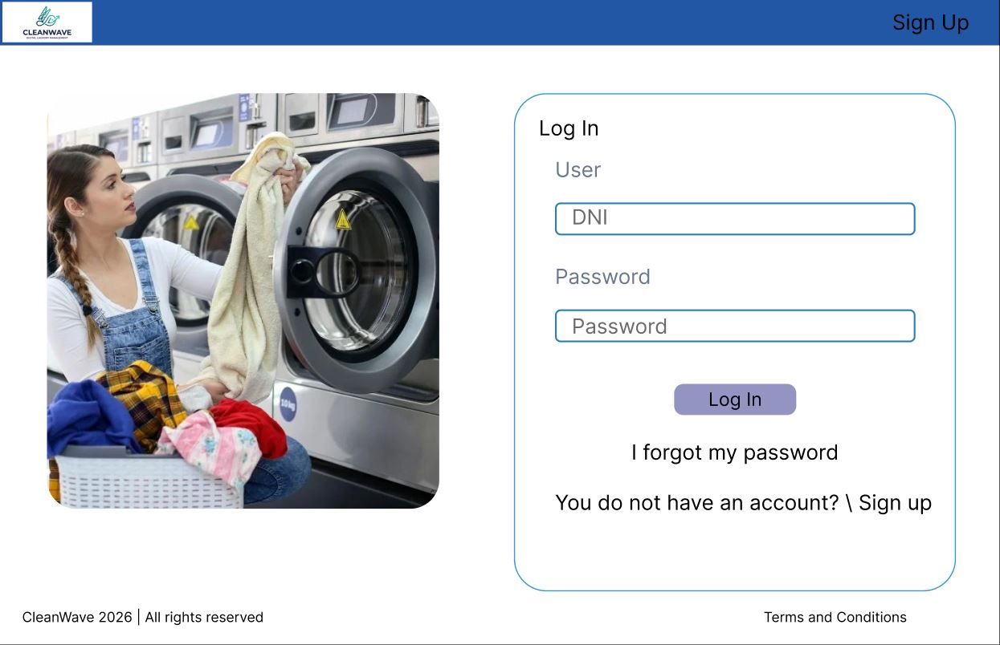
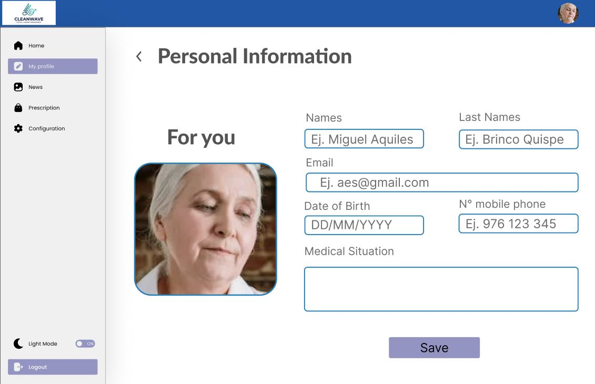
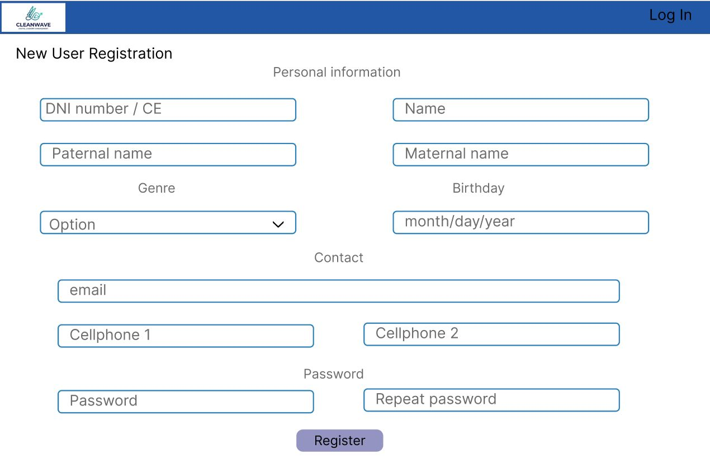
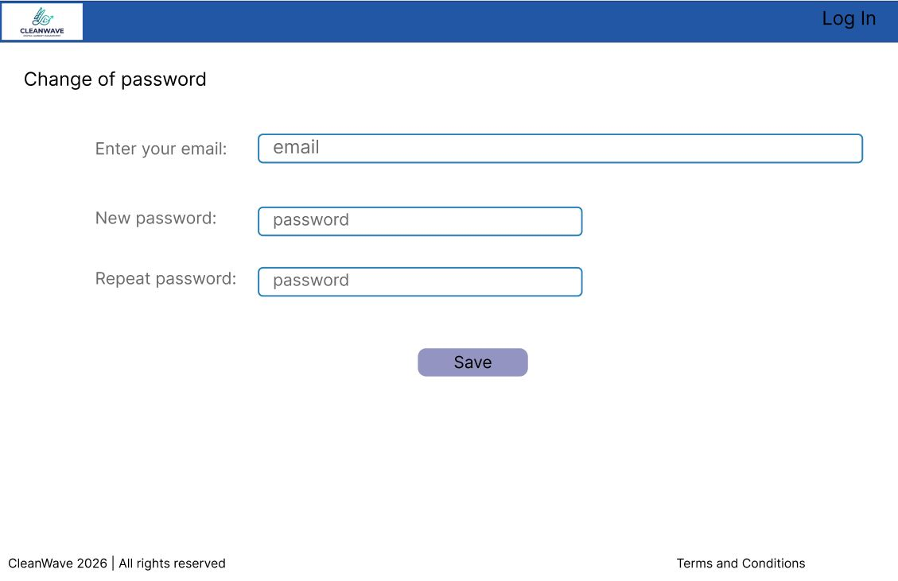
<!--
### 4.4.3. Web Applications User Flow Diagrams
-->

## 4.5. Web Applications Prototyping

## 4.6. Domain-Driven Software Architecture
En esta sección, el equipo profundiza en la arquitectura de software para la solución CleanWave, tomando como base los hitos alcanzados durante el Big Picture Event Storming. 
El objetivo es realizar una transición desde el entendimiento del negocio hacia un modelo técnico riguroso bajo la perspectiva de Domain-Driven Design (DDD).

Este enfoque permite delimitar los Bounded Contexts necesarios para separar responsabilidades críticas, como el seguimiento del estado de las prendas y el sistema de atención de quejas. 
A través de esta metodología, se han identificado los Aggregates, Events, Commands y Queries que garantizan la integridad de la lógica de negocio en cada etapa del proceso de lavandería.

Finalmente, se presenta y explica la representación visual de la arquitectura utilizando el C4 Model. 
Esta estructura jerárquica nos permite comunicar de manera efectiva la solución a través de tres niveles de detalle: el Software Architecture Context Level Diagram, los Software Architecture Container Level Diagrams y los Software Architecture Component Diagrams.

### 4.6.1. Design-Level Event Storming
La sesión se llevó a cabo de manera colaborativa utilizando la herramienta LucidChart y se estructuró en las siguientes actividades.

#### 1. Bounded Context **User**

El bounded context Users se encarga de la autenticación y control de acceso dentro de CleanWave. Administra procesos como el registro de usuarios, inicio de sesión y asignación de roles (administrador o cliente). Su propósito es garantizar que cada usuario acceda únicamente a las funcionalidades correspondientes a su perfil dentro de la plataforma.
   
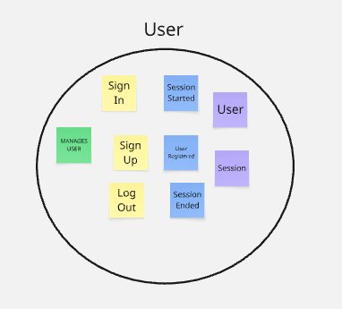

   
#### 2. Bounded Context **Orders**

El bounded context Orders gestiona el ciclo de vida completo de los pedidos de lavandería en CleanWave. Administra procesos como la creación de pedidos, el registro de prendas, la actualización de estados y la cancelación. Su propósito es centralizar la operación principal del negocio, permitiendo tanto a clientes como administradores hacer seguimiento en tiempo real del estado de cada pedido.
   
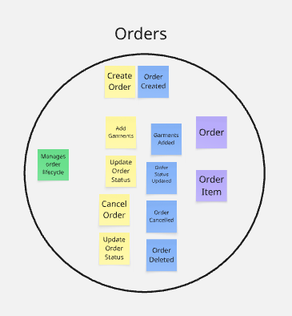


#### 3. Bounded Context **Logistics**

El bounded context Logistics se encarga de la gestión de recogidas y entregas asociadas a los pedidos. Administra procesos como la creación de deliveries, la asignación de repartidores y la actualización del estado de cada entrega. Su propósito es coordinar la operación de campo de la lavandería, asegurando que cada pedido sea recogido y entregado en el tiempo y lugar acordados.
   
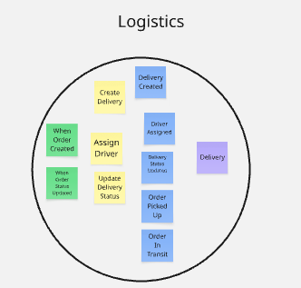


#### 4. Bounded Context **Billing**

El bounded context Billing gestiona los planes de suscripción y las transacciones económicas de las lavanderías dentro de CleanWave. Administra procesos como la suscripción a un plan, la cancelación y el registro de transacciones asociadas. Su propósito es controlar el acceso a las funcionalidades premium de la plataforma y mantener un historial financiero confiable para cada negocio.
   
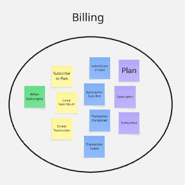


#### 5. Bounded Context **Notifications**

El bounded context Notifications se encarga de la comunicación automática entre la plataforma y sus usuarios. Administra eventos como la confirmación de pedidos, actualizaciones de estado y alertas del sistema, permitiendo marcarlas como leídas o eliminarlas. Su propósito es mantener a clientes y administradores informados en tiempo real sobre cualquier cambio relevante dentro de su operación.
   
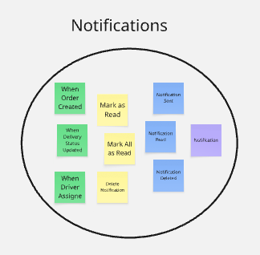>

### 4.6.2. Software Architecture Context Diagram


### 4.6.3. Software Architecture Container Diagrams


### 4.6.4. Software Architecture Components Diagrams


## 4.7. Software Object-Oriented Design

### 4.7.1. Class Diagrams

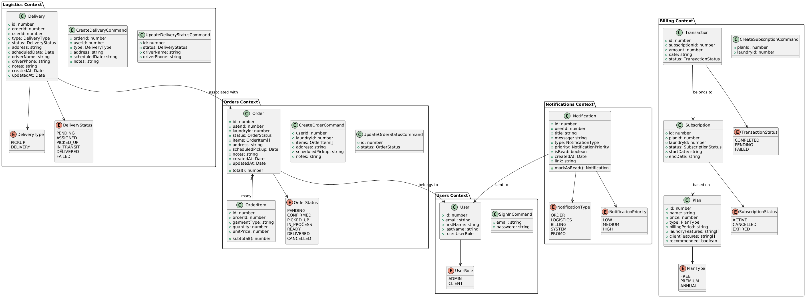


## 4.8. Database Design

### 4.8.1. Database Diagrams.

### Diagrama del frontend completo:


# Capítulo V: Product Implementation, Validation & Deployment

## 5.1. Software Configuration Management

En esta sección se describen las decisiones, convenciones y principios adoptados por el equipo para garantizar la coherencia, trazabilidad y control de versiones durante el ciclo de vida del desarrollo de la solución CleanWave. Se establecen los lineamientos para la configuración del entorno de desarrollo, gestión del código fuente, convenciones de estilo y configuración de despliegue.


### 5.1.1. Software Development Environment Configuration

### 5.1.2. Source Code Management

Para administrar el progreso del código, optamos por una estrategia más simple en lugar de implementar todo el flujo de Git Flow. En nuestro caso, trabajamos directamente con una sola rama principal (main), la cual contiene la versión estable y a la vez en desarrollo de nuestro proyecto. De esta manera, todas las nuevas funcionalidades y correcciones fueron integradas directamente en la rama main, sin necesidad de crear ramas adicionales para desarrollo o características específicas. Aunque este enfoque es menos modular que Git Flow, resultó práctico para el alcance actual del proyecto, ya que permitió un control más directo del avance y evitó la sobrecarga de gestionar múltiples ramas. Además, utilizamos GitHub como repositorio central, aprovechando su función GitHub Pages para la visualización de nuestro trabajo. Esto nos permitió desplegar los archivos .html y obtener un enlace web funcional de manera rápida y sencilla. En resumen, trabajar únicamente con la rama main nos permitió avanzar con agilidad en el desarrollo de la página de destino y mantener una versión estable y actualizada del proyecto sin complicaciones adicionales en la gestión de ramas.

Enlace de la Landing Page en Vercel: https://net-core-landing-page.vercel.app/ 

<div align="center">  <p><em>Figura: Repositorio Landing Page</em>
</p> </div>

Repositorio Github de la Landing Page: https://github.com/NetCore-open/NetCore-LandingPage

<div align="center">  <p><em>Figura: Repositorio Landing Page</em>
</p> </div>


### 5.1.3. Source Code Style Guide & Conventions

En esta sección se establecen las normas, buenas prácticas y convenciones que se utilizarán durante el desarrollo de la aplicación web orientada a la gestión digital de lavanderías. La aplicación busca optimizar procesos operativos como el registro de pedidos, seguimiento de prendas y coordinación logística.

La adopción de estas convenciones permitirá garantizar la calidad, coherencia y mantenibilidad del código, facilitando su evolución y escalabilidad conforme el sistema crezca.

Para el desarrollo del proyecto se emplearán tecnologías como HTML, CSS y JavaScript, mientras que para la definición de escenarios de prueba se utilizará el lenguaje Gherkin, alineado a prácticas de desarrollo ágil.

 **Uso de minúsculas y nomenclatura en inglés**

Se definirá el uso de nombres en idioma inglés para variables, funciones, clases y elementos del sistema, asegurando que estos reflejen claramente su funcionalidad dentro del dominio de la lavandería (por ejemplo: order-status, pickup-time, delivery-route). 

Ejemplo: 

```
.clr {
} /* Mala práctica: nombre ambiguo y poco descriptivo */

.order-status {
} /* Buena práctica: nombre claro y relacionado con el dominio */
```
**Sangría y identación**

La identación permite delimitar visualmente bloques y estructuras del código, facilitando la comprensión de su lógica interna. Una correcta sangría mejora la legibilidad, permite identificar dependencias entre elementos y reduce errores de interpretación.

Ejemplo:

**EN HTML**
```
<ul>
  <li>Pedido registrado</li>
  <li>Pedido en proceso</li>
  <li>Pedido entregado</li>
</ul>

```
**EN CSS**
```
body {
  background: #ffffff;
  color: #333333;
}
```
**EN JavaScript**
```
function calculateTotal(price, quantity) {
  return price * quantity;
}
```
A continuación, se detallan las reglas específicas aplicadas a cada lenguaje.

**HTML**
 
 Se utilizará HTML5 como estándar principal para el desarrollo de la estructura de la aplicación web, debido a que proporciona etiquetas semánticas, soporte multimedia y compatibilidad con navegadores modernos.

Document Type

El proyecto utilizará la declaración específica de HTML5, definida como <!DOCTYPE html>, permitiendo a los navegadores interpretar correctamente la estructura del documento. 

Ejemplo:

```
<!DOCTYPE html>
<html lang="es">
<head>
  <meta charset="UTF-8">
  <title>Laundry Platform</title>
</head>
<body>
</body>
</html>
```
- **Blank Lines**

Se utilizarán líneas en blanco para separar grandes bloques de contenido HTML, con el objetivo de mejorar la legibilidad del documento y facilitar la identificación visual de secciones importantes de la interfaz.

Ejemplo
```
<body>
  <header>
    <h1>Laundry Service</h1>
  </header>

  <section>
    <h2>Cómo funciona</h2>
    <p>El cliente registra o solicita su servicio y puede hacer seguimiento del pedido.</p>
  </section>

  <section>
    <h2>Beneficios</h2>
    <p>Mayor transparencia, ahorro de tiempo y mejor control operativo.</p>
  </section>
</body>
```
- **HTML Quotation Marks**

Para los valores de atributos HTML se emplearán comillas dobles (""), manteniendo consistencia en todos los documentos del proyecto.

```

```
- **Multimedia Fallback**

Se proporcionará contenido alternativo para elementos multimedia, especialmente imágenes, con el objetivo de mejorar la accesibilidad y permitir una adecuada interpretación del contenido.

Ejemplo:
```

```
**CSS**

Se utilizará CSS3 para el diseño visual y la presentación de la aplicación web. El objetivo es mantener una hoja de estilos clara, ordenada y fácil de mantener.

Property Name Stops

Se utilizará un espacio después de los dos puntos (:) que acompañan a cada propiedad CSS, así como un único espacio entre la propiedad y su valor.

Ejemplo:
```
.order-card {
  background: #ffffff;
  padding: 16px;
}
```
- **Declaration Stops**

Cada declaración de propiedad CSS finalizará con punto y coma (;) para mantener consistencia y evitar errores de interpretación.

Ejemplo:
```
.status-label {
  color: green;
  font-weight: bold;
}
```
- **CSS Quotation Marks**

Se utilizarán comillas de manera consistente solo cuando sean necesarias, evitando su uso innecesario en rutas o propiedades donde no aporten claridad. Asimismo, se mantendrá uniformidad en el estilo de redacción de selectores y valores.

Ejemplo:
```
.banner-title {
  font-family: 'Open Sans', Arial, sans-serif;
}
```
- **Declaration Block Separation**

Se mantendrá una separación clara entre selectores y bloques de declaraciones, evitando saltos de línea innecesarios y asegurando uniformidad visual en la hoja de estilos.

Ejemplo:
```
.delivery-info {
  margin-top: 1rem;
  color: #444444;
}
```
**JavaScript**
Se utilizará JavaScript como lenguaje principal para la lógica del sistema, permitiendo implementar funcionalidades como el registro de pedidos, consulta de estados, validaciones, manejo de eventos y comportamiento dinámico de la aplicación.
- **Spaces Around Operations**

Se colocarán espacios alrededor de operadores aritméticos, de comparación y asignación, así como después de las comas, para mejorar la legibilidad del código.

Ejemplo:
```
let totalPrice = unitPrice * quantity;
const districts = ['Miraflores', 'San Isidro', 'Barranco'];
```
- **End of Simple Declaration**
Toda declaración simple deberá finalizar con punto y coma (;), incluyendo variables, constantes y asignaciones.

Ejemplo:

```
const orderStatus = 'ready';
let deliveryTime = 30;
```
- **General Rules for Complex Statements**
Las estructuras complejas, como condicionales, bucles y funciones, seguirán una sintaxis clara y consistente:

La llave de apertura irá al final de la línea.
Se dejará un espacio antes de la llave de apertura.
La llave de cierre irá en una nueva línea.
No se colocará punto y coma al final del bloque.

Ejemplo:
```
if (orderStatus === 'ready') {
  notifyCustomer();
}
```
- **Uso de nombres descriptivos**
Las funciones y variables deberán reflejar claramente su propósito dentro del dominio del negocio. En vez de utilizar nombres genéricos, se emplearán denominaciones relacionadas con el sistema de lavanderías. 

Ejemplo:
```
function updateOrderStatus(orderId, newStatus) {
  console.log(orderId, newStatus);
}
```
**Gherkin**

Gherkin será utilizado como lenguaje de especificación para describir escenarios de prueba y criterios de aceptación de las funcionalidades del sistema. Esto permitirá una comunicación más clara entre el equipo técnico y la perspectiva de negocio.
- **Discernible Given-When-Then Blocks**

Se empleará la estructura clásica de Gherkin basada en bloques Given – When – Then, utilizando And cuando sea necesario para añadir condiciones o resultados adicionales.

Ejemplo:
```
Scenario: Cliente consulta el estado de su pedido
Given que el cliente tiene un pedido registrado
And el pedido se encuentra en proceso
When consulta el estado del pedido
Then el sistema muestra el estado actual
And muestra el tiempo estimado de entrega
```
- **Steps with Tables**
Cuando un escenario requiera trabajar con múltiples registros o datos tabulares, se utilizarán tablas dentro de los pasos, facilitando la comprensión del contexto del escenario.
 
 Ejemplo:
```
Scenario: Visualizar pedidos registrados
Given que existen los siguientes pedidos:
| pedido   | estado      |
| ORD-001  | en proceso  |
| ORD-002  | listo       |
| ORD-003  | entregado   |
When el administrador consulta la lista de pedidos
Then el sistema muestra los pedidos registrados
```
- **Reducing Noise**
Se procurará eliminar información irrelevante de los escenarios, manteniendo únicamente los datos necesarios para comprender el comportamiento esperado del sistema. Esto permite que los criterios de aceptación sean más claros y fáciles de validar.

Ejemplo:
```
Scenario: Pedido listo para notificación
Given que el pedido está registrado
And el pedido cambia a estado listo
When el sistema procesa la actualización
Then el cliente recibe una notificación
```
- **Newlines between scenarios and separator comments**
Cuando se definan múltiples escenarios dentro de un mismo archivo, se dejarán líneas en blanco entre ellos y se podrán utilizar comentarios separadores para facilitar la lectura y navegación del documento.

Ejemplo:
```
#------- Escenario de consulta exitosa -------
Scenario: Cliente consulta pedido existente
Given que el cliente tiene un pedido registrado
When consulta el estado del pedido
Then el sistema muestra el estado correspondiente


#------- Escenario de pedido inexistente -------
Scenario: Cliente consulta pedido no registrado
Given que el cliente no tiene un pedido asociado
When consulta el estado del pedido
Then el sistema informa que no se encontró información
```
### 5.1.4. Software Deployment Configuration

Para desplegar nuestro landing page hemos optado por usar Github Pages el cual brinda la posibilidad de alojar sitios web estáticos sin costo alguno.

1. Ingresamos al repositorio de nuestra landing page


2. Ingresamos al repositorio de nuestra landing page

 

3. Ingresamos a la sección de "Settings" del repositorio


4. En la sección de "Pages", seleccionamos la rama "main" y la carpeta raíz (root) para desplegar nuestro sitio web.


## 5.2. Landing Page, Services & Applications Implementation

### 5.2.1. Sprint 1

En esta sección, documentaremos y explicaremos el progreso del Sprint 1 en términos de desarrollo del producto y colaboración del equipo. Abordaremos varios aspectos clave, incluyendo la planificación del sprint, el backlog del sprint, la evidencia de desarrollo para la Revisión del Sprint. Además, se destacarán los aspectos relacionados con la documentación de servicios, la evidencia de despliegue de software y las perspectivas de colaboración del equipo durante el sprint. Este análisis detallado nos permitirá evaluar el progreso del proyecto y realizar ajustes necesarios para futuros sprints.

#### 5.2.1.1. Sprint Planning 1.

En esta sección, nos sumergiremos en los detalles del Sprint Planning Meeting 1.

| **Sprint #** |                 **Sprint 1**              |
|--------------|-------------------------------------------|
|**Sprint Planning Background**                            |
| Date         | 06-04-2026                                |
| Time         | 2:00 PM                                   |
| Location     | Reunión virtual mediante meet             |
| Prepared By  | Nestor Molina            |
| Attendees    |                  |
| Sprint n-1 Review Summary | No aplica                    |
| Sprint n-1 Retrospective Summary | No aplica             |
| **Sprint Goal & User Stories**                           |
|**Sprint 1**  | El sprint tiene como objetivo desarrollar y publicar la landing page inicial de la startup de lavanderías digitales, la cual permitirá presentar la propuesta de valor del servicio tanto a dueños de lavanderías como a clientes finales. Durante este sprint se implementarán las secciones principales: hero con llamada a la acción, problema y solución, sección “cómo funciona”, beneficios diferenciados para ambos segmentos, testimonios simulados, sección de planes, formulario de contacto y footer con información relevante. Asimismo, se asegurará un diseño moderno, responsive y adaptable a dispositivos móviles y escritorio. El criterio de aceptación es que todas las secciones carguen correctamente, los enlaces funcionen sin errores, el formulario valide datos correctamente y la navegación sea fluida. La landing deberá estar desplegada en un hosting accesible públicamente. Como métrica de éxito, se espera lograr al menos 15 visitas únicas y 30 interacciones en los botones principales durante el sprint.                   |
| Sprint 1 Velocity   | 20 Story Points                    |
| Sum of Story Points | 38 Story Points                    |

#### 5.2.1.2. Aspect Leaders and Collaborators

En esta sección se incluye la elaboración de el artefacto Leadership-andCollaboration Matrix (LACX), el cual elegirenos quién es el líder y quiénes son los
colaboradores para este Sprint 1 

|Team Members (Last Name, First Name)|     GitHub Username     |   Landing Page   |
|------------------------------------|-------------------------|------------------|
| Jorge Armando Laban Hijar |    jarlh19        |        C         |
| Nestor Molina        |      nestoroUPC     |        C         |
| Gabriel Marcelo Mendoza Palacios        |        Gabriel2349        |        L         |


#### 5.2.1.3. Sprint Backlog n.

El Sprint Backlog es el artefacto que recoge el conjunto de User Stories seleccionadas para el Sprint y las descompone en tareas o work-items concretos que el
equipo de desarrollo debe realizar. A diferencia del Product Backlog, que contiene todas las funcionalidades priorizadas del producto, el Sprint Backlog se centra
únicamente en los elementos comprometidos para un Sprint específico.

En este caso, el Sprint Backlog 1 está orientado al desarrollo de la Landing Page de la plataforma CleanWave, incluyendo la implementación del hero, secciones de
servicios, modales, páginas de rol, footer, asistente virtual y ajustes de responsividad.


Enlace: [Enlace Sprint 1](https://upc-team-k20qr1ry.atlassian.net/jira/software/projects/CLEAN/boards/68/backlog?epics=visible&selectedIssue=CLEAN-16) 


<div align="center">  <p><em>Figura: Sprint 1</em>
</p> </div>


## Sprint Backlog – Sprint 1

| ID US | Título User Story | ID WI | Título Work-Item | Descripción | Est. (Hrs) | Asignado a | Estado |
| :--- | :--- | :--- | :--- | :--- | :---: | :--- | :--- |
| **US01** | Menú de navegación | WI-01 | Implementar navbar | Crear barra de navegación con enlaces a Inicio, Beneficios, Planes y Contacto | 3 | Nestor Molina | Done |
| **US02** | Visualización de planes | WI-02 | Implementar sección de planes | Mostrar planes con precio, características y botón de acción | 4 | Nestor Molina | Done |
| **US03** | Selección de plan | WI-03 | Implementar selección de plan | Permitir seleccionar un plan y redirigir al registro | 3 | Nestor Molina | Done |
| **US04** | Propuesta de valor | WI-04 | Implementar sección hero | Crear sección principal con título, descripción y botones CTA | 4 | Nestor Molina | Done |
| **US05** | Cómo funciona | WI-05 | Implementar sección “Cómo funciona” | Mostrar flujo del servicio en pasos (registro, proceso, entrega) | 4 | Nestor Molina | Done |
| **US06** | Beneficios | WI-06 | Implementar sección beneficios | Mostrar beneficios para lavanderías y clientes | 3 | Nestor Molina | Done |
| **US07** | Testimonios | WI-07 | Implementar testimonios | Crear sección con opiniones simuladas de usuarios | 3 | Nestor Molina | Done |
| **US08** | Formulario de contacto | WI-08 | Implementar formulario | Crear formulario con validación y confirmación | 5 | Nestor Molina | Done |
| **US09** | Información de contacto | WI-09 | Implementar sección contacto | Mostrar correo, teléfono y ubicación | 2 | Nestor Molina | Done |
| **US10** | Sección “Nosotros” | WI-10 | Implementar sección empresa | Mostrar información de la startup | 3 | Nestor Molina | Done |
| **US11** | Preguntas frecuentes | WI-11 | Implementar FAQ | Crear lista de preguntas y respuestas | 3 | Nestor Molina | Done |
| **US12** | Redes sociales | WI-12 | Implementar redes sociales | Agregar enlaces a redes sociales | 2 | Nestor Molina | Done |
| **US13** | Footer | WI-13 | Implementar footer | Agregar enlaces legales y contacto | 3 | Nestor Molina | Done |
| **US14** | Responsividad | WI-14 | Adaptar diseño responsive | Ajustar diseño a móvil, tablet y desktop | 6 | Nestor Molina | Done |
| **US15** | CTA principal | WI-15 | Implementar botones CTA | Crear botones de acción para registro y contacto | 2 | Nestor Molina | Done |
| **US16** | Sección cobertura | WI-16 | Implementar cobertura | Mostrar zonas donde opera el servicio | 3 | Nestor Molina | Done |
| **US17** | Beneficios lavandería | WI-17 | Implementar beneficios B2B | Mostrar beneficios para negocios | 3 | Nestor Molina | Done |
| **US18** | Beneficios usuario | WI-18 | Implementar beneficios cliente | Mostrar beneficios para usuarios finales | 3 | Nestor Molina | Done |
| **US19** | Demo del servicio | WI-19 | Implementar demo visual | Simular flujo del pedido (registro → proceso → entrega) | 5 | Nestor Molina | Done |
| **US20** | Política de privacidad | WI-20 | Implementar sección legal | Agregar políticas y términos de uso | 2 | Nestor Molina | Done |

| ID US | Título User Story | ID WI | Título Work-Item | Descripción | Est. (Hrs) | Asignado a | Estado |
| :--- | :--- | :--- | :--- | :--- | :---: | :--- | :--- |
| **US25** | Registrar pedido | WI-21 | Implementar formulario de pedidos | Crear formulario para registrar pedidos utilizando Angular y Angular Material | 4 | Nestor Molina | Done |
| **US25** | Registrar pedido | WI-22 | Integrar Fake API de pedidos | Consumir Fake API para almacenar pedidos simulados | 3 | Nestor Molina | Done |
| **US25** | Registrar pedido | WI-23 | Validar registro de pedidos | Implementar validaciones de campos obligatorios y mensajes de error | 2 | Nestor Molina | Done |
| **US26** | Editar pedido | WI-24 | Implementar edición de pedidos | Crear funcionalidad para modificar pedidos existentes | 4 | Nestor Molina | In-Process |
| **US26** | Editar pedido | WI-25 | Actualizar pedidos en Fake API | Implementar actualización de pedidos mediante Fake API | 3 | Nestor Molina | To-do |
| **US27** | Eliminar pedido | WI-26 | Implementar eliminación de pedidos | Permitir eliminar pedidos desde la interfaz administrativa | 2 | Nestor Molina | To-do |
| **US27** | Eliminar pedido | WI-27 | Sincronizar eliminación con Fake API | Eliminar pedidos simulados desde Fake API | 2 | Nestor Molina | To-do |
| **US28** | Registrar prendas | WI-28 | Crear módulo de prendas | Diseñar componente para agregar prendas dentro de un pedido | 3 | Nestor Molina | Done |
| **US28** | Registrar prendas | WI-29 | Implementar formulario dinámico de prendas | Permitir registrar múltiples prendas por pedido | 4 | Nestor Molina | In-Process |
| **US29** | Clasificar prendas | WI-30 | Implementar clasificación de prendas | Permitir clasificar prendas por tipo y servicio | 3 | Nestor Molina | To-do |
| **US30** | Actualizar estado del pedido | WI-31 | Crear flujo de estados | Implementar estados: pendiente, lavado, listo y entregado | 3 | Nestor Molina | Done |
| **US30** | Actualizar estado del pedido | WI-32 | Actualizar estados mediante Fake API | Sincronizar cambios de estado utilizando Fake API | 3 | Nestor Molina | In-Process |
| **US31** | Consultar estado del pedido | WI-33 | Diseñar vista de consulta | Crear interfaz para consultar pedidos registrados | 3 | Nestor Molina | Done |
| **US31** | Consultar estado del pedido | WI-34 | Implementar búsqueda de pedidos | Permitir búsqueda por código o nombre del cliente | 3 | Nestor Molina | In-Process |
| **US32** | Visualizar lista de pedidos | WI-35 | Implementar tabla de pedidos | Crear tabla responsive para visualizar pedidos registrados | 4 | Nestor Molina | Done |
| **US32** | Visualizar lista de pedidos | WI-36 | Integrar listado desde Fake API | Mostrar pedidos obtenidos desde Fake API | 3 | Nestor Molina | Done |
| **US33** | Buscar pedidos | WI-37 | Implementar filtros de búsqueda | Agregar filtros por estado y fecha | 3 | Nestor Molina | To-do |
| **US14** | Responsividad | WI-38 | Adaptar frontend responsive | Ajustar vistas para móviles, tablet y escritorio | 5 | Nestor Molina | In-Process |
#### 5.2.1.4. Development Evidence for Sprint Review

A continuación presentaremos los commits realizados en el repositorio de nuestra Landing Page, todos estos commits se han hecho en la rama “main” durante el desarrollo de nuestro Sprint 1.

## Git Commit History – NetCore-LandingPage

| Repository | Branch | Commit Id | Commit Message | Commit Message Body | Committed On (Date) |
|:-----------|:-------|:----------|:---------------|:--------------------|:--------------------|
| NetCore-LandingPage | main | e9c7a8c7d61c7e733a584432af5a25fdd02f775d | feat: implement smooth scroll and DOM interactions | Added smooth scrolling behavior and JavaScript DOM event handling | Apr 21, 2026 |
| NetCore-LandingPage | main | 97d53eee124543db7fcbf953abe234b08e120407 | feat: adjust image and text grid for about section | Refined layout grid for the 'About Us' section images and text | Apr 21, 2026 |
| NetCore-LandingPage | main | bcd0f18d9fb7b45ac2972d61bc322a1af95e34f9 | feat: add team information block | Created a new block to display team member details | Apr 21, 2026 |
| NetCore-LandingPage | main | 2263d347d00df669fcb26aa4474ea9d0f12889fc | feat | General feature implementation and updates | Apr 21, 2026 |
| NetCore-LandingPage | main | 976825500023eb767bb97a999fd45524324b78c3 | feat: create mock layout for live logistics dashboard | Initial design for the logistics tracking dashboard interface | Apr 21, 2026 |
| NetCore-LandingPage | main | a5c1006695119b650e76030cb649ad83f3900789 | feat: design large buttons for role selection | Implemented high-visibility buttons for user role selection | Apr 21, 2026 |
| NetCore-LandingPage | main | 9db716e5e0fb26ef44e603dfbda9613d0b837d00 | feat: add B2B and B2C roles division | Separated logic and views for B2B and B2C segments | Apr 21, 2026 |
| NetCore-LandingPage | main | 9cba14f6b7ad666d3f79cef8967d52b6957e2244 | feat: design floating cards for services | Added CSS for floating card effects in the services section | Apr 21, 2026 |
| NetCore-LandingPage | main | ce161bbface1d4799a6c8bee2707b95ccf2a92b5 | feat: mockup core services grid | Developed the main grid layout for primary service offerings | Apr 21, 2026 |
| NetCore-LandingPage | main | 496946242a7a251264d4e85d2f815e2864a18260 | feat: design hero section typography and stats grid | Styled the hero typography and added the statistics grid | Apr 21, 2026 |
| NetCore-LandingPage | main | 3b4d7de4469ec4ca64ebd76278dbda8bd9d4bd4a | feat: build main hero section with metrics | Integrated real-time or static metrics into the hero area | Apr 21, 2026 |
| NetCore-LandingPage | main | ab88999e81b12c296315bda67b5ad9d7ea1fc81f | feat: apply fixed design and blur to navbar | Added sticky positioning and backdrop-blur filter to the navbar | Apr 21, 2026 |
| NetCore-LandingPage | main | ab88999e81b12c296315bda67b5ad9d7ea1fc81f | feat: mockup top navigation bar | Initial mockup of the fixed top navigation menu | Apr 21, 2026 |
| NetCore-LandingPage | main | af5020f9e58e846b5d7356bcf337c16d1525f1cc | feat: create reusable components (buttons and badges) | Built reusable button and badge components for the UI | Apr 21, 2026 |
| NetCore-LandingPage | main | d59656cb7b76735c3397ec0a463e415bd234b92f | feat: add color palette, typography, and CSS reset | Defined global styles, variables, and typography rules | Apr 21, 2026 |
| NetCore-LandingPage | main | 414901b4c9710534e0991b99edc18ca1171f2f9f | feat: create base HTML structure and link static files | Initialized index.html and linked CSS/JS assets | Apr 21, 2026 |
| NetCore-LandingPage | main | 35bd7458f3ae0f246c79e418748a40ae2bb2bc9d | Resolve merge conflicts | Fixed synchronization issues during branch merging | Apr 21, 2026 |
| NetCore-LandingPage | main | 35bd7458f3ae0f246c79e418748a40ae2bb2bc9d | feat: add color palette, typography, and CSS reset | Re-applied global style settings and design tokens | Apr 21, 2026 |
| NetCore-LandingPage | main | 5480b53b30733e6beef387a4beae0f9e65fe395c | feat: create base HTML structure and link static file | Refined base structure and static linking | Apr 21, 2026 |
| NetCore-LandingPage | main | 9db716e5e0fb26ef44e603dfbda9613d0b837d00 | Fix header formatting in README.md | Corrected Markdown syntax errors in the documentation | Apr 20, 2026 |
| NetCore-LandingPage | main | 11f3c1c8a8651140f46fdc4207907ccf2bf2ca0d | Landing page | General updates and content polish for the main landing | Apr 20, 2026 |
| NetCore-LandingPage | main | 34c4ee17f2eef2fd76ba92af5802ce91d5504658 | Initial commit | Project initialization and repository setup | Apr 17, 2026 |


#### 5.2.1.5. Execution Evidence for Sprint Review

Lo que se logró en el Sprint 1 es desplegar una primera versión de la landing page. En esta logramos desarrollar la barra navegadora, las secciones establecidas
de la Landing Page y el formulario de contacto. También se adoptó exitosamente la metodología GitFlow, trabajando en la branch principal “main”.

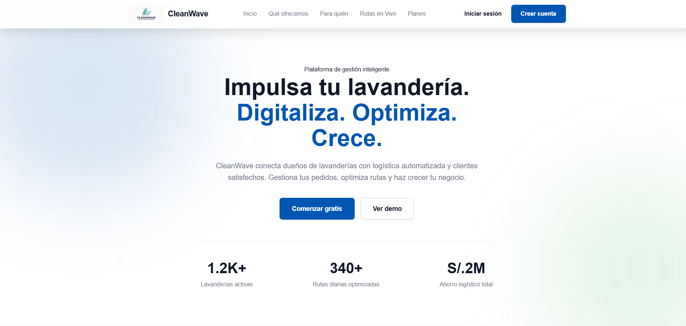
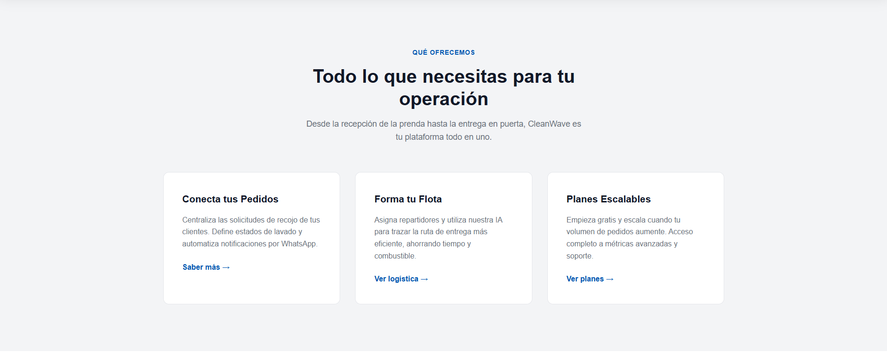
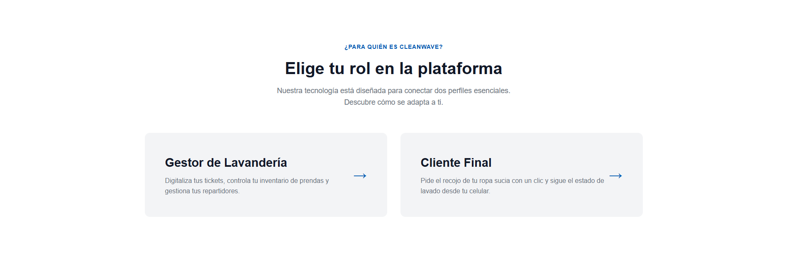
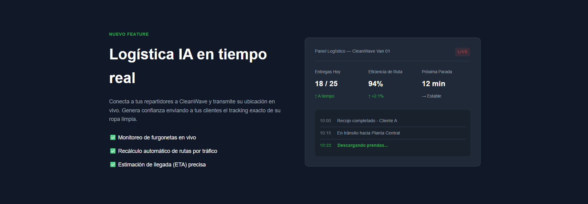

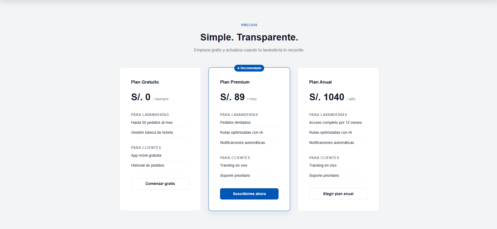

#### 5.2.1.6. Services Documentation Evidence for Sprint Review

Durante el desarrollo del Sprint 1, logramos avances significativos en la creación y configuración del repositorio del proyecto destinado a la Landing Page. Contar con esta base desde el inicio facilitó la organización del trabajo y la estructuración de las ideas del equipo.

En la siguiente etapa, optamos por aprovechar las herramientas colaborativas de GitHub, lo que permitió mejorar la coordinación entre los integrantes. Gracias a esto, se consiguió una implementación fluida y ordenada. Asimismo, al brindar acceso al repositorio a todo el equipo y centralizar el trabajo en la rama principal, los commits se realizaron de manera rápida y sin inconvenientes, permitiendo que cada miembro pudiera visualizar los cambios y el progreso de forma constante.

#### 5.2.1.7. Software Deployment Evidence for Sprint Review

A continuación, detallaremos los procesos realizados a lo largo del Sprint 1: Lo primero que realizamos fue crear dos repositorios en GitHub, uno para nuestro
Landing Page.


Finalmente configuramos vercel para obtener un enlace directo a la Landing Page, facilitando la revisión continua de los cambios realizados.
Link: https://net-core-landing-page.vercel.app/ 
)

#### 5.2.1.8. Team Collaboration Insights during Sprint

Mediante la sección de Insights de GitHub, se presenta a continuación la evidencia de colaboración del repositorio del Landing Page, mostrando la contribución de cada miembro del equipo durante el desarrollo del Sprint 1.

---

#### Analíticos de GitHub — Report

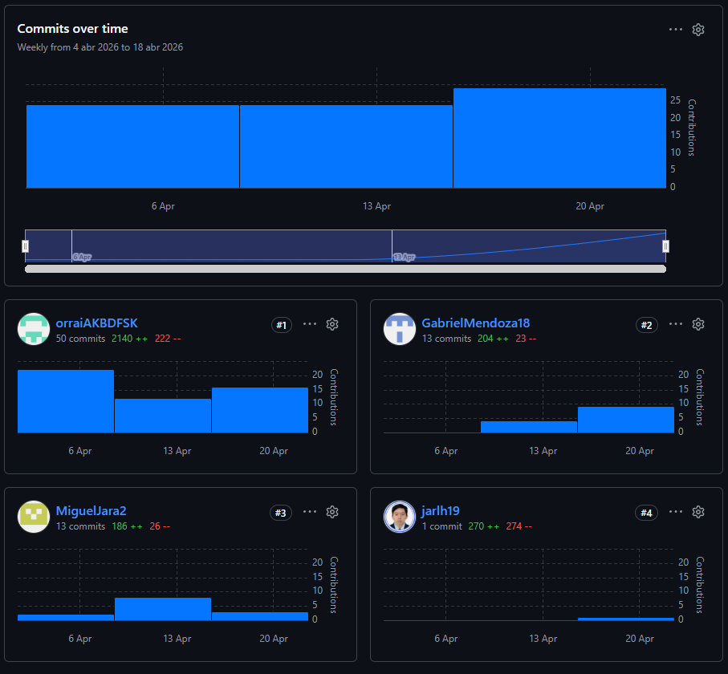

 #### Analíticos de GitHub — Landing Page
 
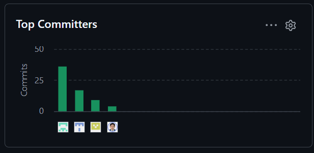


Las imágenes evidencian la participación de los 4 integrantes del equipo en el desarrollo y despliegue del Landing Page durante el Sprint 1. La distribución de commits refleja una colaboración activa y equitativa entre todos los miembros:

| Integrante | Usuario GitHub | Commits |
|---|---|---|
| Gabriel Marcelo Mendoza Palacios | `GabrielMendoza18` | 9 |
| Jorge Armando Laban Hijar | `jarlh19` | 6 |
| Nestor Molina | `nestoroUPC` | 0 |


#### 5.2.2. Sprint 2

En esta sección, nos sumergiremos en los detalles del Sprint Planning Meeting 2.

#### 5.2.2.1.Sprint Planning 2.

| **Sprint #** |                 **Sprint 2**              |
|--------------|-------------------------------------------|
|**Sprint Planning Background**                            |
| Date         | 20-04-2026                                |
| Time         | 2:00 PM                                   |
| Location     | Reunión virtual mediante meet             |
| Prepared By  | Nestor Molina            |
| Attendees    |                  |
| Sprint n-1 Review Summary | Durante el Sprint 1 se desarrolló y publicó la Landing Page inicial del proyecto, incluyendo las secciones principales, navegación responsive y formularios de contacto. Se validó correctamente la propuesta visual y la experiencia de navegación.                  |
| Sprint n-1 Retrospective Summary |El equipo identificó una buena distribución de tareas frontend; sin embargo, se detectó la necesidad de mejorar la integración entre componentes y optimizar tiempos de validación antes del despliegue.duplicaciones.             |
| **Sprint Goal & User Stories**                           |
|**Sprint 2**  | El sprint tiene como objetivo desarrollar el frontend funcional de la plataforma de gestión de lavanderías, utilizando una Fake API para simular la interacción con datos del sistema. Durante este sprint se implementarán las vistas principales relacionadas con pedidos, prendas, estados del servicio, consulta de pedidos y navegación interna del sistema. Asimismo, se utilizarán datos simulados para validar el flujo de interacción entre administrador y cliente sin depender todavía del backend real. El criterio de aceptación es que las vistas del sistema funcionen correctamente, que la Fake API permita listar, registrar, actualizar y consultar pedidos simulados, y que la navegación entre secciones sea fluida y responsive. La métrica de éxito será completar los principales flujos frontend sin errores críticos y validar al menos 5 pedidos simulados durante las pruebas internas. sprint.                   |
| Sprint 1 Velocity   | 28 Story Points                    |
| Sum of Story Points | 54 Story Points                    |

#### 5.2.2.2. Aspect Leaders and Collaborators.

En esta sección se incluye la elaboración de el artefacto Leadership-andCollaboration Matrix (LACX), el cual elegirenos quién es el líder y quiénes son los
colaboradores para este Sprint 1 

|Team Members (Last Name, First Name)|     GitHub Username     |   Landing Page   |
|------------------------------------|-------------------------|------------------|
| Jorge Armando Laban Hijar |    jarlh19        |        C         |
| Nestor Molina        |      nestoroUPC      |        C         |
| Gabriel Marcelo Mendoza Palacios        |        Gabriel2349        |        L         |

#### 5.2.2.3.Sprint Backlog 2.

El Sprint 2 representa la transición entre la validación visual del producto (Landing Page) y el desarrollo de las funcionalidades core del sistema. El objetivo principal es construir la lógica de negocio mínima necesaria para validar el funcionamiento operativo de la plataforma de lavanderías digitales.

Todas las tareas son monitoreadas y actualizadas mediante **Jira Software**.

<div align="center"> 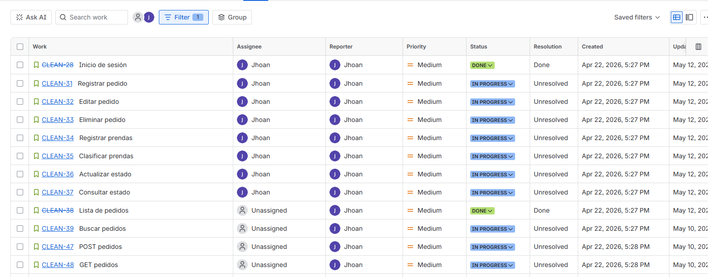 <p><em>Figura: Tablero del Sprint 2 en Jira Software</em>
</p> </div>


#### 5.2.2.4.Development Evidence for Sprint Review.


<table border="1" cellpadding="4" cellspacing="0">
  <thead>
    <tr>
      <th>Repository</th>
      <th>Branch</th>
      <th>Commit Id</th>
      <th>Commit Message</th>
      <th>Committed on (Date)</th>
    </tr>
  </thead>
  <tbody>
    <tr>
      <td rowspan="9">https://github.com/NetCore-open/NetCore-FrontEnd</td>
      <td>main</td>
      <td>d2e8b00</td>
      <td>feat(jam): add JAM module scaffolding</td>
      <td>29-09-2025</td>
    </tr>
    <tr>
      <td>main</td>
      <td>ff01fea</td>
      <td>feat: add SignIn component with validation</td>
      <td>29-09-2025</td>
    </tr>
    <tr>
      <td>main</td>
      <td>fa75547</td>
      <td>feat: add Familiar and SignUpFamiliar components</td>
      <td>29-09-2025</td>
    </tr>
    <tr>
      <td>main</td>
      <td>ec5cece</td>
      <td>feat: add Welcome component with greeting</td>
      <td>29-09-2025</td>
    </tr>
    <tr>
      <td>main</td>
      <td>0fbc1ac</td>
      <td>feat: add AuthenticationSection component</td>
      <td>29-09-2025</td>
    </tr>
    <tr>
      <td>main</td>
      <td>b8cb684</td>
      <td>feat: add Administrator and SignUpAdministrator components</td>
      <td>29-09-2025</td>
    </tr>
    <tr>
      <td>main</td>
      <td>4e12667</td>
      <td>feat(i18n): add English and Spanish language support</td>
      <td>29-09-2025</td>
    </tr>
    <tr>
      <td>main</td>
      <td>9763508</td>
      <td>feat: add language switcher and layout components</td>
      <td>29-09-2025</td>
    </tr>
    <tr>
      <td>main</td>
      <td>4ccacbc</td>
      <td>chore: default Angular setup</td>
      <td>28-09-2025</td>
    </tr>
    <tr>
      <td rowspan="4">https://github.com/NetCore-open/NetCore-FrontEnd</td>
      <td>develop</td>
      <td>5f14512</td>
      <td>feat(env): update API base URL for development and production</td>
      <td>10-10-2025</td>
    </tr>
    <tr>
      <td>develop</td>
      <td>2886e0b</td>
      <td>feat(firebase): update hosting configuration</td>
      <td>10-10-2025</td>
    </tr>
    <tr>
      <td>develop</td>
      <td>251c8a9</td>
      <td>feat(env): add employee endpoint to development</td>
      <td>10-10-2025</td>
    </tr>
    <tr>
      <td>develop</td>
      <td>ee86134</td>
      <td>feat(firebase): configure Firebase hosting</td>
      <td>10-10-2025</td>
    </tr>
  </tbody>
</table>

#### 5.2.2.5.Execution Evidence for Sprint Review.

<p>
  Durante el Sprint 2, se logró implementar completamente el módulo de gestión de tareas con integración 
  a la API Backend. El frontend permite listar, filtrar y navegar entre tareas por miembro y estado, 
  así como visualizar detalles asociados. Además, se mejoró la navegación y el diseño visual adaptando 
  elementos con Angular Material.
</p>

<h5>Video de demostración de funcionalidad:</h5>
<p>
  <strong>URL Youtube:</strong>  <br>
  <strong>Duración:</strong> [10:23:00]
</p>

<h5>Capturas de pantalla principales:</h5>

<p><strong>inicio:</strong></p>
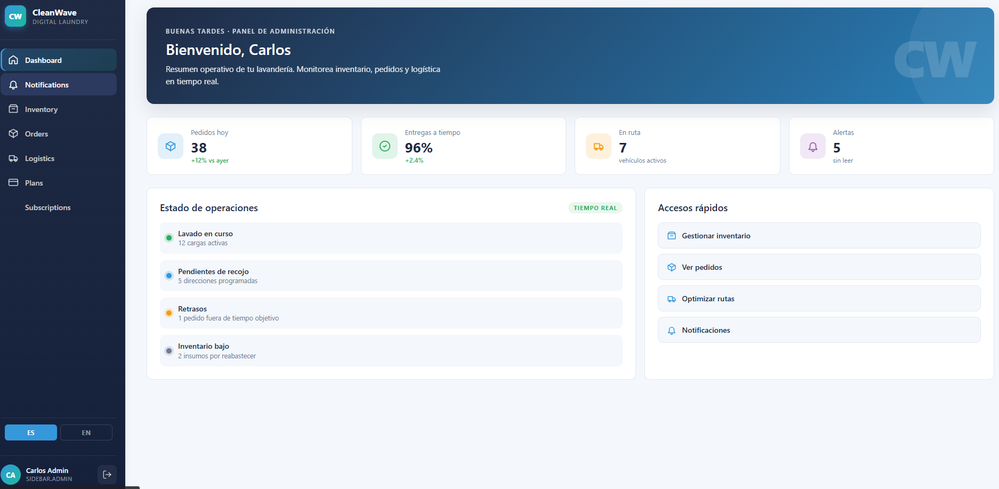

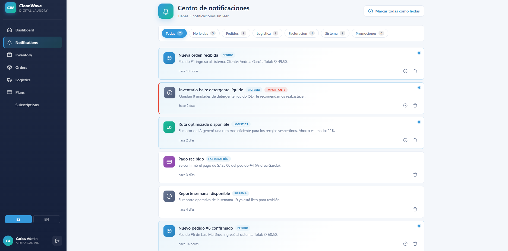

<p><strong>inventario</strong></p>
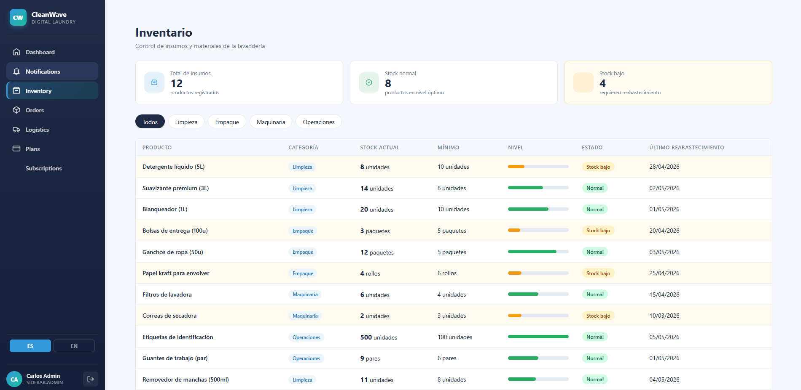

<p><strong>ordenes</strong></p>
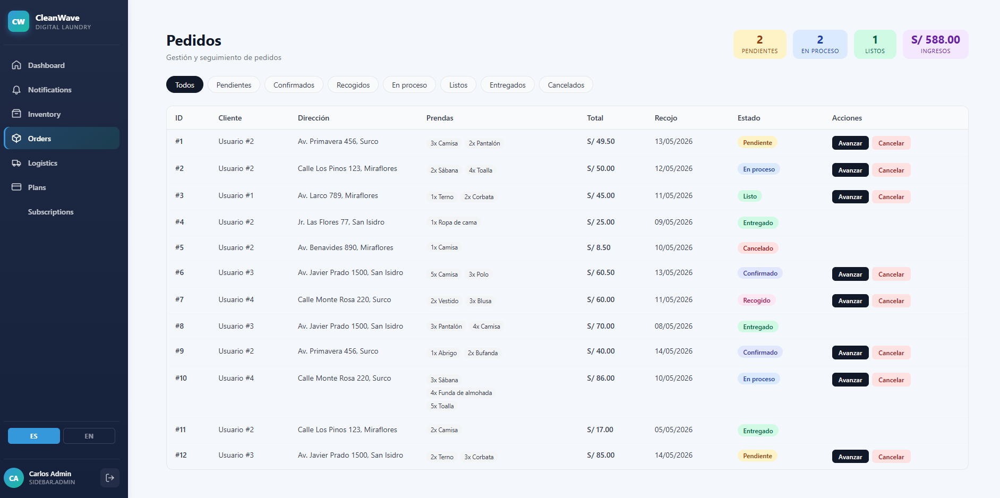

<p><strong>logistca</strong></p>
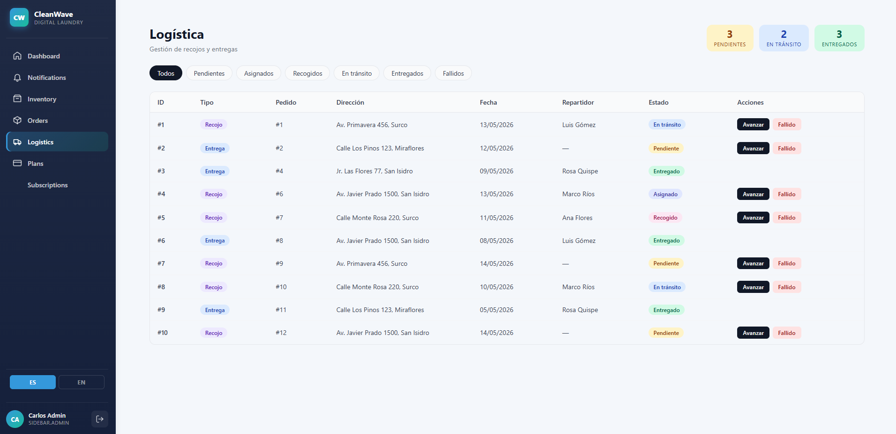

<p><strong>planes</strong></p>
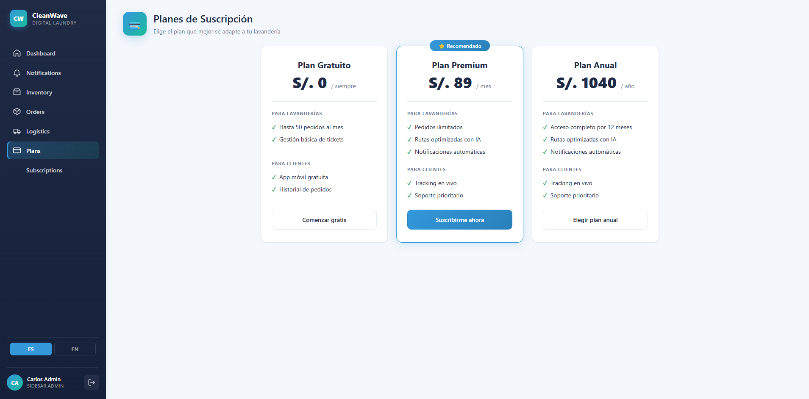

#### 5.2.2.6.Services Documentation Evidence for Sprint Review.


En el Sprint 2, el equipo diseñó, programó e integró el módulo frontend con la API Backend de VEYRA. Se estableció la comunicación con éxito entre el Frontend y los servicios REST proporcionados por el Backend, implementando las operaciones CRUD (Crear, Leer, Actualizar, Eliminar) para las principales entidades. La documentación del servicio se presenta a continuación, cumpliendo con los lineamientos de especificación de Endpoints, verbos HTTP, sintaxis de llamada y explicación del respon

| Endpoint simulado | Metodo HTTP | Descripción | URL  |
|---|---|---|---|
| /users | GET | Lista todos usuarios | https://cleanwave-api-yd7q.onrender.com/usersprojects 
| /laundries | GET | lsita todos los lundries | https://cleanwave-api-yd7q.onrender.com/laundries |
| /plans | GET | Lista todos los planes | https://cleanwave-api-yd7q.onrender.com/plans | GET | Obtiene perfil de un usuario | http://localhost:3000/users/:id |
| /subscriptions | GET | Lista las suscripciones |https://cleanwave-api-yd7q.onrender.com/subscriptions  |
| /transactions | GET | Registra una las transacciones | https://cleanwave-api-yd7q.onrender.com/transactions |
| /orders | GET | Lista los pedidos | https://cleanwave-api-yd7q.onrender.com/orders |
| /deliveries | GET | lista los deliveries| https://cleanwave-api-yd7q.onrender.com/deliveries |
| /notifications | GET | Lista notificaciones del usuario | https://cleanwave-api-yd7q.onrender.com/notifications |

#### 5.2.2.7.Software Deployment Evidence for Sprint Review.

<p>
  <a href="https://frontend-cleanwave.vercel.app/login">Frontend CleanWave</a> — 
  <a href="https://frontend-cleanwave.vercel.app/login">https://net-core-front-end.vercel.app/login</a>
</p>

#### 5.2.2.8.Team Collaboration Insights during Sprint.
<p>
Durante el Sprint 2, los analíticos de colaboración del repositorio CleanWave-Frontend evidencian una participación de  los integrantes del equipo sobre el código de la aplicación web CleanWave. A lo largo del sprint se registran commits asociados a la implementación de los módulos de gestión de notificaciones, users y pagos, así como a la integración con los servicios REST del backend y a las mejoras visuales con Angular y Angular Material. Esta actividad confirma que la construcción de la Web Application se realizó de forma incremental, definidas en el Sprint 2 Goal y la matriz LACX (API Integration, Task UI, Members & Groups).
</p>

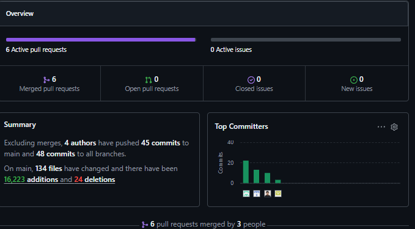

<p>
El Network Graph correspondiente al Sprint 2 muestra un uso activo del flujo de trabajo basado en GitFlow, con ramas de características (features) creadas para la integración Frontend–Backend, la interfaz de gestión de users y los componentes, que luego son fusionadas a la rama principal tras las respectivas revisiones de código. Este patrón de ramas coordinaron el trabajo con sus colaboradores, alineados con las prácticas definidas para el proyecto (feature branches, revisiones colaborativas y consolidación en main/develop), reforzando la trazabilidad y la calidad del código entregado durante el sprint.
</p>

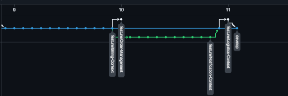

<p>
Finalmente, el gráfico de Visitors del repositorio frontend muestra un incremento de visitas y vistas de página conforme se acercan las fechas de integración y despliegue del producto, lo que sugiere que el equipo utilizó activamente el repositorio como punto central para revisar avances, validar funcionalidades y preparar la Sprint Review. En conjunto, estos analíticos de overview, network graph y visitors demuestran que, durante el Sprint 2, no todos los miembros del equipo participaron efectivamente en la implementación del producto web (Web Application) y en su integración con los Web Services, no cumpliendo con el principio de que cada integrante contribuya a los distintos productos definidos en el proyecto (Landing Page, Web Applications, Web Services) según el alcance de cada sprint.
</p>

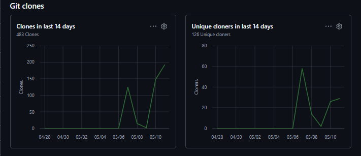

#### 5.2.3. Sprint 3

En esta sección, nos sumergiremos en los detalles del Sprint Planning Meeting 3, enfocado en el desarrollo completo del Backend (Web Services).

#### 5.2.3.1. Sprint Planning 3.

| **Sprint #** |                 **Sprint 3**              |
|--------------|-------------------------------------------|
|**Sprint Planning Background**                            |
| Date         | 05-06-2026                      |
| Time         | 4:00 PM                      |
| Location     | Reunión virtual mediante meet             |
| Prepared By  | Gabriel Marcelo Mendoza Palacios                                  |
| Attendees    | Nestor Molina, Jorge Armando Laban Hijar, Gabriel Marcelo Mendoza Palacios                              |
| Sprint n-1 Review Summary | Durante el Sprint 2 se desarrolló y validó el frontend de la aplicación web, incluyendo las vistas principales y la interacción con una Fake API. |
| Sprint n-1 Retrospective Summary | El equipo identificó la necesidad de implementar un backend real y robusto para reemplazar la Fake API y dotar de persistencia y lógica de negocio a la plataforma. |
| **Sprint Goal & User Stories**                           |
|**Sprint 3**  | El sprint tiene como objetivo desarrollar todo el Backend de la plataforma CleanWave empleando Java Spring Boot y MySQL. Se implementarán los Bounded Contexts, la persistencia de datos y la exposición de los servicios RESTful en Railway para su integración con el frontend. |
| Sprint 2 Velocity   | 54 Story Points                    |
| Sum of Story Points | 72 Story Points                    |

#### 5.2.3.2. Aspect Leaders and Collaborators.

En esta sección se incluye la elaboración del artefacto Leadership-and-Collaboration Matrix (LACX) para el Sprint 3.

|Team Members |     GitHub Username     |   Web Services (Backend) |
|------------------------------------|-------------------------|--------------------------|
| Jorge Armando Laban Hijar          | jarlh19                 | C                        |
| Nestor Molina                      | nestormolina1           | C                        |
| Gabriel Marcelo Mendoza Palacios   | Gabriel2349        | L                        |

#### 5.2.3.3. Sprint Backlog 3.

El Sprint 3 se enfoca en el desarrollo de la arquitectura del lado del servidor (Backend), incluyendo controladores, servicios, repositorios y configuración de bases de datos.

Todas las tareas son monitoreadas y actualizadas mediante **Jira Software**.

<div align="center">  <p><em>Figura: Tablero del Sprint 3 en Jira Software</em></p> </div>

## Sprint Backlog – Sprint 3

| ID US | Título User Story | ID WI | Título Work-Item | Descripción | Est. (Hrs) | Asignado a | Estado |
| :--- | :--- | :--- | :--- | :--- | :---: | :--- | :--- |
| **US35** | Autenticación Segura | WI-40 | Configurar Spring Security | Implementar JWT tokens y roles (Admin/Customer) | 5 | Gabriel Mendoza | Done |
| **US36** | Bounded Context Orders | WI-41 | Implementar Entidad Pedido | Crear capa de dominio e infraestructura para Orders | 6 | Nestor Molina | Done |
| **US36** | Bounded Context Orders | WI-42 | Controladores de Pedidos | Crear endpoints REST para listar y guardar pedidos | 4 | Nestor Molina | Done |
| **US37** | Bounded Context Logistics | WI-43 | Asignación de Entregas | Crear lógica de dominio para repartidores y deliveries | 5 | Jorge Laban | Done |
| **US38** | Bounded Context Billing | WI-44 | Suscripciones y Planes | Manejo de facturación y DB Seeding para planes | 4 | Gabriel Mendoza | Done |
| **US39** | Bounded Context Notifications | WI-45 | Alertas automáticas | Endpoints para leer y generar notificaciones de sistema | 4 | Nestor Molina | Done |
| **US40** | Despliegue en la Nube | WI-46 | Configurar Railway | Desplegar API Spring Boot y DB MySQL en Railway | 4 | Gabriel Mendoza | Done |
| **US41** | Integración Frontend | WI-47 | Conexión a API | Reemplazar Fake API de Angular por endpoints reales | 8 | Todo el equipo | Done |

#### 5.2.3.4. Development Evidence for Sprint Review.

<table border="1" cellpadding="4" cellspacing="0">
  <thead>
    <tr>
      <th>Repository</th>
      <th>Branch</th>
      <th>Commit Id</th>
      <th>Commit Message</th>
      <th>Committed on (Date)</th>
    </tr>
  </thead>
  <tbody>
    <tr>
      <td rowspan="8">https://github.com/NetCore-open/NetCore-CleanWave-Platform</td>
      <td>main</td>
      <td>992a5c4</td>
      <td>chore(db): update notification enums to match java enums</td>
      <td>17-06-2026</td>
    </tr>
    <tr>
      <td>main</td>
      <td>72a763d</td>
      <td>fix(orders): change fetch type to EAGER to resolve LazyInitializationException</td>
      <td>17-06-2026</td>
    </tr>
    <tr>
      <td>main</td>
      <td>08e5249</td>
      <td>fix(security): prevent stale JWT tokens from crashing endpoints with 403 Forbidden</td>
      <td>17-06-2026</td>
    </tr>
    <tr>
      <td>main</td>
      <td>f34dad2</td>
      <td>feat(orders): implement REST API interface layer for orders bounded context</td>
      <td>17-06-2026</td>
    </tr>
    <tr>
      <td>main</td>
      <td>19d47d6</td>
      <td>feat(orders): implement application layer for orders bounded context</td>
      <td>17-06-2026</td>
    </tr>
    <tr>
      <td>main</td>
      <td>f6664b8</td>
      <td>feat(orders): implement infrastructure layer for orders bounded context</td>
      <td>17-06-2026</td>
    </tr>
    <tr>
      <td>main</td>
      <td>83baf1d</td>
      <td>feat(orders): implement domain layer for orders bounded context</td>
      <td>17-06-2026</td>
    </tr>
    <tr>
      <td>main</td>
      <td>91f751d</td>
      <td>fix: add Railway backend URL to CORS to fix Swagger UI requests</td>
      <td>17-06-2026</td>
    </tr>
  </tbody>
</table>

#### 5.2.3.5. Execution Evidence for Sprint Review.

<p>
  Durante el Sprint 3, se logró implementar completamente el Backend de CleanWave utilizando Java Spring Boot y una base de datos relacional MySQL. Se desarrollaron los Bounded Contexts necesarios (IAM, Orders, Logistics, Billing y Notifications), logrando persistencia real de datos. 
</p>

<h5>Capturas de pantalla del funcionamiento Backend:</h5>

<p><strong>Swagger UI (Documentación Interactiva):</strong></p>
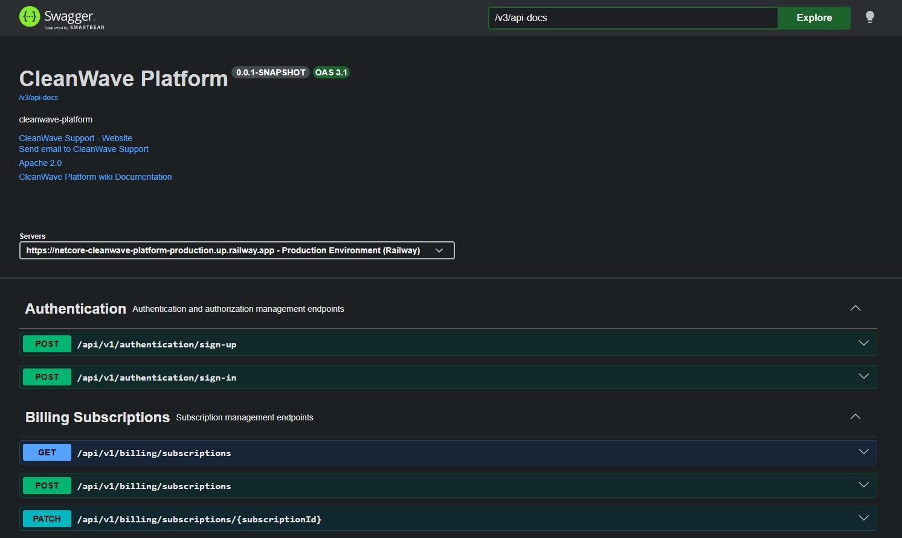

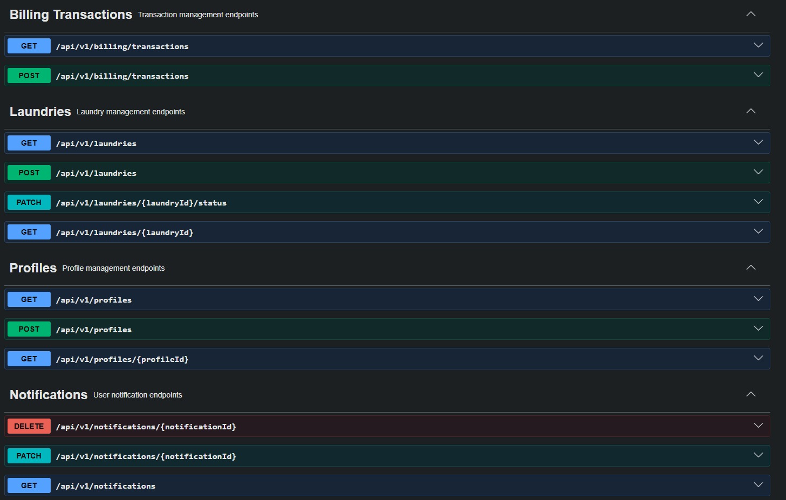

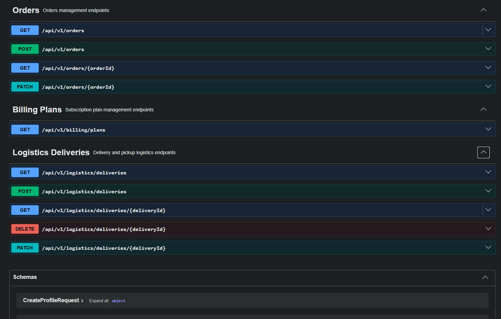

<p><strong>Despliegue y Métricas en Railway:</strong></p>
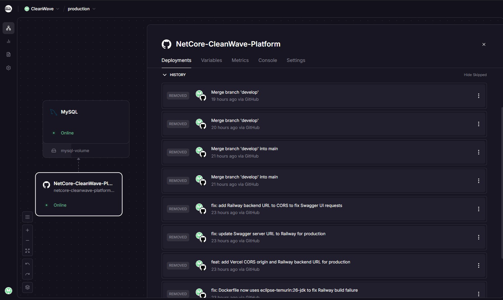

#### 5.2.3.6. Services Documentation Evidence for Sprint Review.

En el Sprint 3, el equipo diseñó y programó la API Backend de CleanWave utilizando las tecnologías seleccionadas. La documentación interactiva se expone mediante OpenAPI (Swagger).

**Enlace a Swagger UI:** https://netcore-cleanwave-platform-production.up.railway.app/swagger-ui/index.html

| Endpoint de API (Base) | Metodo HTTP | Descripción |
|---|---|---|
| `/api/v1/authentication/...` | POST | Gestión de autenticación y autorización |
| `/api/v1/billing/subscriptions` | GET, POST, PATCH | Gestión de suscripciones |
| `/api/v1/billing/transactions` | GET, POST | Gestión de transacciones de pago |
| `/api/v1/laundries` | GET, POST, PATCH | Gestión de lavanderías |
| `/api/v1/profiles` | GET, POST | Gestión de perfiles de usuario |
| `/api/v1/notifications` | GET, PATCH, DELETE | Endpoints de notificaciones de usuario |
| `/api/v1/orders` | GET, POST, PATCH | Gestión del ciclo de vida de pedidos |
| `/api/v1/billing/plans` | GET | Gestión de planes de suscripción |
| `/api/v1/logistics/deliveries` | GET, POST, PATCH, DELETE | Logística de entregas y recojos |

#### 5.2.3.7. Software Deployment Evidence for Sprint Review.

<p>
  <a href="https://netcore-cleanwave-platform-production.up.railway.app/swagger-ui/index.html#/Authentication/signIn">Backend CleanWave API - https://netcore-cleanwave-platform-production.up.railway.app/swagger-ui/index.html#/Authentication/signIn</a>
</p>

#### 5.2.3.8. Team Collaboration Insights during Sprint.

<p>
Durante el Sprint 3, los analíticos de colaboración evidencian una participación muy activa de todos los integrantes en la construcción de los Web Services (Backend). La distribución de commits confirma la correcta adopción de repositorios separados y el trabajo coordinado en los Bounded Contexts del sistema utilizando la rama main para la integración continua en Railway.
</p>

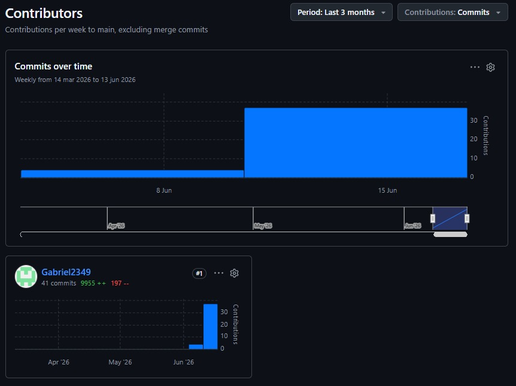

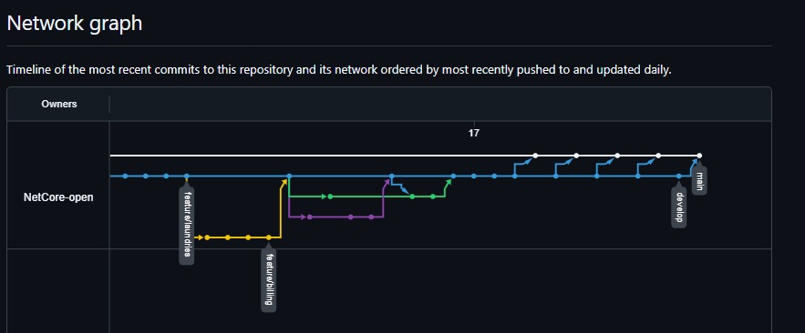


## 5.3. Validation Interviews

En esta sección el equipo registra y explica las actividades de entrevistas de validación realizadas durante el proyecto. A diferencia de las entrevistas de needfinding, en las entrevistas de validación los usuarios de los segmentos objetivo **interactúan directamente con el Landing Page y con la Web Application** de CleanWave, realizando un conjunto de tareas previamente definidas, mientras el equipo observa su comportamiento y recoge sus apreciaciones. El objetivo es validar la usabilidad, la arquitectura de información y el diseño inclusivo de la experiencia, así como comprobar si el producto resuelve la problemática planteada en los Lean UX Hypothesis Statements.

### 5.3.1. Diseño de Entrevistas

Para cada segmento objetivo se definió una sesión de validación que incluye el Landing Page y la Web Application, especificando los user flows que serán evaluados y las preguntas a realizar antes, durante y después de las tareas.

**Segmentos y user flows a validar**

| Segmento objetivo | User flows incluidos en la validación |
| ----------------- | -------------------------------------- |
| **Segmento 1: Cliente Final** | Comprensión del Landing Page → Registro de cuenta → Solicitar un servicio de lavandería con recojo a domicilio → Revisar el estado del pedido |
| **Segmento 2: Administrador de Lavandería** | Comprensión del Landing Page → Inicio de sesión → Actualizar el estado de una orden recibida → Gestionar su plan de suscripción |

#### Guion del moderador (introducción a la sesión)

> *"Hola, gracias por tu tiempo. Estamos desarrollando CleanWave, una plataforma para la gestión inteligente de servicios de lavandería, y queremos conocer tu experiencia usándola. Es importante que sepas que **estamos evaluando el producto, no a ti**: no hay respuestas correctas ni incorrectas. Te voy a pedir que realices algunas tareas y que **pienses en voz alta** mientras lo haces: dime qué ves, qué esperas que pase y qué te confunde. ¿Estás de acuerdo en que grabemos la sesión en video para nuestro análisis?"*

#### Entrevista para el Segmento 1: Cliente Final

**Bloque 1 — Preguntas de contexto (antes de las tareas)**
1. Para empezar, cuéntame un poco sobre ti: ¿a qué te dedicas?
2. ¿Cómo mandas a lavar tu ropa actualmente o con qué frecuencia solicitas servicios de lavandería?
3. ¿Qué es lo más complicado o frustrante de mandar a lavar tu ropa hoy en día?
4. ¿Desde qué dispositivo sueles solicitar servicios a domicilio (celular, laptop, tablet)?

**Bloque 2 — Validación del Landing Page**
1. Imagina que llegaste a esta página por primera vez, ¿qué crees que ofrece CleanWave y para quién es?
2. ¿Qué fue lo primero que te llamó la atención al ver la página?
3. ¿Te quedó claro qué ofrece y para quién es? ¿Qué te generó dudas?
4. ¿La información te genera confianza para usar el servicio? ¿Por qué?
5. En una escala del 1 al 5 (donde 1 es muy difícil y 5 muy fácil), ¿qué tan fácil te resultó encontrar el botón para empezar?

**Bloque 3 — Validación de la Web Application (tareas core)**
1. En una escala del 1 al 5, ¿qué tan fácil o difícil te resultó completar tu registro como cliente?
2. Al intentar solicitar un servicio de lavandería con recojo a domicilio, ¿hubo algún paso donde te trabaste o dudaste?
3. ¿La información sobre el servicio te pareció clara en todo momento? ¿Faltó o sobró algo?
4. Al revisar el estado de tu pedido, ¿la pantalla te mostró claramente en qué etapa está tu ropa?

**Bloque 4 — Preguntas post-sesión (validación global del producto)**
1. En general, ¿cómo describirías tu experiencia solicitando un servicio en CleanWave en una frase?
2. ¿Sientes que esta aplicación te ahorraría tiempo frente a llevar la ropa tú mismo a la lavandería?
3. En una escala del 0 al 10, ¿qué tan probable es que recomiendes CleanWave a un amigo o familiar?
4. Si pudieras cambiar o agregar una sola cosa a la aplicación, ¿cuál sería?

---

#### Entrevista para el Segmento 2: Administrador de Lavandería

**Bloque 1 — Preguntas de contexto (antes de las tareas)**
1. Para empezar, cuéntame un poco sobre tu negocio: ¿hace cuánto administras esta lavandería?
2. ¿Cómo gestionas actualmente los pedidos, el estado de las prendas y las entregas de tus clientes?
3. ¿Qué es lo más caótico o difícil de gestionar en el día a día de la lavandería?
4. ¿Utilizas alguna herramienta digital o todo el control lo llevas en papel / WhatsApp?

**Bloque 2 — Validación del Landing Page**
1. Imagina que llegaste a esta página por primera vez, ¿qué crees que ofrece CleanWave y para quién es?
2. ¿Qué fue lo primero que te llamó la atención al ver la página?
3. ¿Te quedó claro qué ofrece y para quién es? ¿Qué te generó dudas?
4. ¿La información te genera confianza para afiliar tu negocio? ¿Por qué?
5. En una escala del 1 al 5 (donde 1 es muy difícil y 5 muy fácil), ¿qué tan fácil te resultó encontrar el botón para empezar?

**Bloque 3 — Validación de la Web Application (tareas core)**
1. En una escala del 1 al 5, ¿qué tan intuitivo te pareció iniciar sesión y acceder a tu panel principal?
2. Al intentar actualizar el estado de una orden recibida (ej. pasar a 'En proceso'), ¿encontraste fácilmente dónde hacerlo?
3. ¿Comprendiste bien la diferencia visual entre las Órdenes y las Entregas (Deliveries)?
4. Al revisar tu plan de suscripción, ¿te pareció clara la información de facturación que ofrece la plataforma?

**Bloque 4 — Preguntas post-sesión (validación global del producto)**
1. En general, ¿cómo describirías tu experiencia gestionando pedidos en CleanWave en una frase?
2. ¿Sientes que este sistema te ayudaría a reducir los errores o el desorden en tu lavandería?
3. ¿Estarías dispuesto a pagar una suscripción mensual si esto significa ordenar tu negocio y atraer más clientes?
4. Si pudieras cambiar o agregar una sola cosa al sistema administrativo, ¿cuál sería?

### 5.3.2. Registro de Entrevistas


### 5.3.3. Evaluaciones según heurísticas

Tras consolidar las observaciones de las entrevistas de validación, se elaboró la matriz de hallazgos (Anexo D) para identificar problemas de usabilidad e interfaz, clasificándolos según las heurísticas de Nielsen y principios de Arquitectura de Información.

| ID | Descripción del Problema | Nivel de Severidad (1-4) | Heurística / Principio Violado | Recomendación |
| :--- | :--- | :---: | :--- | :--- |
| **H1** | No existe un flujo claro en la interfaz para el registro (Register) de nuevos usuarios, limitando el acceso a cuentas nuevas. | 4 (Crítico) | Control y libertad del usuario (Usability) | Implementar la pantalla de registro conectada al endpoint `/sign-up` para permitir la creación autónoma de cuentas. |
| **H2** | La plataforma no cuenta con un "Modo Oscuro" (Dark Mode), lo que puede generar fatiga visual en entornos de poca iluminación. | 1 (Cosmético) | Diseño estético y minimalista / Diseño Inclusivo | Agregar un interruptor (toggle) en la barra de navegación que permita alternar el tema visual mediante variables CSS. |
| **H3** | El usuario no tiene una sección habilitada donde pueda visualizar o editar sus datos personales y de perfil. | 3 (Mayor) | Visibilidad del estado del sistema | Desarrollar una vista de "Mi Perfil" que consuma el controlador `Profiles` para mostrar la información del usuario actual. |
| **H4** | No existe un historial donde los clientes puedan consultar los pagos o transacciones que ya han realizado. | 3 (Mayor) | Reconocimiento antes que recuerdo | Crear una pestaña de "Historial de Pagos" que recupere la información del controlador de `Billing Transactions`. |
| **H5** | Al procesar acciones (como iniciar sesión), no siempre aparece un indicador visual de carga, dejando al usuario con incertidumbre. | 2 (Menor) | Visibilidad del estado del sistema | Mostrar un indicador de carga ("spinner") y deshabilitar los botones de envío mientras se espera la respuesta de la API. |

**Plan de Acción:** Los problemas H1 y H3 fueron priorizados para ser resueltos a la brevedad en el Frontend, dada su alta severidad y su impacto directo en la funcionalidad base (crear una cuenta y poder ver quién eres). Los demás hallazgos serán programados para los siguientes Sprints de mejora.


# Conclusiones

El desarrollo de la solución digital orientada a la **gestión de lavanderías locales** permitió al equipo contrastar los supuestos iniciales planteados durante el proceso Lean UX con los resultados obtenidos en las etapas de análisis, diseño y validación conceptual. A partir de ello, se identificaron oportunidades claras de mejora, así como la viabilidad del modelo propuesto para resolver problemas reales del sector.

### En relación a los Problem Statements

1. **Problem Statement 1 — Procesos manuales y falta de control en la gestión de pedidos**  
El equipo planteó que las lavanderías locales operan principalmente mediante procesos manuales, lo que genera errores logísticos, pérdida de información y falta de seguimiento adecuado de los pedidos. Este diagnóstico se sustenta en el análisis del contexto, donde se evidenció el uso de herramientas informales como cuadernos, mensajes por WhatsApp y registros no centralizados. La solución propuesta integra estas funciones en una plataforma digital, permitiendo gestionar pedidos, estados y prendas en un solo sistema, reduciendo significativamente la posibilidad de errores.

2. **Problem Statement 2 — Falta de transparencia y mala experiencia del cliente**  
Se identificó que los usuarios finales no cuentan con mecanismos para conocer el estado de sus pedidos en tiempo real, lo que genera incertidumbre, pérdida de tiempo y desconfianza en el servicio. La propuesta de una plataforma con seguimiento en tiempo real y notificaciones automáticas responde directamente a esta problemática, mejorando la comunicación entre cliente y lavandería.

---

### En relación a los Assumptions

1. **Assumption sobre el comportamiento del administrador de lavandería**  
Se asumió que los dueños de lavanderías estarían dispuestos a adoptar una solución digital para optimizar su operación. Este supuesto se considera válido, ya que la propuesta ofrece beneficios claros como reducción de errores, mejor control de pedidos y optimización del tiempo. Sin embargo, se identifica que puede existir resistencia inicial debido a la falta de familiaridad con herramientas digitales, lo que sugiere la necesidad de incorporar procesos de onboarding simples e intuitivos.

2. **Assumption sobre el comportamiento del cliente final**  
Se asumió que los usuarios valoran la posibilidad de hacer seguimiento en tiempo real de sus pedidos y recibir notificaciones. Este supuesto es altamente consistente con las tendencias actuales de consumo digital, donde los usuarios buscan inmediatez, control y transparencia en los servicios que utilizan.

3. **Assumption sobre la optimización logística mediante tecnología**  
Se asumió que la incorporación de algoritmos de optimización de rutas (IA) mejorará la eficiencia en los procesos de recojo y entrega. Este supuesto representa uno de los principales diferenciadores de la solución, ya que permite reducir tiempos de entrega y costos operativos, generando valor tanto para el negocio como para el cliente.

---

### En relación a los Hypothesis Statements y criterios de éxito

1. **Hipótesis 1 — Reducción de errores operativos**  
Se plantea que al menos el 50% de los errores asociados a la gestión manual de pedidos serán eliminados en los primeros meses de uso del sistema. Esta hipótesis se basa en la digitalización de procesos y centralización de la información, lo cual reduce la dependencia de registros informales.

2. **Hipótesis 2 — Mejora en la experiencia del cliente**  
Se plantea que al menos el 60% de los usuarios percibirá una mejora en la transparencia y control del servicio gracias al acceso en tiempo real al estado de sus pedidos. Este criterio es coherente con la incorporación de funcionalidades de seguimiento y notificación.

3. **Hipótesis 3 — Adopción del sistema por lavanderías locales**  
Se plantea que al menos el 30% de las lavanderías contactadas estarán dispuestas a probar la plataforma en un entorno piloto. Este indicador dependerá de la facilidad de uso del sistema y del valor percibido por los administradores.

---

# Recomendaciones y Roadmap

A partir de los resultados obtenidos, el equipo propone los siguientes pasos para el desarrollo del modelo de negocio digital:

## Corto plazo — Lanzamiento piloto (0 a 3 meses)

- Publicar la **Landing Page** desarrollada como primera etapa de validación del modelo de negocio.  
- Implementar una versión inicial del sistema con funcionalidades básicas de registro y seguimiento de pedidos.  
- Validar la propuesta con un grupo reducido de lavanderías locales (piloto).  
- Incorporar un flujo de onboarding sencillo para facilitar la adopción del sistema por parte de los administradores.  

## Mediano plazo — Crecimiento (3 a 9 meses)

- Implementar el sistema completo de gestión de pedidos con estados, historial y control de prendas.  
- Integrar el sistema de notificaciones automáticas (pedido listo, retrasos, etc.).  
- Incorporar el módulo de logística con programación de recojo y entrega.  
- Lanzar campañas de adquisición de usuarios en redes sociales para aumentar la base de clientes.  

## Largo plazo — Escalabilidad (9 a 18 meses)

- Desarrollar la aplicación móvil para clientes y administradores.  
- Implementar algoritmos avanzados de optimización de rutas mediante inteligencia artificial.  
- Integrar métodos de pago digitales (Yape, Plin, etc.).  
- Expandir el modelo a otras ciudades y mercados regionales.  
- Incorporar analítica de datos para mejorar la toma de decisiones en las lavanderías.  

## 📚 Bibliografía


**Akerele, J. I., Uzoka, A., Ojukwu, P. U., & Olamijuwon, O. J. (2024).**
Increasing software deployment speed in agile environments through automated configuration management.
*International Journal of Engineering Research Updates, 7*(02), 028–035.
🔗 [Ver artículo](https://orionjournals.com/ijeru/sites/default/files/IJERU-2024-0047.pdf)

---

**Arroyo Galán, S., Conde Cubas, Y. D., & Dorta Yagüe, A. (2022).**
*Aplicación web de soporte al aprendizaje-servicio.*
🔗 [Ver recurso](https://hdl.handle.net/20.500.14352/3285)

---

**Asonze, C. U., et al. (2024).**
Evaluating the trade-offs between wireless security and performance in IoT networks.
*SSRN 4927991.*
🔗 [Ver artículo](https://www.researchgate.net/publication/383174817_Evaluating_the_Trade-offs_between_Wireless_Security_and_Performance_in_IoT_Networks_A_Case_Study_of_Web_Applications_in_AI-Driven_Home_Appliances)

---

**Balepur, N., et al. (2025).**
Whose boat does it float? Improving personalization in preference tuning via inferred user personas.
*arXiv preprint arXiv:2501.11549.*
🔗 [Ver artículo](https://doi.org/10.48550/arXiv.2501.11549)

---

**Castro Sanz, R. (2024).**
*Desarrollo de una aplicación web para gestión de tareas a través de un dashboard personalizable.*
🔗 [Ver recurso](http://hdl.handle.net/10017/62796)

---

**DemandSage. (2024).**
*Startup statistics.*
🔗 [Ver estadísticas](https://www.demandsage.com/startup-statistics)

---

**Eras, C. M., Badillo, P. R., & Urrutia, D. M. (2020).**
El fracaso de la actividad emprendedora en el contexto latinoamericano.
*Revista UNIANDES Episteme, 7*(2), 162–176.
🔗 [Ver artículo](https://dialnet.unirioja.es/descarga/articulo/8298146.pdf)

---

**Exploding Topics. (2024).**
*Startup failure statistics.*
🔗 [Ver estadísticas](https://explodingtopics.com/blog/startup-failure-stats)

---

**Growthlist. (2024).**
*Startup failure statistics.*
🔗 [Ver estadísticas](https://growthlist.co/startup-failure-statistics)

---

**Guan, M. Y., et al. (2024).**
*Deliberative alignment: Reasoning enables safer language models.*
*arXiv preprint arXiv:2412.16339.*
🔗 [Ver artículo](https://arxiv.org/abs/2412.16339)

---

**Joseph, H., Sicard, B., David, J., & Ospina, A. (2021).**
*Impacto latino: casos de emprendedores sociales de América Latina.*
Editorial CESA.
🔗 [Ver libro](https://books.google.com.pe/books?id=bTRTEAAAQBAJ)

---

**Kiourtis, A., et al. (2024).**
Sustainable UI/UX design: Best practices for CO2 emission reduction in applications.
*9th International Conference on Smart and Sustainable Technologies (SpliTech)* (pp. 1–6). IEEE.
🔗 [Ver artículo](https://ieeexplore.ieee.org/abstract/document/10612495)

---

**Latam Republic. (2023).**
*Startup trends and failures.*
🔗 [Ver recurso](https://www.latamrepublic.com/v/)

---

**Nirumand, A., & Cabot, J. (s.f.).**
*From mockups to IFML-like GUI models: Using large language models in web engineering.*
🔗 [Ver capítulo](https://link.springer.com/chapter/10.1007/978-3-031-97207-2_20)

---

**Panamerican World. (2023).**
*Startups failure in Latin America.*
🔗 [Ver artículo](https://panamericanworld.com/en/magazine/startups/startups-failure-latinamerica)

---

**Purwanto, M. E., Hasanah, H., & Purwanto, E. (2024).**
Improving customer service quality through the use of Google Suite in creating landing pages.
*Jurnal Ekonomi, 13*(02), 502–510.
🔗 [Ver artículo](https://ejournal.seaninstitute.or.id/index.php/Ekonomi/article/view/4399)

---

**Shofiana, A., Riadi, A. A., & Evanita, E. (2025).**
Public complaint information system in government to improve web public services.
*Revista La Multiapp, 6*(4), 750–764.
🔗 [Ver artículo](https://www.newinera.com/index.php/JournalLaMultiapp/article/view/2419/1982)

---

**Torres Martín, G., & López Rodríguez, R. (2024).**
*Projectpulse, una aplicación web de gestión de tareas orientada a empresas.*
🔗 [Ver recurso](https://hdl.handle.net/20.500.14352/101430)

---

**U.S. Chamber of Commerce. (2023).**
*Why small businesses fail.*
🔗 [Ver artículo](https://www.uschamber.com/co/start/strategy/why-small-businesses-fail)

---

**Wicaksono, A. J. A., & Kusumandyoko, T. C. (2024).**
Pengembangan user interface halaman utama pada Wicaraku sebagai media pengenalan terapi gangguan berbicara.
*BARIK – Jurnal S1 Desain Komunikasi Visual, 6*(1), 233–247.
🔗 [Ver artículo](https://ejournal.unesa.ac.id/index.php/JDKV/article/view/62835)

---

**Cómo crear un user journey map: Una guía. Coursera (2023)**

🔗[Ver Articulo](https://www.coursera.org/mx/articles/creating-user-journey-maps-a-guide?msockid=35f7cd24a3526d172d46db55a2476cea)
# Anexos


---

### Anexo A: Prototipos y Diseño

| Recurso | Enlace |
|---|---|
| Web Applications Wireframes (Figma) | https://www.figma.com/design/BYuUfCInkNhZI1UaLu4JJV/WireFrame-Landing-Page-CleanWave?node-id=0-1&t=j8CbnUXdVDki8n37-1 |
| Web Applications Mock-ups (Figma) | https://www.figma.com/design/BYuUfCInkNhZI1UaLu4JJV/WireFrame-Landing-Page-CleanWave?node-id=0-1&t=j8CbnUXdVDki8n37-1 |
| Web Applications Prototyping (Figma) | https://www.figma.com/design/BYuUfCInkNhZI1UaLu4JJV/WireFrame-Landing-Page-CleanWave?node-id=0-1&t=j8CbnUXdVDki8n37-1 |

---

### Anexo B: Gestión del Proyecto

| Recurso | Enlace |
|---|---|
| Design-Level Event Storming (Miro) | https://miro.com/app/board/uXjVGm-88A8=/ |
| Sprint Backlog 1 (Jira) | https://upc-team-k20qr1ry.atlassian.net/jira/software/projects/CLEAN/boards/68/backlog |

---

### Anexo C: Videos del Producto

| Recurso | Enlace |
|---|---|
| Video About-the-Product | — |

---

### Anexo D: Videos de Exposiciones

| Entrega | Título | Enlace |
|---|---|---|
| TB1 | Exposición TB1 — Foundly | — |
| TP | Exposición TP — Foundly | — |
| TB2 | Exposición TB2 — Foundly | — |
| TF | Exposición TF — Foundly | — |
