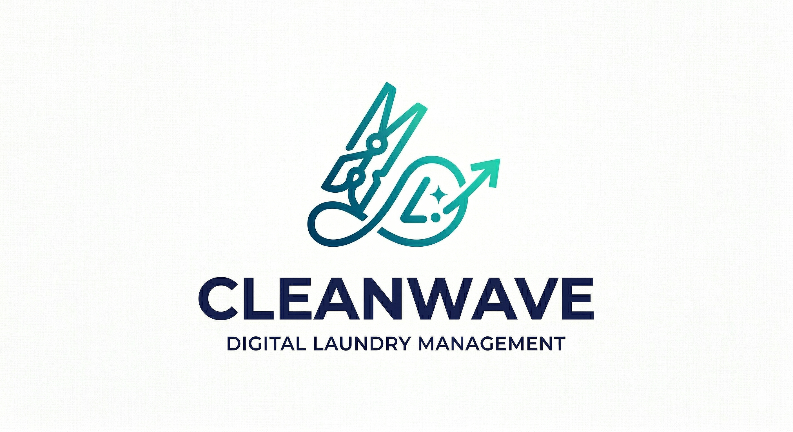
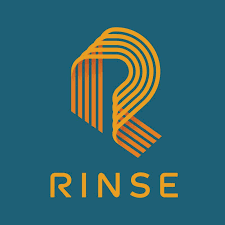
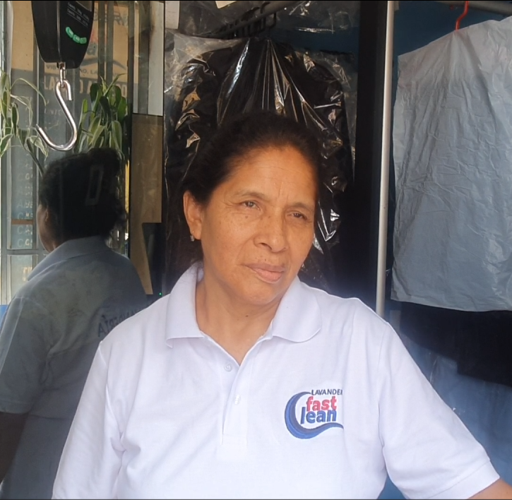
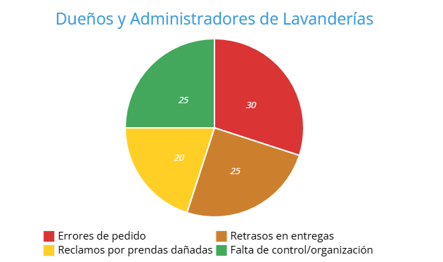
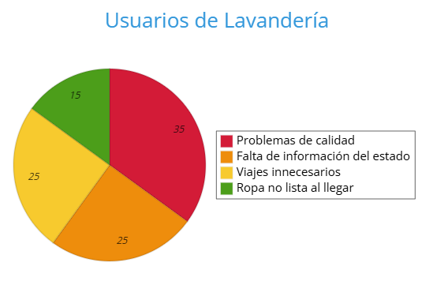
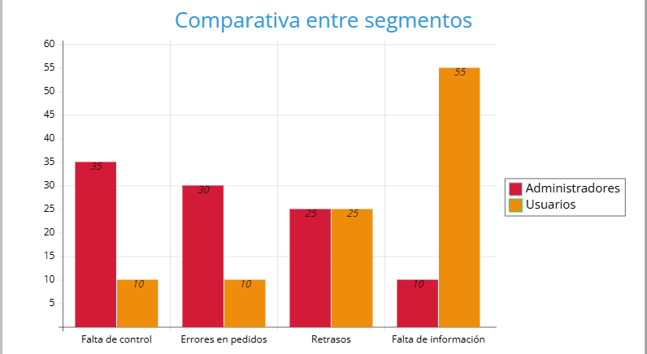
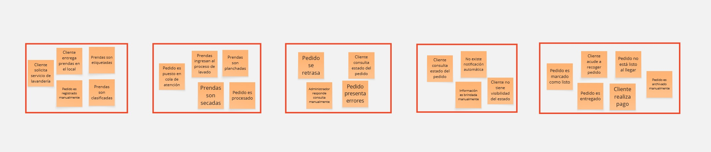

# Capítulo II: Requirements Elicitation & Analysis

## 2.1. Competidores

### 2.1.1. Análisis competitivo

<table border="1" cellpadding="8" cellspacing="0" style="border-collapse:collapse; width:100%; font-family:Arial, sans-serif;">
    <tr>
        <th colspan="7" style="background-color:#d9ead3;">Competitive Analysis Landscape</th>
    </tr>
    <tr>
        <td colspan="2" rowspan="2" style="background-color:#f4cccc;"><strong>¿Por qué llevar a cabo este análisis?</strong></td>
        <td colspan="5">¿Cómo se posiciona nuestra startup frente a sus competidores en cuanto a propuesta de valor, marketing, producto y estrategia?</td>
    </tr>
    <tr>
        <td colspan="5">
            Es un análisis comparativo que permite identificar fortalezas, debilidades, oportunidades y amenazas, así como entender mejor la posición del producto frente a otros actores del mercado de lavanderías y servicios bajo demanda.
        </td>
    </tr>
    <tr>
        <td colspan="3"></td>
        <td style="text-align:center;">
            <strong>Nuestra Startup</strong> 
            
        </td>
        <td style="text-align:center;">
            <strong>Rinse</strong> 
            
        </td>
        <td style="text-align:center;">
            <strong>CleanCloud</strong> 
            
        </td>
        <td style="text-align:center;">
            <strong>Laundryheap</strong> 
            
        </td>
    </tr>
    <tr>
        <td rowspan="2">Perfil</td>
        <td colspan="2">Overview</td>
        <td>Plataforma SaaS enfocada en digitalizar lavanderías locales mediante gestión de pedidos, inventario y optimización logística con inteligencia artificial.</td>
        <td>Servicio premium de lavandería con app móvil enfocado en usuarios de alto nivel adquisitivo.</td>
        <td>Software SaaS especializado en la gestión de lavanderías (POS, inventario, clientes).</td>
        <td>Servicio global de lavandería bajo demanda con enfoque en rapidez y delivery.</td>
    </tr>
    <tr>
        <td colspan="2">Ventaja competitiva ¿Qué valor ofrece a los clientes?</td>
        <td>Especialización en pequeñas lavanderías, optimización logística con IA, seguimiento en tiempo real y modelo accesible tipo SaaS.</td>
        <td>Alta calidad de servicio y experiencia premium para el cliente.</td>
        <td>Gestión operativa completa para lavanderías con múltiples funcionalidades.</td>
        <td>Entrega rápida y cobertura internacional con enfoque en conveniencia.</td>
    </tr>
    <tr>
        <td rowspan="2">Perfil de Marketing</td>
        <td colspan="2">Mercado objetivo</td>
        <td>Lavanderías locales pequeñas y medianas, así como usuarios urbanos que buscan servicios digitalizados.</td>
        <td>Usuarios premium en ciudades grandes (EE.UU.).</td>
        <td>Negocios de lavandería a nivel global.</td>
        <td>Usuarios finales en mercados internacionales.</td>
    </tr>
    <tr>
        <td colspan="2">Estrategias de marketing</td>
        <td>Marketing digital, posicionamiento local, enfoque en digitalización y eficiencia operativa.</td>
        <td>Branding fuerte, marketing digital y experiencia premium.</td>
        <td>Marketing SaaS, posicionamiento como software de gestión.</td>
        <td>Marketing basado en rapidez y conveniencia del servicio.</td>
    </tr>
    <tr>
        <td rowspan="3">Perfil de Producto</td>
        <td colspan="2">Productos & Servicios.</td>
        <td>Plataforma web con gestión operativa, tracking en tiempo real y optimización logística.</td>
        <td>Aplicación móvil + servicio de lavandería.</td>
        <td>Software de gestión para lavanderías.</td>
        <td>App móvil + servicio de lavandería.</td>
    </tr>
    <tr>
        <td colspan="2">Precios & Costos</td>
        <td>Modelo SaaS con suscripción mensual accesible y escalable.</td>
        <td>Servicio de alto costo.</td>
        <td>Suscripción SaaS de costo medio.</td>
        <td>Precios medios-altos según servicio.</td>
    </tr>
    <tr>
        <td colspan="2">Canales de distribución (Web y/o Móvil)</td>
        <td>Web (fase inicial), escalable a móvil.</td>
        <td>App móvil.</td>
        <td>Web.</td>
        <td>App móvil y web.</td>
    </tr>
    <tr>
        <td rowspan="5">Análisis SWOT</td>
    <tr>
        <td colspan="2">Fortalezas</td>
        <td>Especialización en lavanderías locales, uso de IA, modelo escalable.</td>
        <td>Fuerte marca y experiencia premium.</td>
        <td>Funcionalidades completas de gestión.</td>
        <td>Logística eficiente y presencia global.</td>
    </tr>
    <tr>
        <td colspan="2">Debilidades</td>
        <td>Startup nueva, baja presencia en el mercado.</td>
        <td>Alto costo para usuarios.</td>
        <td>No enfocado en experiencia del cliente final.</td>
        <td>No orientado a digitalizar lavanderías pequeñas.</td>
    </tr>
    <tr>
        <td colspan="2">Oportunidades</td>
        <td>Alta demanda de digitalización, crecimiento del sector.</td>
        <td>Expansión a nuevos mercados.</td>
        <td>Mejorar experiencia de usuario.</td>
        <td>Expandir cobertura global.</td>
    </tr>
    <tr>
        <td colspan="2">Amenazas</td>
        <td>Competidores globales y adopción lenta.</td>
        <td>Competencia en precios.</td>
        <td>Nuevas tecnologías disruptivas.</td>
        <td>Nuevas startups locales más económicas.</td>
    </tr>
</table>

### 2.1.2. Estrategias y tácticas frente a competidores

| **Análisis FODA cruzado** | **Oportunidades** | **Amenazas** |
|---|---|---|
| **Fortalezas (F)** 1. Especialización en lavanderías locales con bajo nivel de digitalización. 2. Optimización logística mediante inteligencia artificial. 3. Plataforma SaaS accesible y fácil de implementar. 4. Seguimiento en tiempo real para mejorar la experiencia del cliente. | **Estrategia (FO) — Estrategias Ofensivas** 1. Posicionar la startup como la principal solución de digitalización para lavanderías locales en Perú y LATAM. 2. Implementar campañas de adquisición en zonas urbanas con alta concentración de lavanderías. 3. Generar alianzas con lavanderías piloto para validar el producto y obtener casos de éxito. 4. Ofrecer planes freemium o promociones iniciales para incentivar la adopción temprana. 5. Destacar el uso de IA como diferenciador competitivo en marketing. | **Estrategia (FA) — Estrategias Defensivas** 1. Diferenciarse de plataformas globales mediante enfoque en negocio local y accesibilidad económica. 2. Priorizar la simplicidad y facilidad de uso frente a soluciones complejas. 3. Construir fidelización mediante mejora continua del servicio y experiencia del cliente. 4. Reforzar la propuesta de valor basada en eficiencia operativa y reducción de costos. 5. Comunicar claramente los beneficios de digitalización frente a métodos tradicionales. |
| **Debilidades (D)** 1. Bajo reconocimiento de marca al ser una startup nueva. 2. Recursos limitados frente a competidores consolidados. 3. Dependencia inicial de adopción tecnológica por parte de lavanderías. 4. Necesidad de validar el producto en el mercado real. | **Estrategia (DO) — Reorientación** 1. Validar el modelo mediante pruebas piloto con lavanderías locales. 2. Ejecutar estrategias de marketing digital enfocadas en pequeños negocios. 3. Desarrollar prototipos rápidos para validar funcionalidades clave (Lean UX). 4. Generar contenido educativo sobre digitalización en lavanderías. 5. Buscar financiamiento mediante incubadoras o programas de emprendimiento. | **Estrategia (DA) — Supervivencia** 1. Mantener un enfoque lean en el desarrollo del producto para optimizar recursos. 2. Priorizar funcionalidades esenciales del MVP antes de escalar. 3. Enfocar el mercado en zonas específicas para lograr tracción inicial. 4. Implementar estrategias de retención temprana para fidelizar clientes. 5. Iterar continuamente el producto en base al feedback de los usuarios. |

## 2.2. Entrevistas

### 2.2.1. Diseño de entrevistas

### 2.2.1. Diseño de entrevistas

<h4 id="Segment">Segmento objetivo: Dueños y administradores de lavanderías</h4> 

<h4 id="PreguntPersonal">Preguntas Personales:</h4> 

¿Cuál es su nombre?

¿Cuál es su edad?

¿Cuál es su rol dentro del negocio?

¿Cuántos años de experiencia tiene en el rubro de lavandería?

---

<h4 id="PreguntEspe">Preguntas específicas:</h4> 

¿Cómo gestionan actualmente los pedidos y el control de prendas?

¿Qué tipo de herramientas o sistemas utiliza en sus operaciones diarias (cuaderno, Excel, apps, etc.)?

¿Cuáles son los principales problemas que enfrenta en la gestión de su lavandería?

¿Cómo organizan actualmente el recojo y la entrega de prendas?

¿Ha tenido problemas como pérdida de prendas, retrasos o errores en pedidos?

¿Qué procesos considera más urgentes de digitalizar o mejorar?

¿Qué funcionalidades considera importantes en una plataforma que le ayude a gestionar su negocio?

¿Estaría dispuesto a usar una plataforma digital para mejorar su operación?

¿Estaría dispuesto a pagar por una solución que optimice su negocio?

---

<h4 id="Segment">Segmento objetivo: Usuarios de servicios de lavandería</h4> 

<h4 id="PreguntPersonal">Preguntas Personales:</h4> 

¿Cuál es su nombre?

¿Cuál es su edad?

¿Cuál es su ocupación?

¿Dónde reside actualmente?

---

<h4 id="PreguntESP">Preguntas específicas :</h4> 

¿Con qué frecuencia utiliza servicios de lavandería?

¿Qué problemas ha tenido al usar servicios de lavandería?

¿Qué tan importante es para usted conocer el estado de su pedido en tiempo real?

¿Qué aspectos valora más en el servicio (precio, rapidez, calidad, seguimiento)?

¿Le gustaría poder solicitar y gestionar el servicio desde una plataforma web o aplicación?

¿Qué tipo de información le gustaría recibir sobre su pedido?

¿Qué tipo de dispositivo utiliza con mayor frecuencia (celular, laptop, tablet, PC)?

¿Por qué medio preferiría recibir notificaciones importantes? (WhatsApp, SMS, llamada, correo, app)

---

### 2.2.2. Registro de entrevistas

<table>
<colgroup>
</colgroup>
<thead>
  <tr>
    <th colspan="2">Entrevista #1 </th>
  </tr>
</thead>
<tbody>
  <tr>
    <td>Nombre</td>
    <td>Madeleine</td>
  </tr>
  <tr>
    <td>Apellidos</td>
    <td>- </td>
  </tr>
  <tr>
    <td>Edad</td>
    <td>49 años</td>
  </tr>
  <tr>
    <td>Rol</td>
    <td>Nutricionista</td>
  </tr>
  <tr>
    <td>Evidencia</td>
    <td>
</td>
  </tr>
  <tr>
    <td>Link</td>
    <td>
<a target="_blank"  href="" title="Title">
</td>
  </tr>
    <td>Timing donde inicia la entrevista </td>
    <td>00:00 min</td>
  </tr>
  <tr>
    <td>Duración de la entrevista </td>
    <td>00:00 min</td>
  <tr>
    <td>Resumen</td>
    <td> Mencionó que le frustra mucho desplazarse hasta el local y descubrir que su ropa aún no está lista. Prefiere un sistema que le permita verificar el estado real de su pedido desde el celular para evitar viajes en vano.
* **Calidad del servicio:** Comentó que ha tenido experiencias donde algunas manchas no fueron removidas por completo. Para ella, es clave que el servicio garantice una limpieza profunda y un cuidado impecable de las prendas.
* **Digitalización y notificaciones:** Al ser una persona muy ocupada, prefiere gestionar todo vía app o web. Le gustaría recibir avisos directos (como por WhatsApp) cuando su ropa esté lista para ser recogida.
* **Equilibrio entre rapidez y costo:** Valora mucho la velocidad de entrega, especialmente por temas de urgencia, pero espera que el precio sea justo y no se sienta como un cobro excesivo.
</td>
  </tr>
</tbody>
</table>

<table>
<colgroup>
</colgroup>
<thead>
  <tr>
    <th colspan="2">Entrevista #2 </th>
  </tr>
</thead>
<tbody>
  <tr>
    <td>Nombre</td>
    <td>Beatriz</td>
  </tr>
  <tr>
    <td>Apellidos</td>
    <td>Espinoza</td>
  </tr>
  <tr>
    <td>Edad</td>
    <td>55 años</td>
  </tr>
  <tr>
    <td>Rol</td>
    <td>Contadora</td>
  </tr>
  <tr>
    <td>Evidencia</td>
    <td>
</td>
  </tr>
  <tr>
    <td>Link</td>
    <td>
<a target="_blank"  href="" title="Title">
</td>
  </tr>
    <td>Timing donde inicia la entrevista </td>
    <td>00:00 min</td>
  </tr>
  <tr>
    <td>Duración de la entrevista </td>
    <td>00:00 min</td>
  <tr>
    <td>Resumen</td>
    <td>
    Mencionó que le molesta que su ropa aún no esté lista luego de que vaya a la lavanderia a preguntas por ella. Prefiere una aplicación que le avise el estado de su ropa.
    Comentó que ha tenido experiencias en las que iba a la lavandería y los ternos aún no estaban planchados. Gracias a esto ella ha gastado mucho tiempo en viaje. 
    Al ser una persona ocupada, menciona que le gustaría tener un servicio que le avise cuando su ropa ya está lista para ser recogida. Menciona que usa mucho la aplicación de
    WhatsApp, y que le gustaría recibir mensajes por ese medio preferiblemente.
</td>
  </tr>
</tbody>
</table>

<table>
<colgroup>
</colgroup>
<thead>
  <tr>
    <th colspan="2">Entrevista #3 </th>
  </tr>
</thead>
<tbody>
  <tr>
    <td>Nombre</td>
    <td>Ana</td>
  </tr>
  <tr>
    <td>Apellidos</td>
    <td>Fernandez</td>
  </tr>
  <tr>
    <td>Edad</td>
    <td>60 años</td>
  </tr>
  <tr>
    <td>Rol</td>
    <td>Administradora</td>
  </tr>
  <tr>
    <td>Evidencia</td>
    <td>
</td>
  </tr>
  <tr>
    <td>Link</td>
    <td>
<a target="_blank"  href="" title="Title">
</td>
  </tr>
    <td>Timing donde inicia la entrevista </td>
    <td>00:00 min</td>
  </tr>
  <tr>
    <td>Duración de la entrevista </td>
    <td>00:00 min</td>
  <tr>
    <td>Resumen</td>
    <td>
    Mencionó que tuvo problemas con algunos clientes que reportaron ropa en mal estado, manifestó desconocer los daños a las ropas
    dañadas, pero igual tuvo que reparar estos daños. Mencionó además que no estaría mal el crear una plataforma mas avanzada que le permita
    gestionar mejor su negocio de lavandería. Contó que la gestión de los clientes es en su mayoría a travez de un cuaderno, y solo usa computadoras
    para gestionar las boletas de pago.
</td>
  </tr>
</tbody>
</table>

<table>
<colgroup>
</colgroup>
<thead>
  <tr>
    <th colspan="2">Entrevista #4 </th>
  </tr>
</thead>
<tbody>
  <tr>
    <td>Nombre</td>
    <td>Jimena</td>
  </tr>
  <tr>
    <td>Apellidos</td>
    <td>Bartolo Corimanya</td>
  </tr>
  <tr>
    <td>Edad</td>
    <td>25 años</td>
  </tr>
  <tr>
    <td>Rol</td>
    <td>Administradora</td>
  </tr>
  <tr>
    <td>Evidencia</td>
    <td>
</td>
  </tr>
  <tr>
    <td>Link</td>
    <td>
<a target="_blank"  href="" title="Title">
</td>
  </tr>
    <td>Timing donde inicia la entrevista </td>
    <td>00:00 min</td>
  </tr>
  <tr>
    <td>Duración de la entrevista </td>
    <td>00:00 min</td>
  <tr>
    <td>Resumen</td>
    <td>
    Jimena, dueña de una lavandería, mencionó que actualmente gestiona los pedidos de forma manual, utilizando un cuaderno y etiquetas escritas a mano para identificar las prendas. Señala que esto le ha generado problemas como pérdida de prendas, confusión entre pedidos y retrasos en las entregas, especialmente cuando hay alta demanda. Además, le resulta difícil llevar un control claro del estado de cada pedido. Considera importante contar con una solución digital que le permita organizar mejor los pedidos, hacer seguimiento de las prendas y reducir errores, y estaría dispuesta a usarla si es fácil de manejar y le ahorra tiempo.
</td>
  </tr>
</tbody>
</table>

### 2.2.3. Análisis de entrevistas

En esta sección se presenta el análisis detallado de la información recolectada. Para cada segmento, se explican primero los hallazgos estadísticos objetivos y subjetivos, seguidos de la evidencia gráfica correspondiente.

#### Segmento 1: Dueños y administradores de lavanderías

El análisis revela una digitalización precaria en la gestión operativa. Como se observa en el gráfico, el 100% de los administradores utiliza cuadernos para registrar pedidos, mientras que solo un 40% emplea computadoras, principalmente para la emisión de boletas. Asimismo, el 0% cuenta con un sistema digital integrado, evidenciando una fuerte dependencia de procesos manuales.

 

#### Segmento 2: Usuarios de servicios de lavandería

Los datos confirman una experiencia actual ineficiente y poco transparente. El 100% de los usuarios debe acudir presencialmente para verificar el estado de su pedido, y el 100% reporta haber encontrado su ropa no lista al llegar, lo que evidencia una falta total de comunicación efectiva. Además, el 75% ha perdido tiempo en desplazamientos innecesarios.

 

#### Análisis Comparativo

Al comparar ambos grupos, se identifican coincidencias clave para el desarrollo de la solución. Tanto administradores como usuarios presentan un 100% de necesidad de digitalización y mejora en la comunicación, evidenciando una oportunidad clara para la implementación de una plataforma tecnológica.

 

### Conclusiones y Definición de Arquetipos

Basado en el análisis estadístico, se concluye que existe una desconexión crítica entre la operación interna de las lavanderías y la experiencia del cliente. Mientras el 100% de los administradores trabaja con métodos manuales, el 100% de los usuarios demanda información en tiempo real, lo que genera ineficiencia, errores y pérdida de tiempo.

## 2.3. Needfinding

### 2.3.1. User Personas

A partir del análisis de entrevistas y la recolección de información sobre la operación de lavanderías locales y la experiencia de los usuarios finales, se identificaron los principales perfiles de usuarios que interactúan directamente con la solución propuesta. Estos perfiles representan los segmentos clave del sistema, ya que concentran tanto las necesidades de gestión operativa del negocio como las expectativas del cliente en cuanto a eficiencia, transparencia y comodidad del servicio.

La construcción de los User Persona permite comprender en profundidad sus comportamientos, motivaciones, frustraciones y hábitos, lo cual resulta fundamental para diseñar una solución tecnológica alineada con las necesidades reales del mercado. De esta manera, se busca garantizar que la plataforma no solo resuelva problemas operativos, sino que también mejore significativamente la experiencia del usuario.

**1) Segmento 1: Dueños y administradores de lavandería **

Para este segmento se elaboró el User Persona Carlos Ramírez Huamán, propietario de una lavandería local con varios años de experiencia en el rubro.

Carlos tiene 42 años y gestiona su negocio de manera tradicional, utilizando cuadernos para registrar pedidos y apoyándose ocasionalmente en herramientas básicas como Excel o aplicaciones de mensajería. Su principal objetivo es mantener el control de su operación diaria, asegurar la entrega oportuna de prendas y evitar errores que afecten la confianza de sus clientes.

 

**2) Segmento 2: Usuarios de servicios de lavandería**

Para este segmento se elaboró el User Persona Andrea López García, profesional joven que utiliza servicios de lavandería de manera frecuente debido a su estilo de vida dinámico.

Andrea tiene 27 años, trabaja a tiempo completo y cuenta con poco tiempo disponible para realizar actividades domésticas. Por ello, recurre a servicios de lavandería como una solución práctica que le permita optimizar su tiempo.

 

### 2.3.2. User Task Matrix

El User Task Matrix presenta las tareas que realizan los User Persona para cumplir sus objetivos en su día a día, independientemente de si usan nuestro software o no. Se evalúa la frecuencia y la importancia de cada tarea para identificar dónde aportar valor.

<table border="1" cellpadding="8" cellspacing="0" style="border-collapse:collapse; width:100%; font-family:Arial, sans-serif;">
  <thead>
    <tr style="background-color:#eef3f7;">
      <th rowspan="2">Tarea (Task)</th>
      <th colspan="2">Administrador (Carlos)</th>
      <th colspan="2">Usuario (Andrea)</th>
    </tr>
    <tr style="background-color:#eef3f7;">
      <th>Frecuencia</th>
      <th>Importancia</th>
      <th>Frecuencia</th>
      <th>Importancia</th>
    </tr>
  </thead>
  <tbody>
    <tr>
      <td style="text-align:left;">Registrar pedidos y prendas</td>
      <td>Often</td><td>High</td>
      <td>Rarely</td><td>Low</td>
    </tr>
    <tr>
      <td style="text-align:left;">Actualizar el estado del pedido</td>
      <td>Often</td><td>High</td>
      <td>Often</td><td>High</td>
    </tr>
    <tr>
      <td style="text-align:left;">Coordinar recojo y entrega de prendas</td>
      <td>Often</td><td>High</td>
      <td>Occasionally</td><td>Medium</td>
    </tr>
    <tr>
      <td style="text-align:left;">Consultar el estado del pedido</td>
      <td>Often</td><td>Medium</td>
      <td>Often</td><td>High</td>
    </tr>
    <tr>
      <td style="text-align:left;">Notificar al cliente sobre avances del servicio</td>
      <td>Occasionally</td><td>High</td>
      <td>Often</td><td>High</td>
    </tr
    <tr>
      <td style="text-align:left;">Gestionar pagos y cobros del servicio</td>
      <td>Often</td><td>High</td>
      <td>Occasionally</td><td>High</td>
    </tr>
    <tr>
      <td style="text-align:left;">Revisar historial de pedidos</td>
      <td>Occasionally</td><td>Medium</td>
      <td>Occasionally</td><td>Medium</td>
    </tr>
    <tr>
      <td style="text-align:left;">Reportar problemas o incidencias</td>
      <td>Occasionally</td><td>High</td>
      <td>Occasionally</td><td>High</td>
    </tr>
  </tbody>
</table>

### 2.3.3. User Journey Mapping

<strong>Segmento 1 – Dueño de lavandería (Carlos Ramírez Huamán)</strong>

El User Journey Mapping de Carlos representa el recorrido actual que experimenta como administrador de una lavandería local en la gestión diaria de pedidos, control de prendas, organización logística y comunicación con los clientes. El mapa ilustra el proceso completo (end-to-end), desde la recepción de prendas hasta la entrega final al cliente.

En la situación As-Is, Carlos enfrenta un flujo de trabajo predominantemente manual y poco estructurado: registra pedidos en cuadernos, organiza las prendas de forma empírica y coordina entregas mediante llamadas o mensajes informales. Esta dinámica genera desorden operativo, pérdida de información, errores en los pedidos y dificultades para dar seguimiento al estado de cada servicio.

El Journey busca evidenciar los puntos críticos de su experiencia actual, identificando las tareas, emociones, fricciones y oportunidades de mejora a lo largo de cada etapa del proceso (Recepción de prendas, Registro de pedidos, Procesamiento, Coordinación logística, Entrega y Seguimiento).

 

<strong>Segmento 2 – Usuario de lavandería (Andrea López García)</strong>

El User Journey Mapping de Andrea representa el recorrido actual que experimenta como usuaria de servicios de lavandería, desde la necesidad de lavar sus prendas hasta la recolección final del pedido. Este recorrido refleja la interacción del cliente con el servicio y evidencia las limitaciones del modelo tradicional.

En la situación As-Is, Andrea debe acudir físicamente a la lavandería para dejar y recoger sus prendas, sin contar con información clara sobre el estado del servicio. La falta de comunicación efectiva y seguimiento en tiempo real genera incertidumbre, pérdida de tiempo y una experiencia poco satisfactoria.

Durante su recorrido, Andrea enfrenta múltiples fricciones, como la necesidad de desplazarse innecesariamente, la falta de notificaciones sobre el estado del pedido y la posibilidad de encontrar su ropa no lista al momento de recogerla.

El Journey busca identificar las emociones, expectativas y dificultades presentes en cada etapa del proceso (Necesidad del servicio, Entrega de prendas, Espera, Consulta del estado, Recojo del pedido y Post-servicio).

 

### 2.3.4. Empathy Mapping

Para la elaboración de los *Empathy Maps*, el equipo partió del conocimiento y observaciones recolectadas durante el análisis de los User Persona. Se colocó al centro de cada mapa al usuario correspondiente  y se respondieron las preguntas claves sobre su entorno, emociones, comportamientos y necesidades.

**Segmento 1: Administrador**

**Segmento 2: Usuario de lavandería**

## 2.4. Big Picture Event Storming

**Step 1 – Free Exploration**

En esta primera etapa, el equipo realizó una sesión de lluvia de ideas con el objetivo de identificar todos los eventos relevantes dentro del dominio del servicio de lavanderías. Durante esta actividad, se buscó capturar los acontecimientos reales que ocurren en la operación diaria del negocio, sin establecer un orden específico ni una jerarquía entre ellos.

**Step 2 – Structured Organization**

Después de listar los eventos, el equipo los organizó en flujos de negocio lógicos que reflejan las principales etapas en la operación de una casa de reposo.
Esta estructura ayudó a identificar los procesos clave y las áreas de mejora que posteriormente podrían abordarse mediante soluciones digitales o de gestión.

## 2.5. Ubiquitous Language

 En el presente proyecto, cuyo objetivo principal es mejorar la eficiencia operativa y la transparencia del servicio en lavanderías locales mediante una plataforma digital, se ha definido el siguiente <strong>lenguaje ubicuo</strong> con el fin de garantizar claridad y consistencia entre usuarios, desarrolladores y stakeholders. 
 <table border="1" style="border-collapse: collapse; width: 100%;"> <tr> <td><strong>Término</strong></td> <td><strong>Definición</strong></td> </tr> <tr> <td>Cliente</td> <td>Usuario que solicita el servicio de lavandería, entrega sus prendas y recibe información sobre el estado de su pedido.</td> </tr> <tr> <td>Administrador</td> <td>Propietario o encargado de la lavandería responsable de gestionar pedidos, operaciones y el funcionamiento general del negocio.</td> </tr> <tr> <td>Pedido</td> <td>Conjunto de prendas entregadas por el cliente para ser procesadas dentro de un ciclo de servicio (lavado, secado, planchado).</td> </tr> <tr> <td>Prenda</td> <td>Unidad individual de ropa que forma parte de un pedido y pasa por las distintas etapas del servicio.</td> </tr> <tr> <td>Estado del Pedido</td> <td>Etapa actual en la que se encuentra un pedido (Registrado, En proceso, Listo, Entregado), permitiendo su seguimiento.</td> </tr> <tr> <td>Seguimiento (Tracking)</td> <td>Visualización en tiempo real del estado del pedido, que permite al cliente conocer el progreso del servicio.</td> </tr> <tr> <td>Notificación</td> <td>Mensaje automático enviado al cliente para informarle sobre eventos relevantes (pedido listo, retraso, entrega).</td> </tr> <tr> <td>Recojo y Entrega</td> <td>Proceso logístico mediante el cual se recogen las prendas del cliente y se entregan una vez finalizado el servicio.</td> </tr> <tr> <td>Optimización Logística</td> <td>Uso de reglas o algoritmos para mejorar las rutas de recojo y entrega, reduciendo tiempos y costos operativos.</td> </tr> <tr> <td>Panel de Control (Dashboard)</td> <td>Interfaz principal para el administrador donde se visualizan pedidos, métricas y el estado general del negocio.</td> </tr> <tr> <td>Flujo del Servicio</td> <td>Secuencia de etapas que sigue un pedido desde su recepción hasta su entrega final.</td> </tr> <tr> <td>Incidencia</td> <td>Evento inesperado durante el proceso (retraso, pérdida o daño de prendas) que requiere atención.</td> </tr> <tr> <td>Pago</td> <td>Transacción realizada por el cliente para cancelar el servicio de lavandería.</td> </tr> <tr> <td>Plan de Suscripción</td> <td>Modelo de acceso tipo SaaS para lavanderías, que define funcionalidades disponibles según el plan contratado.</td> </tr> <tr> <td>Sesión</td> <td>Periodo de acceso autenticado en el que un usuario interactúa con la plataforma.</td> </tr> <tr> <td>Roles y Permisos</td> <td>Mecanismo de control que define qué acciones puede realizar cada tipo de usuario dentro del sistema.</td> </tr> </table>

<strong>Beneficios esperados del lenguaje ubicuo:</strong>
 <ul> <li>Facilita la comunicación entre desarrolladores, usuarios y propietarios de lavanderías.</li> <li>Mejora la comprensión de los procesos y funcionalidades del sistema.</li> <li>Evita ambigüedades en la definición de requerimientos.</li> <li>Garantiza consistencia en el diseño, desarrollo e implementación del proyecto.</li> </ul>