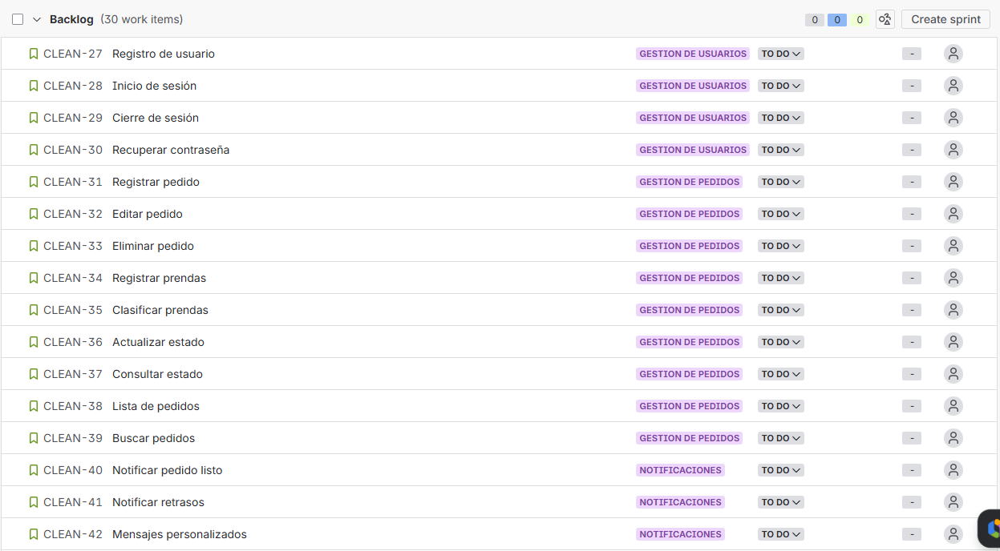

# Capítulo III: Requirements Specification

## 3.1. User Stories

Para la especificación de requisitos de los usuarios, se desarrollaron las historias de usuario que describen cada requisito y funcionalidad que debe estar implementado en el desarrollo del producto final para satisfacer las necesidades del público objetivo. A continuación se presentan las historias de usuario relacionadas con la plataforma "CleanWave". Esta sección reúne historias de usuario centradas en la experiencia de los distintos roles: el Administrador y el usuario final. Aquí se definen las necesidades clave para cada uno, desde la navegación inicial y contacto.

<table>
    <thead>
        <tr>
            <th>Story ID</th>
            <th>Título</th>
            <th>Descripción</th>
            <th>Criterios de Aceptación (Gherkin)</th>
        </tr>
    </thead>
    <tbody>
        <!-- EP01 -->
        <tr>
            <td>EP01</td>
            <td>Navegación en la Landing Page</td>
            <td>Como visitante quiero tener una experiencia fluida y completa en el sitio web para conocer los servicios y tomar decisiones informadas.</td>
            <td></td>
        </tr>
        <tr>
            <td>US01</td>
            <td>Menú de navegación</td>
            <td>Como visitante de la Landing Page, quiero poder acceder a un menú de navegación para explorar fácilmente las secciones principales del sitio.</td>
            <td>
                <strong>Escenario 1: Navegación exitosa a través del menú</strong> 
                <strong>Dado que</strong> el visitante accede al sitio web 
                <strong>Cuando</strong> el menú de navegación está disponible 
                <strong>Entonces</strong> el sistema permite acceder a las secciones principales del contenido.  
                <strong>Escenario 2: Menú no disponible</strong> 
                <strong>Dado que</strong> el visitante accede al sitio web 
                <strong>Cuando</strong> el menú no se carga correctamente 
                <strong>Entonces</strong> el sistema informa la incidencia y mantiene disponible el contenido principal.
            </td>
        </tr>
        <tr>
            <td>US02</td>
            <td>Visualización de planes</td>
            <td>Como visitante de la Landing Page, quiero ver los planes junto con sus características para comparar alternativas.</td>
            <td>
                <strong>Escenario 1: Planes disponibles</strong> 
                <strong>Dado que</strong> el visitante consulta la sección de planes 
                <strong>Cuando</strong> la información se encuentra disponible 
                <strong>Entonces</strong> el sistema muestra los planes con sus características y condiciones.  
                <strong>Escenario 2: Planes no disponibles</strong> 
                <strong>Dado que</strong> el visitante consulta la sección de planes 
                <strong>Cuando</strong> la información no está disponible 
                <strong>Entonces</strong> el sistema muestra un mensaje informativo.
            </td>
        </tr>
        <tr>
            <td>US03</td>
            <td>Selección de plan en Landing Page</td>
            <td>Como visitante de la Landing Page, quiero seleccionar un plan para continuar con el proceso de registro o contacto.</td>
            <td>
                <strong>Escenario 1: Selección exitosa</strong> 
                <strong>Dado que</strong> el visitante consulta los planes disponibles 
                <strong>Cuando</strong> selecciona un plan válido 
                <strong>Entonces</strong> el sistema asocia la selección al proceso siguiente.  
                <strong>Escenario 2: Selección inválida</strong> 
                <strong>Dado que</strong> el visitante consulta los planes disponibles 
                <strong>Cuando</strong> la selección no puede procesarse 
                <strong>Entonces</strong> el sistema informa que no fue posible completar la operación.
            </td>
        </tr>
        <tr>
            <td>US04</td>
            <td>Visualización de propuesta de valor</td>
            <td>Como visitante de la Landing Page, quiero comprender la propuesta de valor del servicio para evaluar su relevancia.</td>
            <td>
                <strong>Escenario 1: Información disponible</strong> 
                <strong>Dado que</strong> el visitante accede a la página principal 
                <strong>Cuando</strong> el contenido se carga correctamente 
                <strong>Entonces</strong> el sistema presenta la propuesta de valor del servicio.  
                <strong>Escenario 2: Información no disponible</strong> 
                <strong>Dado que</strong> el visitante accede a la página principal 
                <strong>Cuando</strong> la propuesta de valor no puede recuperarse 
                <strong>Entonces</strong> el sistema muestra un mensaje informativo.
            </td>
        </tr>
        <tr>
            <td>US05</td>
            <td>Sección “Cómo funciona”</td>
            <td>Como visitante de la Landing Page, quiero conocer el flujo general del servicio para entender su funcionamiento.</td>
            <td>
                <strong>Escenario 1: Flujo visible</strong> 
                <strong>Dado que</strong> el visitante revisa la sección correspondiente 
                <strong>Cuando</strong> la información está disponible 
                <strong>Entonces</strong> el sistema muestra las etapas del servicio.  
                <strong>Escenario 2: Flujo no disponible</strong> 
                <strong>Dado que</strong> el visitante revisa la sección correspondiente 
                <strong>Cuando</strong> la información no puede mostrarse 
                <strong>Entonces</strong> el sistema informa la incidencia.
            </td>
        </tr>
        <tr>
            <td>US06</td>
            <td>Visualización de beneficios</td>
            <td>Como visitante de la Landing Page, quiero conocer los beneficios del servicio para valorar su utilidad.</td>
            <td>
                <strong>Escenario 1: Beneficios visibles</strong> 
                <strong>Dado que</strong> el visitante accede a la sección de beneficios 
                <strong>Cuando</strong> la información está disponible 
                <strong>Entonces</strong> el sistema muestra los beneficios del servicio.  
                <strong>Escenario 2: Beneficios no visibles</strong> 
                <strong>Dado que</strong> el visitante accede a la sección de beneficios 
                <strong>Cuando</strong> ocurre una incidencia de carga 
                <strong>Entonces</strong> el sistema muestra un mensaje informativo.
            </td>
        </tr>
        <tr>
            <td>US07</td>
            <td>Visualización de testimonios</td>
            <td>Como visitante de la Landing Page, quiero ver testimonios para generar confianza en el servicio.</td>
            <td>
                <strong>Escenario 1: Testimonios disponibles</strong> 
                <strong>Dado que</strong> el visitante accede a la sección de testimonios 
                <strong>Cuando</strong> existen testimonios registrados 
                <strong>Entonces</strong> el sistema muestra la información correspondiente.  
                <strong>Escenario 2: Testimonios no disponibles</strong> 
                <strong>Dado que</strong> el visitante accede a la sección de testimonios 
                <strong>Cuando</strong> no existen testimonios disponibles 
                <strong>Entonces</strong> el sistema muestra un mensaje informativo.
            </td>
        </tr>
        <tr>
            <td>US08</td>
            <td>Formulario de contacto</td>
            <td>Como visitante de la Landing Page, quiero enviar una consulta para obtener más información sobre el servicio.</td>
            <td>
                <strong>Escenario 1: Envío exitoso</strong> 
                <strong>Dado que</strong> el visitante proporciona la información requerida 
                <strong>Cuando</strong> envía la solicitud de contacto 
                <strong>Entonces</strong> el sistema registra correctamente la consulta.  
                <strong>Escenario 2: Datos incompletos</strong> 
                <strong>Dado que</strong> el visitante intenta enviar la solicitud 
                <strong>Cuando</strong> faltan datos obligatorios 
                <strong>Entonces</strong> el sistema informa qué información es requerida.
            </td>
        </tr>
        <tr>
            <td>US09</td>
            <td>Información de contacto</td>
            <td>Como visitante de la Landing Page, quiero visualizar los medios de contacto para comunicarme con la empresa.</td>
            <td>
                <strong>Escenario 1: Información disponible</strong> 
                <strong>Dado que</strong> el visitante consulta la sección de contacto 
                <strong>Cuando</strong> la información se encuentra disponible 
                <strong>Entonces</strong> el sistema muestra los medios de contacto habilitados.  
                <strong>Escenario 2: Información no disponible</strong> 
                <strong>Dado que</strong> el visitante consulta la sección de contacto 
                <strong>Cuando</strong> la información no puede recuperarse 
                <strong>Entonces</strong> el sistema muestra un mensaje informativo.
            </td>
        </tr>
        <tr>
            <td>US10</td>
            <td>Sección “Nosotros”</td>
            <td>Como visitante de la Landing Page, quiero conocer información sobre la startup para generar confianza en la propuesta.</td>
            <td>
                <strong>Escenario 1: Información visible</strong> 
                <strong>Dado que</strong> el visitante accede a la sección institucional 
                <strong>Cuando</strong> la información está disponible 
                <strong>Entonces</strong> el sistema muestra el propósito y la identidad de la startup.  
                <strong>Escenario 2: Información no disponible</strong> 
                <strong>Dado que</strong> el visitante accede a la sección institucional 
                <strong>Cuando</strong> la información no puede mostrarse 
                <strong>Entonces</strong> el sistema informa la incidencia.
            </td>
        </tr>
        <tr>
            <td>US11</td>
            <td>Preguntas frecuentes</td>
            <td>Como visitante de la Landing Page, quiero consultar preguntas frecuentes para resolver dudas comunes.</td>
            <td>
                <strong>Escenario 1: FAQ disponible</strong> 
                <strong>Dado que</strong> el visitante accede a la sección de preguntas frecuentes 
                <strong>Cuando</strong> existen preguntas registradas 
                <strong>Entonces</strong> el sistema muestra las preguntas y sus respuestas.  
                <strong>Escenario 2: FAQ no disponible</strong> 
                <strong>Dado que</strong> el visitante accede a la sección de preguntas frecuentes 
                <strong>Cuando</strong> no existe información disponible 
                <strong>Entonces</strong> el sistema muestra un mensaje informativo.
            </td>
        </tr>
        <tr>
            <td>US12</td>
            <td>Acceso a redes sociales</td>
            <td>Como visitante de la Landing Page, quiero acceder a las redes sociales de la startup para conocer más contenido relacionado.</td>
            <td>
                <strong>Escenario 1: Acceso correcto</strong> 
                <strong>Dado que</strong> el visitante consulta los enlaces de redes sociales 
                <strong>Cuando</strong> selecciona un enlace válido 
                <strong>Entonces</strong> el sistema redirige al recurso correspondiente.  
                <strong>Escenario 2: Enlace inválido</strong> 
                <strong>Dado que</strong> el visitante consulta los enlaces de redes sociales 
                <strong>Cuando</strong> el recurso no está disponible 
                <strong>Entonces</strong> el sistema muestra un mensaje informativo.
            </td>
        </tr>
        <tr>
            <td>US13</td>
            <td>Visualización de cobertura</td>
            <td>Como visitante de la Landing Page, quiero conocer la cobertura del servicio para saber si la solución está disponible en mi zona.</td>
            <td>
                <strong>Escenario 1: Cobertura visible</strong> 
                <strong>Dado que</strong> el visitante consulta la sección de cobertura 
                <strong>Cuando</strong> la información está disponible 
                <strong>Entonces</strong> el sistema muestra las zonas de atención del servicio.  
                <strong>Escenario 2: Cobertura no disponible</strong> 
                <strong>Dado que</strong> el visitante consulta la sección de cobertura 
                <strong>Cuando</strong> la información no puede mostrarse 
                <strong>Entonces</strong> el sistema informa la incidencia.
            </td>
        </tr>
        <tr>
            <td>US14</td>
            <td>Beneficios para lavanderías</td>
            <td>Como visitante del segmento lavanderías, quiero conocer los beneficios del sistema para evaluar su utilidad en la gestión del negocio.</td>
            <td>
                <strong>Escenario 1: Información disponible</strong> 
                <strong>Dado que</strong> el visitante consulta la sección dirigida a lavanderías 
                <strong>Cuando</strong> la información está disponible 
                <strong>Entonces</strong> el sistema muestra beneficios orientados a la digitalización operativa.  
                <strong>Escenario 2: Información no disponible</strong> 
                <strong>Dado que</strong> el visitante consulta la sección dirigida a lavanderías 
                <strong>Cuando</strong> la información no puede recuperarse 
                <strong>Entonces</strong> el sistema informa la incidencia.
            </td>
        </tr>
        <tr>
            <td>US15</td>
            <td>Beneficios para usuarios finales</td>
            <td>Como visitante del segmento usuarios finales, quiero conocer los beneficios del servicio para evaluar cómo mejora su experiencia.</td>
            <td>
                <strong>Escenario 1: Información disponible</strong> 
                <strong>Dado que</strong> el visitante consulta la sección dirigida a usuarios finales 
                <strong>Cuando</strong> la información está disponible 
                <strong>Entonces</strong> el sistema muestra beneficios asociados a comodidad, transparencia y seguimiento.  
                <strong>Escenario 2: Información no disponible</strong> 
                <strong>Dado que</strong> el visitante consulta la sección dirigida a usuarios finales 
                <strong>Cuando</strong> la información no puede recuperarse 
                <strong>Entonces</strong> el sistema informa la incidencia.
            </td>
        </tr>
        <tr>
            <td>US16</td>
            <td>Registro de interés</td>
            <td>Como visitante de la Landing Page, quiero registrar mi interés en el servicio para recibir información o una demostración.</td>
            <td>
                <strong>Escenario 1: Registro exitoso</strong> 
                <strong>Dado que</strong> el visitante proporciona la información solicitada 
                <strong>Cuando</strong> envía el formulario de interés 
                <strong>Entonces</strong> el sistema registra correctamente la solicitud.  
                <strong>Escenario 2: Información incompleta</strong> 
                <strong>Dado que</strong> el visitante intenta registrar su interés 
                <strong>Cuando</strong> faltan datos obligatorios 
                <strong>Entonces</strong> el sistema informa qué información debe completarse.
            </td>
        </tr>
        <tr>
            <td>US17</td>
            <td>Visualización de métricas del servicio</td>
            <td>Como visitante de la Landing Page, quiero visualizar datos relevantes del servicio para percibir respaldo y confianza.</td>
            <td>
                <strong>Escenario 1: Métricas disponibles</strong> 
                <strong>Dado que</strong> el visitante consulta la sección de métricas 
                <strong>Cuando</strong> existen datos disponibles 
                <strong>Entonces</strong> el sistema muestra indicadores relevantes del servicio.  
                <strong>Escenario 2: Métricas no disponibles</strong> 
                <strong>Dado que</strong> el visitante consulta la sección de métricas 
                <strong>Cuando</strong> la información no puede recuperarse 
                <strong>Entonces</strong> el sistema muestra un mensaje informativo.
            </td>
        </tr>
        <tr>
            <td>US18</td>
            <td>Acceso a demo o recurso informativo</td>
            <td>Como visitante de la Landing Page, quiero acceder a una demostración o recurso informativo para comprender mejor la solución.</td>
            <td>
                <strong>Escenario 1: Recurso disponible</strong> 
                <strong>Dado que</strong> el visitante solicita acceder al recurso 
                <strong>Cuando</strong> el recurso está disponible 
                <strong>Entonces</strong> el sistema permite el acceso al contenido.  
                <strong>Escenario 2: Recurso no disponible</strong> 
                <strong>Dado que</strong> el visitante solicita acceder al recurso 
                <strong>Cuando</strong> el contenido no puede recuperarse 
                <strong>Entonces</strong> el sistema muestra un mensaje informativo.
            </td>
        </tr>
        <tr>
            <td>US19</td>
            <td>Política de privacidad</td>
            <td>Como visitante de la Landing Page, quiero consultar la política de privacidad para conocer el tratamiento de mis datos.</td>
            <td>
                <strong>Escenario 1: Política disponible</strong> 
                <strong>Dado que</strong> el visitante solicita consultar la política de privacidad 
                <strong>Cuando</strong> el contenido está disponible 
                <strong>Entonces</strong> el sistema muestra la información correspondiente.  
                <strong>Escenario 2: Política no disponible</strong> 
                <strong>Dado que</strong> el visitante solicita consultar la política de privacidad 
                <strong>Cuando</strong> la información no puede recuperarse 
                <strong>Entonces</strong> el sistema informa la incidencia.
            </td>
        </tr>
        <tr>
            <td>US20</td>
            <td>Términos y condiciones</td>
            <td>Como visitante de la Landing Page, quiero consultar los términos y condiciones para conocer las reglas del servicio.</td>
            <td>
                <strong>Escenario 1: Términos disponibles</strong> 
                <strong>Dado que</strong> el visitante solicita consultar los términos y condiciones 
                <strong>Cuando</strong> el contenido está disponible 
                <strong>Entonces</strong> el sistema muestra la información correspondiente.  
                <strong>Escenario 2: Términos no disponibles</strong> 
                <strong>Dado que</strong> el visitante solicita consultar los términos y condiciones 
                <strong>Cuando</strong> la información no puede recuperarse 
                <strong>Entonces</strong> el sistema informa la incidencia.
            </td>
        </tr>
        <!-- EP02 -->
        <tr>
            <td>EP02</td>
            <td>Gestión de usuarios</td>
            <td>Como usuario del sistema quiero gestionar mi acceso para utilizar las funcionalidades correspondientes a mi rol.</td>
            <td></td>
        </tr>
        <tr>
            <td>US21</td>
            <td>Registro de usuario</td>
            <td>Como cliente, quiero registrarme en la plataforma para acceder a mis pedidos y notificaciones.</td>
            <td>
                <strong>Escenario 1: Registro exitoso</strong> 
                <strong>Dado que</strong> el cliente proporciona información válida 
                <strong>Cuando</strong> solicita registrarse 
                <strong>Entonces</strong> el sistema crea la cuenta correctamente.  
                <strong>Escenario 2: Datos inválidos</strong> 
                <strong>Dado que</strong> el cliente solicita registrarse 
                <strong>Cuando</strong> la información no cumple las validaciones requeridas 
                <strong>Entonces</strong> el sistema informa la causa de rechazo.
            </td>
        </tr>
        <tr>
            <td>US22</td>
            <td>Inicio de sesión</td>
            <td>Como usuario, quiero iniciar sesión para acceder a mis funcionalidades dentro del sistema.</td>
            <td>
                <strong>Escenario 1: Credenciales válidas</strong> 
                <strong>Dado que</strong> el usuario cuenta con una cuenta registrada 
                <strong>Cuando</strong> solicita iniciar sesión con credenciales válidas 
                <strong>Entonces</strong> el sistema concede acceso según su rol.  
                <strong>Escenario 2: Credenciales inválidas</strong> 
                <strong>Dado que</strong> el usuario solicita iniciar sesión 
                <strong>Cuando</strong> las credenciales no son válidas 
                <strong>Entonces</strong> el sistema rechaza el acceso e informa la incidencia.
            </td>
        </tr>
        <tr>
            <td>US23</td>
            <td>Cierre de sesión</td>
            <td>Como usuario, quiero cerrar sesión para proteger el acceso a mi cuenta.</td>
            <td>
                <strong>Escenario 1: Cierre exitoso</strong> 
                <strong>Dado que</strong> el usuario se encuentra autenticado 
                <strong>Cuando</strong> solicita cerrar sesión 
                <strong>Entonces</strong> el sistema finaliza la sesión correctamente.
            </td>
        </tr>
        <tr>
            <td>US24</td>
            <td>Recuperación de contraseña</td>
            <td>Como usuario, quiero recuperar mi contraseña para restablecer el acceso a mi cuenta.</td>
            <td>
                <strong>Escenario 1: Solicitud válida</strong> 
                <strong>Dado que</strong> el usuario se encuentra registrado 
                <strong>Cuando</strong> solicita recuperar su contraseña 
                <strong>Entonces</strong> el sistema genera el procedimiento de recuperación.  
                <strong>Escenario 2: Usuario no registrado</strong> 
                <strong>Dado que</strong> el usuario solicita recuperar su contraseña 
                <strong>Cuando</strong> la cuenta no existe 
                <strong>Entonces</strong> el sistema informa que no se encontró un usuario asociado.
            </td>
        </tr>
        <!-- EP03 -->
        <tr>
            <td>EP03</td>
            <td>Gestión de pedidos</td>
            <td>Como administrador quiero gestionar pedidos y prendas para controlar adecuadamente la operación del servicio.</td>
            <td></td>
        </tr>
        <tr>
            <td>US25</td>
            <td>Registrar pedido</td>
            <td>Como administrador, quiero registrar un pedido para iniciar el ciclo del servicio de lavandería.</td>
            <td>
                <strong>Escenario 1: Registro exitoso</strong> 
                <strong>Dado que</strong> el administrador dispone de la información requerida 
                <strong>Cuando</strong> solicita registrar el pedido 
                <strong>Entonces</strong> el sistema crea el pedido correctamente.  
                <strong>Escenario 2: Información incompleta</strong> 
                <strong>Dado que</strong> el administrador solicita registrar el pedido 
                <strong>Cuando</strong> faltan datos obligatorios 
                <strong>Entonces</strong> el sistema rechaza la operación e informa la información faltante.
            </td>
        </tr>
        <tr>
            <td>US26</td>
            <td>Editar pedido</td>
            <td>Como administrador, quiero editar un pedido para corregir errores o actualizar información.</td>
            <td>
                <strong>Escenario 1: Edición exitosa</strong> 
                <strong>Dado que</strong> el pedido existe 
                <strong>Cuando</strong> el administrador solicita actualizar información válida 
                <strong>Entonces</strong> el sistema guarda los cambios correctamente.  
                <strong>Escenario 2: Pedido inexistente</strong> 
                <strong>Dado que</strong> el administrador solicita editar un pedido 
                <strong>Cuando</strong> el pedido no existe 
                <strong>Entonces</strong> el sistema informa que el recurso no fue encontrado.
            </td>
        </tr>
        <tr>
            <td>US27</td>
            <td>Eliminar pedido</td>
            <td>Como administrador, quiero eliminar un pedido para mantener consistencia en la gestión operativa cuando corresponda.</td>
            <td>
                <strong>Escenario 1: Eliminación permitida</strong> 
                <strong>Dado que</strong> el pedido existe y cumple condiciones de eliminación 
                <strong>Cuando</strong> el administrador solicita eliminarlo 
                <strong>Entonces</strong> el sistema elimina o inactiva el pedido según regla de negocio.  
                <strong>Escenario 2: Eliminación no permitida</strong> 
                <strong>Dado que</strong> el administrador solicita eliminar un pedido 
                <strong>Cuando</strong> el pedido no cumple las condiciones de eliminación 
                <strong>Entonces</strong> el sistema rechaza la operación e informa la restricción.
            </td>
        </tr>
        <tr>
            <td>US28</td>
            <td>Registrar prendas</td>
            <td>Como administrador, quiero registrar las prendas dentro de un pedido para detallar el servicio solicitado.</td>
            <td>
                <strong>Escenario 1: Registro exitoso</strong> 
                <strong>Dado que</strong> el pedido existe 
                <strong>Cuando</strong> el administrador registra prendas válidas 
                <strong>Entonces</strong> el sistema asocia correctamente las prendas al pedido.  
                <strong>Escenario 2: Datos inválidos</strong> 
                <strong>Dado que</strong> el administrador registra prendas 
                <strong>Cuando</strong> la información es incorrecta 
                <strong>Entonces</strong> el sistema rechaza la operación.
            </td>
        </tr>
        <tr>
            <td>US29</td>
            <td>Clasificar prendas</td>
            <td>Como administrador, quiero clasificar las prendas para aplicar el tratamiento adecuado.</td>
            <td>
                <strong>Escenario</strong> 
                <strong>Dado que</strong> las prendas están registradas 
                <strong>Cuando</strong> el administrador asigna una categoría 
                <strong>Entonces</strong> el sistema guarda la clasificación.
            </td>
        </tr>
        <tr>
            <td>US30</td>
            <td>Actualizar estado del pedido</td>
            <td>Como administrador, quiero actualizar el estado del pedido para reflejar su avance.</td>
            <td>
                <strong>Escenario</strong> 
                <strong>Dado que</strong> el pedido existe 
                <strong>Cuando</strong> se cambia a un estado válido 
                <strong>Entonces</strong> el sistema actualiza el estado.
            </td>
        </tr>
        <tr>
            <td>US31</td>
            <td>Consultar estado del pedido</td>
            <td>Como cliente, quiero consultar el estado del pedido para conocer su progreso.</td>
            <td>
                <strong>Escenario</strong> 
                <strong>Dado que</strong> el cliente consulta 
                <strong>Cuando</strong> el pedido existe 
                <strong>Entonces</strong> el sistema muestra el estado actual.
            </td>
        </tr>
        <tr>
            <td>US32</td>
            <td>Visualizar lista de pedidos</td>
            <td>Como administrador, quiero visualizar todos los pedidos para controlarlos.</td>
            <td>
                <strong>Escenario</strong> 
                <strong>Dado que</strong> existen pedidos 
                <strong>Cuando</strong> se consulta la lista 
                <strong>Entonces</strong> el sistema muestra los pedidos registrados.
            </td>
        </tr>
        <tr>
            <td>US33</td>
            <td>Buscar pedidos</td>
            <td>Como administrador, quiero buscar pedidos para encontrarlos rápidamente.</td>
            <td>
                <strong>Escenario</strong> 
                <strong>Dado que</strong> el administrador ingresa criterios de búsqueda 
                <strong>Cuando</strong> realiza la consulta 
                <strong>Entonces</strong> el sistema retorna resultados coincidentes.
            </td>
        </tr>
        <!-- EP04 -->
        <tr>
            <td>EP04</td>
            <td>Notificaciones</td>
            <td>Como sistema quiero comunicar eventos importantes a los usuarios.</td>
            <td></td>
        </tr>
        <tr>
            <td>US34</td>
            <td>Notificar pedido listo</td>
            <td>Como sistema, quiero notificar cuando el pedido esté listo.</td>
            <td>
                <strong>Escenario</strong> 
                <strong>Dado que</strong> el pedido cambia a listo 
                <strong>Cuando</strong> se registra el cambio 
                <strong>Entonces</strong> se envía notificación.
            </td>
        </tr>
        <tr>
            <td>US35</td>
            <td>Notificar retrasos</td>
            <td>Como sistema, quiero notificar retrasos para mantener informado al cliente.</td>
            <td>
                <strong>Escenario</strong> 
                <strong>Dado que</strong> el pedido excede el tiempo estimado 
                <strong>Cuando</strong> se detecta retraso 
                <strong>Entonces</strong> se envía notificación.
            </td>
        </tr>
        <tr>
            <td>US36</td>
            <td>Enviar mensajes personalizados</td>
            <td>Como administrador, quiero enviar mensajes para comunicar información relevante.</td>
            <td>
                <strong>Escenario</strong> 
                <strong>Dado que</strong> el administrador redacta mensaje 
                <strong>Cuando</strong> lo envía 
                <strong>Entonces</strong> el sistema lo entrega al cliente.
            </td>
        </tr>
        <!-- EP05 -->
        <tr>
            <td>EP05</td>
            <td>Logística</td>
            <td>Como sistema quiero gestionar la logística de recojo y entrega.</td>
            <td></td>
        </tr>
        <tr>
            <td>US37</td>
            <td>Coordinar entrega</td>
            <td>Como administrador, quiero coordinar entregas para cumplir tiempos.</td>
            <td>
                <strong>Escenario</strong> 
                <strong>Dado que</strong> el pedido está listo 
                <strong>Cuando</strong> se programa entrega 
                <strong>Entonces</strong> el sistema registra la programación.
            </td>
        </tr>
        <tr>
            <td>US38</td>
            <td>Solicitar recojo</td>
            <td>Como cliente, quiero solicitar recojo de prendas.</td>
            <td>
                <strong>Escenario</strong> 
                <strong>Dado que</strong> el cliente solicita recojo 
                <strong>Cuando</strong> envía datos válidos 
                <strong>Entonces</strong> el sistema registra la solicitud.
            </td>
        </tr>
        <tr>
            <td>US39</td>
            <td>Consultar horario de entrega</td>
            <td>Como cliente, quiero conocer el horario de entrega.</td>
            <td>
                <strong>Escenario</strong> 
                <strong>Dado que</strong> el cliente consulta 
                <strong>Cuando</strong> existe programación 
                <strong>Entonces</strong> el sistema muestra horario.
            </td>
        </tr>
        <tr>
            <td>US40</td>
            <td>Optimizar rutas</td>
            <td>Como sistema, quiero optimizar rutas de entrega para reducir tiempos.</td>
            <td>
                <strong>Escenario</strong> 
                <strong>Dado que</strong> existen múltiples entregas 
                <strong>Cuando</strong> se ejecuta optimización 
                <strong>Entonces</strong> el sistema genera rutas eficientes.
            </td>
        </tr>
        <!-- EP06 -->
        <tr>
            <td>EP06</td>
            <td>API REST</td>
            <td>Como developer quiero integrar funcionalidades mediante servicios REST.</td>
            <td></td>
        </tr>
        <tr>
            <td>US41</td>
            <td>POST pedidos</td>
            <td>Como developer, quiero registrar pedidos vía API.</td>
            <td>
                <strong>Escenario</strong> 
                <strong>Dado que</strong> se envía request POST válido 
                <strong>Cuando</strong> se procesa 
                <strong>Entonces</strong> se crea el recurso.
            </td>
        </tr>
        <tr>
            <td>US42</td>
            <td>GET pedidos</td>
            <td>Como developer, quiero obtener pedidos vía API.</td>
            <td>
                <strong>Escenario</strong> 
                <strong>Dado que</strong> se envía request GET 
                <strong>Cuando</strong> se procesa 
                <strong>Entonces</strong> retorna información.
            </td>
        </tr>
        <tr>
            <td>US43</td>
            <td>PUT pedidos</td>
            <td>Como developer, quiero actualizar pedidos vía API.</td>
            <td>
                <strong>Escenario</strong> 
                <strong>Dado que</strong> se envía request PUT 
                <strong>Cuando</strong> el recurso existe 
                <strong>Entonces</strong> se actualiza correctamente.
            </td>
        </tr>
        <tr>
            <td>US44</td>
            <td>DELETE pedidos</td>
            <td>Como developer, quiero eliminar pedidos vía API.</td>
            <td>
                <strong>Escenario</strong> 
                <strong>Dado que</strong> se envía request DELETE 
                <strong>Cuando</strong> el recurso existe 
                <strong>Entonces</strong> se elimina correctamente.
            </td>
        </tr>
        <tr>
            <td>US45</td>
            <td>Autenticación API</td>
            <td>Como developer, quiero validar credenciales en API.</td>
            <td>
                <strong>Escenario</strong> 
                <strong>Dado que</strong> se envía token válido 
                <strong>Cuando</strong> se valida 
                <strong>Entonces</strong> se permite acceso.
            </td>
        </tr>
        <tr>
            <td>US46</td>
            <td>Gestión de errores API</td>
            <td>Como developer, quiero manejar errores para garantizar respuestas consistentes.</td>
            <td>
                <strong>Escenario</strong> 
                <strong>Dado que</strong> ocurre un error 
                <strong>Cuando</strong> se procesa la solicitud 
                <strong>Entonces</strong> el sistema retorna error controlado.
            </td>
        </tr>
        <tr>
            <td>US47</td>
            <td>Registro de logs</td>
            <td>Como sistema, quiero registrar eventos para auditoría.</td>
            <td>
                <strong>Escenario</strong> 
                <strong>Dado que</strong> ocurre una acción 
                <strong>Cuando</strong> se ejecuta 
                <strong>Entonces</strong> se registra en logs.
            </td>
        </tr>
        <tr>
            <td>US48</td>
            <td>Seguridad de datos</td>
            <td>Como sistema, quiero proteger los datos de los usuarios.</td>
            <td>
                <strong>Escenario</strong> 
                <strong>Dado que</strong> existen datos sensibles 
                <strong>Cuando</strong> se almacenan 
                <strong>Entonces</strong> se aplican mecanismos de seguridad.
            </td>
        </tr>
        <tr>
            <td>US49</td>
            <td>Control de acceso</td>
            <td>Como sistema, quiero restringir accesos según roles.</td>
            <td>
                <strong>Escenario</strong> 
                <strong>Dado que</strong> un usuario intenta acceder 
                <strong>Cuando</strong> no tiene permisos 
                <strong>Entonces</strong> se deniega el acceso.
            </td>
        </tr>
        <tr>
            <td>US50</td>
            <td>Escalabilidad del sistema</td>
            <td>Como sistema, quiero soportar múltiples usuarios simultáneamente.</td>
            <td>
                <strong>Escenario</strong> 
                <strong>Dado que</strong> existen múltiples solicitudes 
                <strong>Cuando</strong> el sistema procesa 
                <strong>Entonces</strong> mantiene rendimiento adecuado.
            </td>
        </tr>
       </tbody>
</table>     

## 3.2. Impact Mapping

En el Impact Mapping del modelo de negocio digital para la gestión de lavanderías locales, el equipo elaboró el mapa en UXPressia partiendo de un Business Goal principal que cumple con los criterios SMART: “Mejorar la eficiencia operativa, reducir los errores logísticos y aumentar la satisfacción del cliente en lavanderías locales, alcanzando la afiliación de 300 negocios y 5,000 usuarios activos durante el primer año de operación”.

A partir de esta meta se incorporaron como Actors/Personas a los User Personas previamente definidos: Carlos Ramírez (administrador de lavandería) y Andrea López (cliente/usuario final). Para cada uno se identificaron los Impacts esperados, es decir, cómo se busca modificar su comportamiento para contribuir al logro del objetivo. En el caso de Carlos, se plantean la optimización de la gestión de pedidos y prendas, la reducción de errores operativos derivados de procesos manuales, el mayor control del estado de los servicios y la mejora en la coordinación de recojo y entrega. En el caso de Andrea, se identifican el acceso en tiempo real al estado de sus pedidos, la reducción de la incertidumbre respecto a tiempos de entrega, el ahorro de tiempo mediante servicios de recojo y entrega, y una mayor confianza en el servicio gracias a la transparencia y comunicación constante.

A partir de estos impactos se definieron los Deliverables que el sistema digital debe ofrecer para provocar dichos cambios en el comportamiento de los actores. Entre ellos se incluyen el módulo de gestión de pedidos (registro, edición, control de estados y prendas), el sistema digital centralizado para el control operativo, el panel de control en tiempo real con métricas clave, el módulo de logística con optimización de rutas mediante inteligencia artificial, y el sistema de notificaciones automáticas. Para el cliente final, se plantean el sistema de seguimiento en tiempo real del pedido, el servicio de recojo y entrega, y el módulo de comunicación directa entre cliente y lavandería.

## 3.3. Product Backlog

En esta sección se presenta el Product Backlog priorizado, el cual contiene las Historias de Usuario y Technical Stories estimadas en Story Points. El orden de los elementos ha sido determinado por el valor que aportan al negocio, priorizando en las primeras iteraciones los elementos de la Landing Page y las funcionalidades core del sistema.

<table border="1" style="border-collapse: collapse; width: 100%;">
  <tr>
    <td><strong>Orden</strong></td>
    <td><strong>User Story Id</strong></td>
    <td><strong>Título</strong></td>
    <td><strong>Descripción</strong></td>
    <td><strong>Story Points (1/2/3)</strong></td>
  </tr>
  <!-- LANDING -->
  <tr><td>1</td><td>US01</td><td>Menú de navegación</td><td>Como visitante, quiero acceder a un menú de navegación para explorar fácilmente las secciones del sitio.</td><td>1</td></tr>
  <tr><td>2</td><td>US02</td><td>Visualización de planes</td><td>Como visitante, quiero ver los planes con precios y características para compararlos.</td><td>2</td></tr>
  <tr><td>3</td><td>US03</td><td>Selección de plan</td><td>Como visitante, quiero seleccionar un plan para iniciar el registro.</td><td>3</td></tr>
  <tr><td>4</td><td>US04</td><td>Propuesta de valor</td><td>Como visitante, quiero entender el valor del servicio para decidir si usarlo.</td><td>1</td></tr>
  <tr><td>5</td><td>US05</td><td>Cómo funciona</td><td>Como visitante, quiero ver cómo funciona el servicio para entender el proceso.</td><td>2</td></tr>
  <tr><td>6</td><td>US06</td><td>Beneficios</td><td>Como visitante, quiero conocer los beneficios del servicio para evaluarlo.</td><td>1</td></tr>
  <tr><td>7</td><td>US07</td><td>Testimonios</td><td>Como visitante, quiero ver opiniones de otros usuarios para generar confianza.</td><td>1</td></tr>
  <tr><td>8</td><td>US08</td><td>Formulario de contacto</td><td>Como visitante, quiero enviar consultas para recibir información.</td><td>3</td></tr>
  <tr><td>9</td><td>US09</td><td>Información de contacto</td><td>Como visitante, quiero ver medios de contacto disponibles.</td><td>1</td></tr>
  <tr><td>10</td><td>US10</td><td>Sección “Nosotros”</td><td>Como visitante, quiero conocer la empresa para generar confianza.</td><td>1</td></tr>
  <tr><td>11</td><td>US11</td><td>Preguntas frecuentes</td><td>Como visitante, quiero resolver dudas comunes antes de usar el servicio.</td><td>2</td></tr>
  <tr><td>12</td><td>US12</td><td>Redes sociales</td><td>Como visitante, quiero acceder a redes sociales para conocer más información.</td><td>1</td></tr>
  <!-- CORE -->
  <tr><td>13</td><td>US25</td><td>Registrar pedido</td><td>Como administrador, quiero registrar pedidos para gestionar el servicio.</td><td>3</td></tr>
  <tr><td>14</td><td>US26</td><td>Editar pedido</td><td>Como administrador, quiero modificar pedidos para corregir errores.</td><td>2</td></tr>
  <tr><td>15</td><td>US27</td><td>Eliminar pedido</td><td>Como administrador, quiero eliminar pedidos para mantener orden.</td><td>1</td></tr>
  <tr><td>16</td><td>US28</td><td>Registrar prendas</td><td>Como administrador, quiero registrar prendas dentro de un pedido.</td><td>3</td></tr>
  <tr><td>17</td><td>US29</td><td>Clasificar prendas</td><td>Como administrador, quiero clasificar prendas para su tratamiento.</td><td>2</td></tr>
  <tr><td>18</td><td>US30</td><td>Actualizar estado</td><td>Como administrador, quiero actualizar el estado del pedido.</td><td>2</td></tr>
  <tr><td>19</td><td>US31</td><td>Consultar estado</td><td>Como cliente, quiero consultar el estado de mi pedido.</td><td>2</td></tr>
  <tr><td>20</td><td>US32</td><td>Visualizar pedidos</td><td>Como administrador, quiero ver todos los pedidos registrados.</td><td>2</td></tr>
  <tr><td>21</td><td>US33</td><td>Buscar pedidos</td><td>Como administrador, quiero buscar pedidos rápidamente.</td><td>1</td></tr>
  <!-- NOTIFICACIONES -->
  <tr><td>22</td><td>US34</td><td>Notificar pedido listo</td><td>Como sistema, quiero notificar cuando el pedido esté listo.</td><td>2</td></tr>
  <tr><td>23</td><td>US35</td><td>Notificar retrasos</td><td>Como sistema, quiero notificar retrasos en pedidos.</td><td>2</td></tr>
  <tr><td>24</td><td>US36</td><td>Mensajes personalizados</td><td>Como administrador, quiero enviar mensajes a clientes.</td><td>2</td></tr>
  <!-- LOGISTICA -->
  <tr><td>25</td><td>US37</td><td>Coordinar entrega</td><td>Como administrador, quiero coordinar la entrega del pedido.</td><td>3</td></tr>
  <tr><td>26</td><td>US38</td><td>Solicitar recojo</td><td>Como cliente, quiero solicitar recojo de prendas.</td><td>3</td></tr>
  <tr><td>27</td><td>US39</td><td>Consultar horario</td><td>Como cliente, quiero conocer el horario de entrega.</td><td>2</td></tr>
  <tr><td>28</td><td>US40</td><td>Optimizar rutas</td><td>Como sistema, quiero optimizar rutas de entrega.</td><td>3</td></tr>
  <!-- SISTEMA / SEGURIDAD -->
  <tr><td>29</td><td>US41</td><td>Registro de usuario</td><td>Como usuario, quiero registrarme en el sistema.</td><td>2</td></tr>
  <tr><td>30</td><td>US42</td><td>Inicio de sesión</td><td>Como usuario, quiero iniciar sesión.</td><td>2</td></tr>
  <tr><td>31</td><td>US43</td><td>Cerrar sesión</td><td>Como usuario, quiero cerrar sesión para seguridad.</td><td>1</td></tr>
  <tr><td>32</td><td>US44</td><td>Recuperar contraseña</td><td>Como usuario, quiero recuperar mi contraseña.</td><td>2</td></tr>
  <tr><td>33</td><td>US45</td><td>Control de acceso</td><td>Como sistema, quiero restringir accesos según roles.</td><td>3</td></tr>
</table>

**Evidencia de Product Backlog en Jira:**

A continuación, se muestra la gestión del backlog en la herramienta Jira Software, evidenciando la priorización y estimación de las historias.

  
  
<em>Figura: Captura del Product Backlog en Jira Software.</em>

**Enlace al Product Backlog:**: https://upc-team-k20qr1ry.atlassian.net/jira/software/projects/CLEAN/boards/68/backlog 