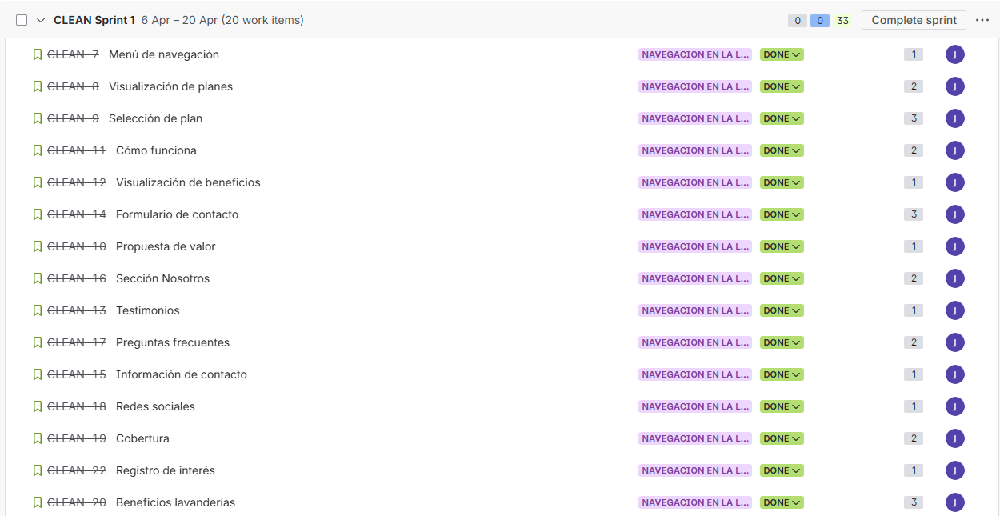

# Capítulo V: Product Implementation, Validation & Deployment

## 5.1. Software Configuration Management

En esta sección se describen las decisiones, convenciones y principios adoptados por el equipo para garantizar la coherencia, trazabilidad y control de versiones durante el ciclo de vida del desarrollo de la solución CleanWave. Se establecen los lineamientos para la configuración del entorno de desarrollo, gestión del código fuente, convenciones de estilo y configuración de despliegue.


### 5.1.1. Software Development Environment Configuration

### 5.1.2. Source Code Management

Para administrar el progreso del código, optamos por una estrategia más simple en lugar de implementar todo el flujo de Git Flow. En nuestro caso, trabajamos directamente con una sola rama principal (main), la cual contiene la versión estable y a la vez en desarrollo de nuestro proyecto. De esta manera, todas las nuevas funcionalidades y correcciones fueron integradas directamente en la rama main, sin necesidad de crear ramas adicionales para desarrollo o características específicas. Aunque este enfoque es menos modular que Git Flow, resultó práctico para el alcance actual del proyecto, ya que permitió un control más directo del avance y evitó la sobrecarga de gestionar múltiples ramas. Además, utilizamos GitHub como repositorio central, aprovechando su función GitHub Pages para la visualización de nuestro trabajo. Esto nos permitió desplegar los archivos .html y obtener un enlace web funcional de manera rápida y sencilla. En resumen, trabajar únicamente con la rama main nos permitió avanzar con agilidad en el desarrollo de la página de destino y mantener una versión estable y actualizada del proyecto sin complicaciones adicionales en la gestión de ramas.

Enlace de la Landing Page en GitHub Pages: 

<div align="center">  <p><em>Figura: Repositorio Landing Page</em>
</p> </div>

Repositorio Github de la Landing Page:

<div align="center">  <p><em>Figura: Repositorio Landing Page</em>
</p> </div>


### 5.1.3. Source Code Style Guide & Conventions

En esta sección se establecen las normas, buenas prácticas y convenciones que se utilizarán durante el desarrollo de la aplicación web orientada a la gestión digital de lavanderías. La aplicación busca optimizar procesos operativos como el registro de pedidos, seguimiento de prendas y coordinación logística.

La adopción de estas convenciones permitirá garantizar la calidad, coherencia y mantenibilidad del código, facilitando su evolución y escalabilidad conforme el sistema crezca.

Para el desarrollo del proyecto se emplearán tecnologías como HTML, CSS y JavaScript, mientras que para la definición de escenarios de prueba se utilizará el lenguaje Gherkin, alineado a prácticas de desarrollo ágil.

 **Uso de minúsculas y nomenclatura en inglés**

Se definirá el uso de nombres en idioma inglés para variables, funciones, clases y elementos del sistema, asegurando que estos reflejen claramente su funcionalidad dentro del dominio de la lavandería (por ejemplo: order-status, pickup-time, delivery-route). 

Ejemplo: 

```
.clr {
} /* Mala práctica: nombre ambiguo y poco descriptivo */

.order-status {
} /* Buena práctica: nombre claro y relacionado con el dominio */
```
**Sangría y identación**

La identación permite delimitar visualmente bloques y estructuras del código, facilitando la comprensión de su lógica interna. Una correcta sangría mejora la legibilidad, permite identificar dependencias entre elementos y reduce errores de interpretación.

Ejemplo:

**EN HTML**
```
<ul>
  <li>Pedido registrado</li>
  <li>Pedido en proceso</li>
  <li>Pedido entregado</li>
</ul>

```
**EN CSS**
```
body {
  background: #ffffff;
  color: #333333;
}
```
**EN JavaScript**
```
function calculateTotal(price, quantity) {
  return price * quantity;
}
```
A continuación, se detallan las reglas específicas aplicadas a cada lenguaje.

**HTML**
 
 Se utilizará HTML5 como estándar principal para el desarrollo de la estructura de la aplicación web, debido a que proporciona etiquetas semánticas, soporte multimedia y compatibilidad con navegadores modernos.

Document Type

El proyecto utilizará la declaración específica de HTML5, definida como <!DOCTYPE html>, permitiendo a los navegadores interpretar correctamente la estructura del documento. 

Ejemplo:

```
<!DOCTYPE html>
<html lang="es">
<head>
  <meta charset="UTF-8">
  <title>Laundry Platform</title>
</head>
<body>
</body>
</html>
```
- **Blank Lines**

Se utilizarán líneas en blanco para separar grandes bloques de contenido HTML, con el objetivo de mejorar la legibilidad del documento y facilitar la identificación visual de secciones importantes de la interfaz.

Ejemplo
```
<body>
  <header>
    <h1>Laundry Service</h1>
  </header>

  <section>
    <h2>Cómo funciona</h2>
    <p>El cliente registra o solicita su servicio y puede hacer seguimiento del pedido.</p>
  </section>

  <section>
    <h2>Beneficios</h2>
    <p>Mayor transparencia, ahorro de tiempo y mejor control operativo.</p>
  </section>
</body>
```
- **HTML Quotation Marks**

Para los valores de atributos HTML se emplearán comillas dobles (""), manteniendo consistencia en todos los documentos del proyecto.

```

```
- **Multimedia Fallback**

Se proporcionará contenido alternativo para elementos multimedia, especialmente imágenes, con el objetivo de mejorar la accesibilidad y permitir una adecuada interpretación del contenido.

Ejemplo:
```

```
**CSS**

Se utilizará CSS3 para el diseño visual y la presentación de la aplicación web. El objetivo es mantener una hoja de estilos clara, ordenada y fácil de mantener.

Property Name Stops

Se utilizará un espacio después de los dos puntos (:) que acompañan a cada propiedad CSS, así como un único espacio entre la propiedad y su valor.

Ejemplo:
```
.order-card {
  background: #ffffff;
  padding: 16px;
}
```
- **Declaration Stops**

Cada declaración de propiedad CSS finalizará con punto y coma (;) para mantener consistencia y evitar errores de interpretación.

Ejemplo:
```
.status-label {
  color: green;
  font-weight: bold;
}
```
- **CSS Quotation Marks**

Se utilizarán comillas de manera consistente solo cuando sean necesarias, evitando su uso innecesario en rutas o propiedades donde no aporten claridad. Asimismo, se mantendrá uniformidad en el estilo de redacción de selectores y valores.

Ejemplo:
```
.banner-title {
  font-family: 'Open Sans', Arial, sans-serif;
}
```
- **Declaration Block Separation**

Se mantendrá una separación clara entre selectores y bloques de declaraciones, evitando saltos de línea innecesarios y asegurando uniformidad visual en la hoja de estilos.

Ejemplo:
```
.delivery-info {
  margin-top: 1rem;
  color: #444444;
}
```
**JavaScript**
Se utilizará JavaScript como lenguaje principal para la lógica del sistema, permitiendo implementar funcionalidades como el registro de pedidos, consulta de estados, validaciones, manejo de eventos y comportamiento dinámico de la aplicación.
- **Spaces Around Operations**

Se colocarán espacios alrededor de operadores aritméticos, de comparación y asignación, así como después de las comas, para mejorar la legibilidad del código.

Ejemplo:
```
let totalPrice = unitPrice * quantity;
const districts = ['Miraflores', 'San Isidro', 'Barranco'];
```
- **End of Simple Declaration**
Toda declaración simple deberá finalizar con punto y coma (;), incluyendo variables, constantes y asignaciones.

Ejemplo:

```
const orderStatus = 'ready';
let deliveryTime = 30;
```
- **General Rules for Complex Statements**
Las estructuras complejas, como condicionales, bucles y funciones, seguirán una sintaxis clara y consistente:

La llave de apertura irá al final de la línea.
Se dejará un espacio antes de la llave de apertura.
La llave de cierre irá en una nueva línea.
No se colocará punto y coma al final del bloque.

Ejemplo:
```
if (orderStatus === 'ready') {
  notifyCustomer();
}
```
- **Uso de nombres descriptivos**
Las funciones y variables deberán reflejar claramente su propósito dentro del dominio del negocio. En vez de utilizar nombres genéricos, se emplearán denominaciones relacionadas con el sistema de lavanderías. 

Ejemplo:
```
function updateOrderStatus(orderId, newStatus) {
  console.log(orderId, newStatus);
}
```
**Gherkin**

Gherkin será utilizado como lenguaje de especificación para describir escenarios de prueba y criterios de aceptación de las funcionalidades del sistema. Esto permitirá una comunicación más clara entre el equipo técnico y la perspectiva de negocio.
- **Discernible Given-When-Then Blocks**

Se empleará la estructura clásica de Gherkin basada en bloques Given – When – Then, utilizando And cuando sea necesario para añadir condiciones o resultados adicionales.

Ejemplo:
```
Scenario: Cliente consulta el estado de su pedido
Given que el cliente tiene un pedido registrado
And el pedido se encuentra en proceso
When consulta el estado del pedido
Then el sistema muestra el estado actual
And muestra el tiempo estimado de entrega
```
- **Steps with Tables**
Cuando un escenario requiera trabajar con múltiples registros o datos tabulares, se utilizarán tablas dentro de los pasos, facilitando la comprensión del contexto del escenario.
 
 Ejemplo:
```
Scenario: Visualizar pedidos registrados
Given que existen los siguientes pedidos:
| pedido   | estado      |
| ORD-001  | en proceso  |
| ORD-002  | listo       |
| ORD-003  | entregado   |
When el administrador consulta la lista de pedidos
Then el sistema muestra los pedidos registrados
```
- **Reducing Noise**
Se procurará eliminar información irrelevante de los escenarios, manteniendo únicamente los datos necesarios para comprender el comportamiento esperado del sistema. Esto permite que los criterios de aceptación sean más claros y fáciles de validar.

Ejemplo:
```
Scenario: Pedido listo para notificación
Given que el pedido está registrado
And el pedido cambia a estado listo
When el sistema procesa la actualización
Then el cliente recibe una notificación
```
- **Newlines between scenarios and separator comments**
Cuando se definan múltiples escenarios dentro de un mismo archivo, se dejarán líneas en blanco entre ellos y se podrán utilizar comentarios separadores para facilitar la lectura y navegación del documento.

Ejemplo:
```
#------- Escenario de consulta exitosa -------
Scenario: Cliente consulta pedido existente
Given que el cliente tiene un pedido registrado
When consulta el estado del pedido
Then el sistema muestra el estado correspondiente


#------- Escenario de pedido inexistente -------
Scenario: Cliente consulta pedido no registrado
Given que el cliente no tiene un pedido asociado
When consulta el estado del pedido
Then el sistema informa que no se encontró información
```
### 5.1.4. Software Deployment Configuration

Para desplegar nuestro landing page hemos optado por usar Github Pages el cual brinda la posibilidad de alojar sitios web estáticos sin costo alguno.

1. Ingresamos al repositorio de nuestra landing page


2. Ingresamos al repositorio de nuestra landing page

 

3. Ingresamos a la sección de "Settings" del repositorio


4. En la sección de "Pages", seleccionamos la rama "main" y la carpeta raíz (root) para desplegar nuestro sitio web.


## 5.2. Landing Page, Services & Applications Implementation

### 5.2.1. Sprint 1

En esta sección, documentaremos y explicaremos el progreso del Sprint 1 en términos de desarrollo del producto y colaboración del equipo. Abordaremos varios aspectos clave, incluyendo la planificación del sprint, el backlog del sprint, la evidencia de desarrollo para la Revisión del Sprint. Además, se destacarán los aspectos relacionados con la documentación de servicios, la evidencia de despliegue de software y las perspectivas de colaboración del equipo durante el sprint. Este análisis detallado nos permitirá evaluar el progreso del proyecto y realizar ajustes necesarios para futuros sprints.

#### 5.2.1.1. Sprint Planning 1.

En esta sección, nos sumergiremos en los detalles del Sprint Planning Meeting 1.

| **Sprint #** |                 **Sprint 1**              |
|--------------|-------------------------------------------|
|**Sprint Planning Background**                            |
| Date         | 06-04-2026                                |
| Time         | 2:00 PM                                   |
| Location     | Reunión virtual mediante meet             |
| Prepared By  | Jhoan Darner Janampa Gutierrez            |
| Attendees    |                  |
| Sprint n-1 Review Summary | No aplica                    |
| Sprint n-1 Retrospective Summary | No aplica             |
| **Sprint Goal & User Stories**                           |
|**Sprint 1**  | El sprint tiene como objetivo desarrollar y publicar la landing page inicial de la startup de lavanderías digitales, la cual permitirá presentar la propuesta de valor del servicio tanto a dueños de lavanderías como a clientes finales. Durante este sprint se implementarán las secciones principales: hero con llamada a la acción, problema y solución, sección “cómo funciona”, beneficios diferenciados para ambos segmentos, testimonios simulados, sección de planes, formulario de contacto y footer con información relevante. Asimismo, se asegurará un diseño moderno, responsive y adaptable a dispositivos móviles y escritorio. El criterio de aceptación es que todas las secciones carguen correctamente, los enlaces funcionen sin errores, el formulario valide datos correctamente y la navegación sea fluida. La landing deberá estar desplegada en un hosting accesible públicamente. Como métrica de éxito, se espera lograr al menos 15 visitas únicas y 30 interacciones en los botones principales durante el sprint.                   |
| Sprint 1 Velocity   | 20 Story Points                    |
| Sum of Story Points | 38 Story Points                    |

#### 5.2.1.2. Aspect Leaders and Collaborators

En esta sección se incluye la elaboración de el artefacto Leadership-andCollaboration Matrix (LACX), el cual elegirenos quién es el líder y quiénes son los
colaboradores para este Sprint 1 

|Team Members (Last Name, First Name)|     GitHub Username     |   Landing Page   |
|------------------------------------|-------------------------|------------------|
| Miguel Angel Jara Espinoza |    MiguelJara2        |        C         |
| Janampa Gutierrez Jhoan Darner        |      orraiAKBDFSK      |        L         |
| Gabriel Marcelo Mendoza Palacios        |        GabrielMendoza18        |        C         |
| Jorge Armando Laban Hijar |   jarlh19    |        C         |


#### 5.2.1.3. Sprint Backlog n.

El Sprint Backlog es el artefacto que recoge el conjunto de User Stories seleccionadas para el Sprint y las descompone en tareas o work-items concretos que el
equipo de desarrollo debe realizar. A diferencia del Product Backlog, que contiene todas las funcionalidades priorizadas del producto, el Sprint Backlog se centra
únicamente en los elementos comprometidos para un Sprint específico.

En este caso, el Sprint Backlog 1 está orientado al desarrollo de la Landing Page de la plataforma CleanWave, incluyendo la implementación del hero, secciones de
servicios, modales, páginas de rol, footer, asistente virtual y ajustes de responsividad.


Enlace: [Enlace Sprint 1](https://upc-team-k20qr1ry.atlassian.net/jira/software/projects/CLEAN/boards/68/backlog?epics=visible&selectedIssue=CLEAN-16) 


<div align="center">  <p><em>Figura: Sprint 1</em>
</p> </div>


## Sprint Backlog – Sprint 1

| ID US | Título User Story | ID WI | Título Work-Item | Descripción | Est. (Hrs) | Asignado a | Estado |
| :--- | :--- | :--- | :--- | :--- | :---: | :--- | :--- |
| **US01** | Menú de navegación | WI-01 | Implementar navbar | Crear barra de navegación con enlaces a Inicio, Beneficios, Planes y Contacto | 3 | Jhoan Janampa Gutierrez | Done |
| **US02** | Visualización de planes | WI-02 | Implementar sección de planes | Mostrar planes con precio, características y botón de acción | 4 | Jhoan Janampa Gutierrez | Done |
| **US03** | Selección de plan | WI-03 | Implementar selección de plan | Permitir seleccionar un plan y redirigir al registro | 3 | Jhoan Janampa Gutierrez | Done |
| **US04** | Propuesta de valor | WI-04 | Implementar sección hero | Crear sección principal con título, descripción y botones CTA | 4 | Jhoan Janampa Gutierrez | Done |
| **US05** | Cómo funciona | WI-05 | Implementar sección “Cómo funciona” | Mostrar flujo del servicio en pasos (registro, proceso, entrega) | 4 | Jhoan Janampa Gutierrez | Done |
| **US06** | Beneficios | WI-06 | Implementar sección beneficios | Mostrar beneficios para lavanderías y clientes | 3 | Jhoan Janampa Gutierrez | Done |
| **US07** | Testimonios | WI-07 | Implementar testimonios | Crear sección con opiniones simuladas de usuarios | 3 | Jhoan Janampa Gutierrez | Done |
| **US08** | Formulario de contacto | WI-08 | Implementar formulario | Crear formulario con validación y confirmación | 5 | Jhoan Janampa Gutierrez | Done |
| **US09** | Información de contacto | WI-09 | Implementar sección contacto | Mostrar correo, teléfono y ubicación | 2 | Jhoan Janampa Gutierrez | Done |
| **US10** | Sección “Nosotros” | WI-10 | Implementar sección empresa | Mostrar información de la startup | 3 | Jhoan Janampa Gutierrez | Done |
| **US11** | Preguntas frecuentes | WI-11 | Implementar FAQ | Crear lista de preguntas y respuestas | 3 | Jhoan Janampa Gutierrez | Done |
| **US12** | Redes sociales | WI-12 | Implementar redes sociales | Agregar enlaces a redes sociales | 2 | Jhoan Janampa Gutierrez | Done |
| **US13** | Footer | WI-13 | Implementar footer | Agregar enlaces legales y contacto | 3 | Jhoan Janampa Gutierrez | Done |
| **US14** | Responsividad | WI-14 | Adaptar diseño responsive | Ajustar diseño a móvil, tablet y desktop | 6 | Jhoan Janampa Gutierrez | Done |
| **US15** | CTA principal | WI-15 | Implementar botones CTA | Crear botones de acción para registro y contacto | 2 | Jhoan Janampa Gutierrez | Done |
| **US16** | Sección cobertura | WI-16 | Implementar cobertura | Mostrar zonas donde opera el servicio | 3 | Jhoan Janampa Gutierrez | Done |
| **US17** | Beneficios lavandería | WI-17 | Implementar beneficios B2B | Mostrar beneficios para negocios | 3 | Jhoan Janampa Gutierrez | Done |
| **US18** | Beneficios usuario | WI-18 | Implementar beneficios cliente | Mostrar beneficios para usuarios finales | 3 | Jhoan Janampa Gutierrez | Done |
| **US19** | Demo del servicio | WI-19 | Implementar demo visual | Simular flujo del pedido (registro → proceso → entrega) | 5 | Jhoan Janampa Gutierrez | Done |
| **US20** | Política de privacidad | WI-20 | Implementar sección legal | Agregar políticas y términos de uso | 2 | Jhoan Janampa Gutierrez | Done |


#### 5.2.X.4. Development Evidence for Sprint Review

#### 5.2.X.5. Execution Evidence for Sprint Review

#### 5.2.X.6. Services Documentation Evidence for Sprint Review

#### 5.2.X.7. Software Deployment Evidence for Sprint Review

#### 5.2.X.8. Team Collaboration Insights during Sprint

## 5.3. Validation Interviews

### 5.3.1. Diseño de Entrevistas

### 5.3.2. Registro de Entrevistas

### 5.3.3. Evaluaciones según heurísticas

## 5.4. Video About-the-Product
