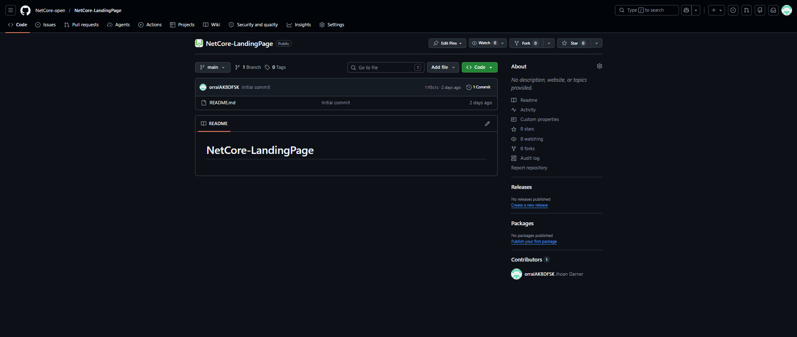

# Capítulo V: Product Implementation, Validation & Deployment

## 5.1. Software Configuration Management

En esta sección se describen las decisiones, convenciones y principios adoptados por el equipo para garantizar la coherencia, trazabilidad y control de versiones durante el ciclo de vida del desarrollo de la solución CleanWave. Se establecen los lineamientos para la configuración del entorno de desarrollo, gestión del código fuente, convenciones de estilo y configuración de despliegue.


### 5.1.1. Software Development Environment Configuration

### 5.1.2. Source Code Management

Para administrar el progreso del código, optamos por una estrategia más simple en lugar de implementar todo el flujo de Git Flow. En nuestro caso, trabajamos directamente con una sola rama principal (main), la cual contiene la versión estable y a la vez en desarrollo de nuestro proyecto. De esta manera, todas las nuevas funcionalidades y correcciones fueron integradas directamente en la rama main, sin necesidad de crear ramas adicionales para desarrollo o características específicas. Aunque este enfoque es menos modular que Git Flow, resultó práctico para el alcance actual del proyecto, ya que permitió un control más directo del avance y evitó la sobrecarga de gestionar múltiples ramas. Además, utilizamos GitHub como repositorio central, aprovechando su función GitHub Pages para la visualización de nuestro trabajo. Esto nos permitió desplegar los archivos .html y obtener un enlace web funcional de manera rápida y sencilla. En resumen, trabajar únicamente con la rama main nos permitió avanzar con agilidad en el desarrollo de la página de destino y mantener una versión estable y actualizada del proyecto sin complicaciones adicionales en la gestión de ramas.

Enlace de la Landing Page en GitHub Pages: 

Repositorio Github de la Landing Page:

<div align="center">  <p><em>Figura: Repositorio Landing Page</em>
</p> </div>


### 5.1.3. Source Code Style Guide & Conventions

En esta sección se establecen las normas, buenas prácticas y convenciones que se utilizarán durante el desarrollo de la aplicación web orientada a la gestión digital de lavanderías. La aplicación busca optimizar procesos operativos como el registro de pedidos, seguimiento de prendas y coordinación logística.

La adopción de estas convenciones permitirá garantizar la calidad, coherencia y mantenibilidad del código, facilitando su evolución y escalabilidad conforme el sistema crezca.

Para el desarrollo del proyecto se emplearán tecnologías como HTML, CSS y JavaScript, mientras que para la definición de escenarios de prueba se utilizará el lenguaje Gherkin, alineado a prácticas de desarrollo ágil.

 **Uso de minúsculas y nomenclatura en inglés**

Se definirá el uso de nombres en idioma inglés para variables, funciones, clases y elementos del sistema, asegurando que estos reflejen claramente su funcionalidad dentro del dominio de la lavandería (por ejemplo: order-status, pickup-time, delivery-route). 

Ejemplo: 

```
.clr {
} /* Mala práctica: nombre ambiguo y poco descriptivo */

.order-status {
} /* Buena práctica: nombre claro y relacionado con el dominio */
```
**Sangría y identación**

La identación permite delimitar visualmente bloques y estructuras del código, facilitando la comprensión de su lógica interna. Una correcta sangría mejora la legibilidad, permite identificar dependencias entre elementos y reduce errores de interpretación.

Ejemplo:

**EN HTML**
```
<ul>
  <li>Pedido registrado</li>
  <li>Pedido en proceso</li>
  <li>Pedido entregado</li>
</ul>

```
**EN CSS**
```
body {
  background: #ffffff;
  color: #333333;
}
```
**EN JavaScript**
```
function calculateTotal(price, quantity) {
  return price * quantity;
}
```

### 5.1.4. Software Deployment Configuration

## 5.2. Landing Page, Services & Applications Implementation

### 5.2.X. Sprint n

#### 5.2.X.1. Sprint Planning n.

#### 5.2.X.2. Aspect Leaders and Collaborators

#### 5.2.X.3. Sprint Backlog n.

#### 5.2.X.4. Development Evidence for Sprint Review

#### 5.2.X.5. Execution Evidence for Sprint Review

#### 5.2.X.6. Services Documentation Evidence for Sprint Review

#### 5.2.X.7. Software Deployment Evidence for Sprint Review

#### 5.2.X.8. Team Collaboration Insights during Sprint

## 5.3. Validation Interviews

### 5.3.1. Diseño de Entrevistas

### 5.3.2. Registro de Entrevistas

### 5.3.3. Evaluaciones según heurísticas

## 5.4. Video About-the-Product
